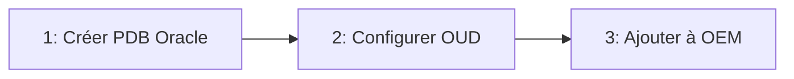
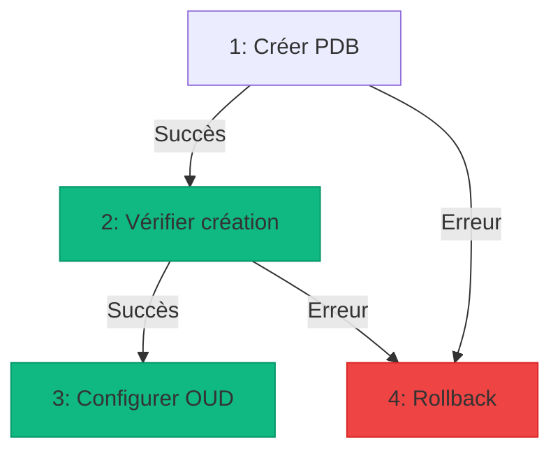

# Story 5.8 : Visualiseur de workflow (flowchart)

Status: backlog

## Story

As a DBA ou DBOPS,
I want visualiser un workflow comme un diagramme de flux avec les étapes et les conditions de passage,
So que je comprenne rapidement la structure et le flux d'exécution d'un workflow complexe.

## Contexte

**Contexte Epic 5 — Dashboard & Activité :**

Les workflows peuvent contenir plusieurs étapes. Actuellement, les workflows sont linéaires (étapes séquentielles), mais à l'avenir ils pourront avoir des branches conditionnelles (succès/erreur). Un visualiseur simple et lisible aide à comprendre rapidement la structure d'un workflow.

**État actuel :**

- Les workflows sont affichés dans le catalogue avec une icône dédiée (Story 5.7)
- Les étapes d'un workflow sont visibles dans l'éditeur (WorkflowStepsEditor) mais sous forme de liste textuelle
- Aucune visualisation graphique du flux d'exécution n'existe actuellement
- Les workflows actuels sont linéaires (séquentiels), mais l'Epic 16 Builder prévoit des branches conditionnelles

**Objectif de cette story :**

Créer un visualiseur simple et lisible (flowchart) pour visualiser la structure d'un workflow, avec les étapes et leurs connexions. Le visualiseur doit être prêt pour les branches conditionnelles futures (succès/erreur) mais fonctionner avec les workflows linéaires actuels.

**Inspiration et leçons :**

- AAP 2.5 a un visualiseur mais peut devenir complexe et illisible ("what a mess") avec beaucoup d'étapes
- Notre approche doit être **simple et lisible** : éviter la surcharge visuelle
- Format clair : nœuds (étapes) + flèches (connexions) avec couleurs pour les conditions

## Acceptance Criteria

### AC1 — Affichage du visualiseur dans le drawer et l'admin

**Given** un DBA consulte un workflow dans le catalogue,
**When** il ouvre le drawer de détail (ActionDrawerPreview),
**Then** un onglet "Visualisation" est disponible (en plus de "Détails", "Documentation")
**And** l'onglet affiche le diagramme de flux du workflow

**Given** un DBOPS consulte un workflow dans l'admin,
**When** il ouvre la page d'édition ou de détail,
**Then** une section "Visualisation" est affichée (peut être dans un onglet ou panneau latéral)
**And** le diagramme de flux du workflow est affiché

**Given** le visualiseur est affiché,
**When** le workflow n'a pas d'étapes (workflow vide),
**Then** un message informatif s'affiche : "Ce workflow n'a pas encore d'étapes configurées"

### AC2 — Visualisation des workflows linéaires (état actuel)

**Given** un workflow linéaire (étapes séquentielles),
**When** le visualiseur affiche le workflow,
**Then** les étapes sont affichées en séquence (de gauche à droite ou de haut en bas)
**And** chaque nœud affiche :
  - Le numéro d'ordre de l'étape (ex: "1", "2", "3")
  - Le nom de l'action référencée (ou le nom d'affichage de l'étape si défini)
  - L'icône de la technologie de l'action référencée (Oracle, SQL Server, etc.)
**And** des flèches simples connectent les étapes dans l'ordre (étape 1 → étape 2 → étape 3)

**Given** le visualiseur affiche un workflow linéaire,
**When** une étape n'a pas de nom d'affichage défini,
**Then** le nœud affiche le nom de l'action référencée
**And** si l'action référencée n'est pas chargée, afficher "Action #{referenced_action_id}" temporairement

### AC3 — Visualisation des branches conditionnelles (futur)

**Given** un workflow avec branches conditionnelles (quand cette fonctionnalité sera implémentée),
**When** le visualiseur affiche le workflow,
**Then** les branches sont affichées avec des flèches colorées :
  - **Flèche verte** pour le chemin de succès (`on_success_step_id`)
  - **Flèche rouge** pour le chemin d'erreur (`on_error_step_id`)
  - **Flèche bleue** pour le chemin "toujours" (si applicable)
**And** les labels sur les flèches indiquent la condition ("Succès", "Erreur", "Toujours")

**Given** un workflow avec plusieurs chemins parallèles,
**When** le visualiseur affiche le workflow,
**Then** les chemins parallèles sont affichés côte à côte
**And** les points de convergence (plusieurs étapes → une étape) sont clairement visibles

**Given** un workflow avec une boucle (étape A → étape B → étape A),
**When** le visualiseur affiche le workflow,
**Then** la boucle est clairement visible avec une flèche qui revient en arrière
**And** un indicateur visuel (ex: badge "Boucle") signale la présence d'une boucle

### AC4 — Navigation et zoom

**Given** le visualiseur affiche un workflow avec beaucoup d'étapes (10+),
**When** l'utilisateur consulte le diagramme,
**Then** le diagramme est zoomable (molette souris ou boutons +/-)
**And** le diagramme est pannable (glisser-déposer pour déplacer la vue)
**And** un bouton "Vue d'ensemble" permet de voir tout le workflow en une seule vue (zoom automatique)

**Given** le visualiseur affiche un workflow,
**When** l'utilisateur navigue dans le diagramme,
**Then** les contrôles de zoom et pan sont accessibles au clavier
**And** un indicateur de zoom actuel est affiché (ex: "100%", "50%")

### AC5 — Détails des étapes au survol/clic

**Given** le visualiseur affiche un workflow,
**When** un utilisateur survole un nœud d'étape,
**Then** un tooltip s'affiche avec :
  - Nom complet de l'action référencée
  - Description de l'action (si disponible)
  - Moteur et plateforme de l'action
  - Paramètres requis (liste des paramètres si `parameters_schema` disponible)

**Given** le visualiseur affiche un workflow,
**When** un utilisateur clique sur un nœud d'étape,
**Then** un panneau latéral ou modal s'ouvre avec les détails complets de l'action référencée
**And** le panneau affiche les mêmes informations que le tooltip mais de manière plus détaillée
**And** un lien "Voir l'action dans le catalogue" permet d'ouvrir le drawer de l'action référencée

### AC6 — Visualisation pendant l'exécution (optionnel)

**Given** un workflow est en cours d'exécution,
**When** le visualiseur affiche le workflow,
**Then** les étapes exécutées sont mises en évidence :
  - **Vert** pour les étapes terminées avec succès
  - **Rouge** pour les étapes terminées en erreur
  - **Bleu/Animation** pour l'étape en cours d'exécution
**And** les étapes non encore exécutées restent en gris/neutre

**Given** le visualiseur affiche un workflow en cours d'exécution,
**When** une étape échoue et le workflow a des branches conditionnelles,
**Then** le chemin d'erreur est mis en évidence (flèche rouge plus épaisse ou animée)
**And** l'étape suivante sur le chemin d'erreur est mise en évidence

### AC7 — Accessibilité et UX

**Given** le visualiseur affiche un workflow,
**When** un utilisateur navigue avec le clavier,
**Then** les nœuds sont focusables (Tab)
**And** Enter ou Espace sur un nœud ouvre les détails
**And** Les flèches directionnelles permettent de naviguer entre les nœuds

**Given** le visualiseur affiche un workflow,
**When** un utilisateur utilise un lecteur d'écran,
**Then** chaque nœud a un label ARIA descriptif : "Étape {order} : {action_name}"
**And** les connexions sont décrites : "Étape {order} connectée à étape {next_order}"

**Given** le visualiseur affiche un workflow,
**When** l'utilisateur consulte le diagramme,
**Then** le contraste des couleurs respecte WCAG 2.1 AA
**And** les textes sont lisibles (taille minimale, contraste suffisant)

## Implementation Tasks

### Task 1: Choisir la bibliothèque de visualisation

- [ ] Subtask 1.1: Évaluer les options
  - [ ] Option A : Mermaid.js (léger, génération de diagrammes depuis texte)
  - [ ] Option B : React Flow (plus flexible, interactif, drag-and-drop)
  - [ ] Option C : Diagramme SVG custom (contrôle total, mais plus de code)
  - [ ] Option D : Ant Design Graph (si disponible)

- [ ] Subtask 1.2: Décider de l'approche
  - [ ] Pour visualisation simple (lecture seule) : Mermaid.js semble idéal
  - [ ] Pour futur builder visuel : React Flow serait nécessaire
  - [ ] **Recommandation** : Commencer avec Mermaid.js pour la visualisation simple, migrer vers React Flow si besoin de plus d'interactivité

### Task 2: Créer le composant WorkflowVisualizer

- [ ] Subtask 2.1: Créer `WorkflowVisualizer.tsx`
  - [ ] Props : `workflowSteps: WorkflowStep[]`, `referencedActions?: ActionDetail[]`, `executionStatus?: 'idle' | 'running' | 'completed'`
  - [ ] Charger les détails des actions référencées si non fournis
  - [ ] Générer le diagramme Mermaid ou SVG depuis les données

- [ ] Subtask 2.2: Générer le diagramme pour workflows linéaires
  - [ ] Convertir `workflowSteps` en format Mermaid flowchart
  - [ ] Format : `flowchart LR` (Left to Right) ou `TD` (Top Down)
  - [ ] Chaque nœud : `Step{order}[Action: {action_name}]`
  - [ ] Connexions : `Step1 --> Step2 --> Step3`

- [ ] Subtask 2.3: Préparer pour branches conditionnelles (futur)
  - [ ] Structure de données extensible pour `on_success_step_id` et `on_error_step_id`
  - [ ] Format Mermaid avec styles conditionnels : `Step1 -->|Succès| Step2`, `Step1 -->|Erreur| Step3`
  - [ ] Couleurs : `classDef success fill:#10b981,stroke:#059669`, `classDef error fill:#ef4444,stroke:#dc2626`

### Task 3: Intégrer dans ActionDrawerPreview

- [ ] Subtask 3.1: Ajouter onglet "Visualisation"
  - [ ] Détecter si l'action est un workflow (`item_type === 'workflow'`)
  - [ ] Ajouter onglet "Visualisation" seulement pour les workflows
  - [ ] Charger `workflow_steps` depuis `action.workflow_steps`

- [ ] Subtask 3.2: Charger les détails des actions référencées
  - [ ] Pour chaque `workflow_steps`, charger l'action référencée via `GET /catalog/actions/{referenced_action_id}`
  - [ ] Optionnel : Endpoint dédié `GET /catalog/workflows/{id}/referenced-actions` pour charger toutes en une fois
  - [ ] Afficher skeleton/loading pendant le chargement

- [ ] Subtask 3.3: Afficher le visualiseur
  - [ ] Rendre `WorkflowVisualizer` dans l'onglet "Visualisation"
  - [ ] Gérer les erreurs (action référencée supprimée, non accessible)
  - [ ] Afficher message si workflow vide

### Task 4: Intégrer dans AdminPage (édition workflow)

- [ ] Subtask 4.1: Ajouter section "Visualisation" dans ActionWizard
  - [ ] Pour les workflows en édition, ajouter un panneau "Aperçu" ou "Visualisation"
  - [ ] Afficher le visualiseur avec les étapes actuelles (même si non sauvegardées)
  - [ ] Mettre à jour en temps réel quand l'utilisateur modifie les étapes

- [ ] Subtask 4.2: Mode lecture seule dans admin
  - [ ] Lors de la consultation d'un workflow (bouton "Voir"), afficher le visualiseur
  - [ ] Le visualiseur est en lecture seule (pas de modification via le diagramme)

### Task 5: Améliorer la lisibilité (éviter le "mess")

- [ ] Subtask 5.1: Optimiser la disposition
  - [ ] Pour workflows linéaires : disposition horizontale simple (gauche à droite)
  - [ ] Pour workflows avec branches : disposition verticale ou mixte selon la complexité
  - [ ] Espacement suffisant entre les nœuds pour éviter la surcharge visuelle

- [ ] Subtask 5.2: Limiter la complexité visuelle
  - [ ] Nœuds compacts : nom de l'action + icône, pas trop de détails
  - [ ] Flèches claires : épaisseur suffisante, couleurs distinctes
  - [ ] Labels courts sur les flèches : "Succès", "Erreur" plutôt que descriptions longues

- [ ] Subtask 5.3: Gérer les workflows complexes
  - [ ] Pour workflows avec 20+ étapes : proposer vue "simplifiée" (masquer détails)
  - [ ] Groupement optionnel : regrouper des séquences d'étapes similaires
  - [ ] Recherche/filtre : permettre de filtrer les étapes affichées

### Task 6: Support de l'exécution en temps réel (optionnel)

- [ ] Subtask 6.1: Intégrer avec ExecutionTimeline
  - [ ] Lorsqu'un workflow est en cours d'exécution, mettre à jour le visualiseur
  - [ ] Recevoir les événements d'exécution via WebSocket ou polling
  - [ ] Mettre à jour les couleurs des nœuds selon le statut d'exécution

- [ ] Subtask 6.2: Animation et feedback visuel
  - [ ] Animation subtile pour l'étape en cours (pulse, glow)
  - [ ] Transition douce lors du changement de statut d'une étape
  - [ ] Indicateur de progression globale du workflow

### Task 7: Accessibilité

- [ ] Subtask 7.1: Navigation clavier
  - [ ] Rendre les nœuds focusables avec Tab
  - [ ] Enter/Espace sur un nœud ouvre les détails
  - [ ] Flèches directionnelles pour naviguer entre nœuds

- [ ] Subtask 7.2: Labels ARIA
  - [ ] Chaque nœud a `aria-label="Étape {order} : {action_name}"`
  - [ ] Les connexions sont décrites dans `aria-describedby`
  - [ ] Le diagramme a `role="img"` et `aria-label="Diagramme de flux du workflow {workflow_name}"`

- [ ] Subtask 7.3: Contraste et lisibilité
  - [ ] Vérifier le contraste des couleurs (WCAG 2.1 AA)
  - [ ] Taille de texte minimale 12px
  - [ ] Mode sombre/clair selon le thème de l'application

### Task 8: Tests

- [ ] Subtask 8.1: Tests unitaires
  - [ ] Test de génération du diagramme Mermaid depuis workflowSteps
  - [ ] Test avec workflow linéaire simple (3 étapes)
  - [ ] Test avec workflow vide
  - [ ] Test avec action référencée supprimée (gestion d'erreur)

- [ ] Subtask 8.2: Tests d'intégration
  - [ ] Test d'affichage dans ActionDrawerPreview
  - [ ] Test de chargement des actions référencées
  - [ ] Test de navigation et zoom
  - [ ] Test d'accessibilité (navigation clavier, lecteur d'écran)

- [ ] Subtask 8.3: Tests visuels
  - [ ] Vérifier la lisibilité avec workflows de différentes tailles (5, 10, 20 étapes)
  - [ ] Vérifier le rendu sur différents navigateurs
  - [ ] Vérifier le responsive (si applicable)

## Notes techniques

### Format Mermaid pour workflows linéaires



### Format Mermaid pour workflows avec branches (futur)



### Bibliothèque recommandée : Mermaid.js

**Avantages :**
- Léger (~200KB)
- Génération depuis texte (facile à déboguer)
- Support natif des flowcharts
- Accessible (peut être converti en SVG avec labels ARIA)

**Inconvénients :**
- Moins interactif que React Flow
- Pas de drag-and-drop (mais pas nécessaire pour visualisation seule)

**Alternative :** React Flow si besoin de plus d'interactivité à l'avenir

### Structure des données

**WorkflowStep actuel :**
```typescript
interface WorkflowStep {
  order: number;
  name: string | null;
  referenced_action_id: number;
}
```

**WorkflowStep futur (avec branches) :**
```typescript
interface WorkflowStep {
  order: number;
  name: string | null;
  referenced_action_id: number;
  on_success_step_id?: number | null;  // Futur
  on_error_step_id?: number | null;    // Futur
}
```

Le visualiseur doit fonctionner avec les deux formats.

### Performance

- Pour workflows avec < 20 étapes : rendu immédiat
- Pour workflows avec 20-50 étapes : lazy loading des détails des actions référencées
- Pour workflows avec 50+ étapes : vue simplifiée ou groupement

### Éviter le "mess" d'AAP

**Leçons à retenir :**
1. **Simplicité** : Nœuds compacts, pas trop d'informations par nœud
2. **Espacement** : Suffisamment d'espace entre les nœuds
3. **Couleurs** : Palette limitée et cohérente
4. **Disposition** : Logique claire (gauche→droite pour linéaire, top→down pour branches)
5. **Zoom** : Permettre de zoomer pour voir les détails sans surcharger la vue d'ensemble

## Références

- Story 5.7 : Workflow — conteneur d'actions et icône identifiable dans le catalogue
- Epic 16 Builder : Builder de Workflow Visuel avec Branches Conditionnelles (futur)
- Story 9.5 : Interface Admin pour création/édition de workflows
- `idp-portal/frontend/src/components/catalog/ActionDrawerPreview.tsx` : Drawer où intégrer le visualiseur
- `idp-portal/frontend/src/components/admin/ActionWizard.tsx` : Wizard où intégrer le visualiseur
- Mermaid.js : https://mermaid.js.org/
- React Flow : https://reactflow.dev/ (alternative si besoin de plus d'interactivité)
