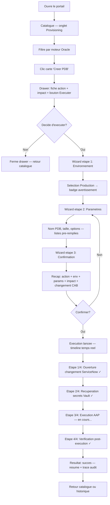
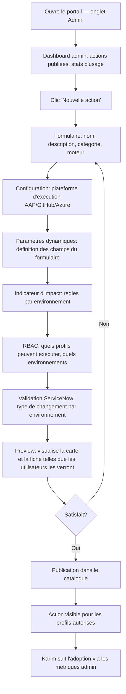
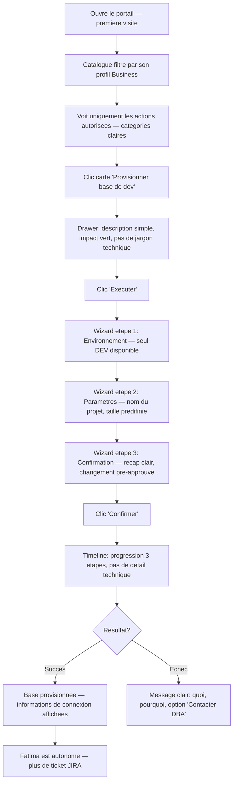
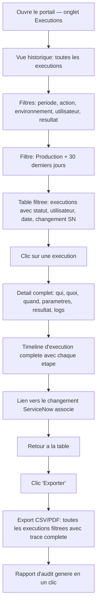

---
stepsCompleted:
  - step-01-init
  - step-02-discovery
  - step-03-core-experience
  - step-04-emotional-response
  - step-05-inspiration
  - step-06-design-system
  - step-07-defining-experience
  - step-08-visual-foundation
  - step-09-design-directions
  - step-10-user-journeys
  - step-11-component-strategy
  - step-12-ux-patterns
  - step-13-responsive-accessibility
  - step-14-complete
inputDocuments:
  - planning-artifacts/prd.md
  - design-thinking-2026-01-26.md
---

# UX Design Specification test

**Author:** Cyrille
**Date:** 2026-01-27

---

## Executive Summary

### Project Vision

Internal Developer Platform (IDP) specialise operations base de donnees pour une entreprise bancaire. Le portail centralise la decouverte, l'execution et le suivi de toutes les actions DB a travers un Software Catalog, des Golden Paths guides et une facade API event-driven. L'experience UX vise une interface epuree inspiree de Port.io (catalogue, self-service) et Temporal (visualisation de workflows), desktop-only, ou chaque action est une boite noire quel que soit le niveau technique de l'utilisateur.

### Target Users

| Profil | Role UX | Besoin emotionnel | Frequence d'usage |
|--------|---------|-------------------|-------------------|
| **DBA Applicatif (Marc)** | Consommateur d'actions + dashboard | Retrouver son role de conseil expert | Quotidien |
| **DBA Infrastructure (Sophie)** | Consommateur + diagnostic | Voir, comprendre, agir depuis un seul outil | Quotidien |
| **Client Business (Fatima)** | Self-service via Golden Paths | Autonomie, transparence, zero attente | Ponctuel |
| **DBOPS (Karim)** | Administrateur du catalogue | Que ses automatisations soient visibles et consommables | Regulier |
| **Specialiste Securite (Nadia)** | Audit et rapports | Preuves completes sans friction | Periodique (audit) |

Contexte d'utilisation : desktop-only, poste fixe, reseau interne bancaire. Niveau technique : mixte (DBA experts + clients business non-techniques). L'action comme boite noire absorbe cette difference.

### Key Design Challenges

1. **Deux audiences, une interface** — DBA experts et clients business non-techniques cohabitent. Le profil RBAC determine la vue (complete vs simplifiee) sans duplication d'interface. Modele : Port.io role-based views.

2. **Indicateur d'impact lisible en 1 seconde** — Vert/orange/rouge ne suffit pas seul. L'indicateur doit combiner couleur + icone + texte court pour etre accessible sans formation. Contexte bancaire = zero ambiguite.

3. **Suivi d'execution qui rassure** — Timeline etape par etape inspiree Temporal. L'interface principale montre la progression, pas les logs bruts. Les logs techniques sont accessibles en profondeur pour les DBA qui creusent.

4. **Administration du catalogue aussi soignee que la consommation** — L'interface DBOPS (creation d'actions, RBAC, publication) doit etre de premiere classe. Pas de formulaires admin generiques.

### Design Opportunities

1. **Le Golden Path comme experience signature** — Formulaire contextuel → indicateur d'impact → execution → timeline temps reel. Si ce flow est impeccable, le portail se vend tout seul aux utilisateurs.

2. **Dashboard DBA = preuve de valeur quotidienne** — Vue epuree montrant l'activite self-service, les statuts, les metriques. Validation tangible que la plateforme libere le temps DBA.

3. **Audit de premiere classe** — Module aussi soigne que le reste. Filtres, export, timeline de conformite. Differenciant par rapport aux outils internes habituels.

4. **Densite maitrisee** — Interface epuree (Port.io / Temporal) avec progressive disclosure : l'essentiel visible, le detail accessible au clic. Pas de surcharge cognitive.

## Core User Experience

### Defining Experience

Le portail IDP se definit par une experience unique : le **Golden Path**. Qu'il soit DBA ou client business, l'utilisateur parcourt le meme cycle fondamental :

**Decouvrir → Comprendre → Executer → Suivre → Resultat**

Ce cycle est l'experience signature du portail. Il doit etre parfait pour les deux audiences :
- **DBA (MVP)** : premiere execution via le portail au lieu de l'outil natif — c'est la conversion
- **Client Business (Phase 2)** : premiere action en self-service sans DBA — c'est la preuve de valeur

Le cycle admin (DBOPS) est le miroir invisible qui alimente cette experience :

**Creer → Configurer → Publier → Observer**

### Platform Strategy

- **Desktop-only** : poste fixe, reseau interne bancaire
- **Clavier/souris** : pas de touch, pas de gestes
- **Pas d'offline** : le portail est connecte en permanence aux plateformes d'execution
- **Largeur d'ecran exploitable** : panneaux lateraux, split views, tableaux riches — sans compromis responsive
- **References visuelles** : Port.io (catalogue, navigation, self-service actions) et Temporal (timeline de workflows, progression d'execution)

### Effortless Interactions

Tout ce qui est invisible pour l'utilisateur — par design :

| Interaction | Ce que l'utilisateur voit | Ce qui se passe en coulisse |
|-------------|---------------------------|----------------------------|
| **Secrets** | Rien — le formulaire ne demande jamais de credential | Vault recupere dynamiquement les secrets a l'execution |
| **Changement ServiceNow** | Badge "Changement pre-approuve" ou "CAB requis" sur la fiche action | Ouverture automatique du changement comme etape integree |
| **Routage plateforme** | Rien — l'action s'execute, point | Facade API route vers AAP, GitHub Actions, Azure DevOps ou Terraform |
| **Donnees de formulaire** | Listes deroulantes pre-remplies (bases, environnements) | Synchronisation avec l'inventaire interne via API |
| **RBAC** | L'utilisateur voit uniquement les actions qu'il peut executer | Filtrage par profil, action et environnement en amont |

Principe : l'infrastructure est invisible. L'utilisateur ne fait que des choix metier.

### Critical Success Moments

Le moment "c'est mieux" se joue en 3 temps durant le Golden Path :

**Moment 1 — "L'action est claire"**
L'utilisateur ouvre la fiche d'une action et comprend immediatement :
- Ce que fait l'action (description concise)
- Quel est l'impact (indicateur visuel vert/orange/rouge + texte)
- Quels parametres il doit fournir
- S'il a le droit de l'executer dans cet environnement

Si ce moment echoue, l'utilisateur ne clique pas sur "Executer". C'est le GO/NO-GO de l'experience.

**Moment 2 — "Je sais ce qui se passe"**
L'execution est lancee. L'utilisateur voit une timeline etape par etape (inspiree Temporal) :
- Progression visuelle claire (etape N sur M)
- Statut de chaque etape (en attente / en cours / termine / erreur)
- Detail accessible au clic pour les DBA qui veulent creuser
- Pas de "boite noire" — jamais

Si ce moment echoue, l'utilisateur perd confiance et retourne a l'outil natif.

**Moment 3 — "C'est fait, j'ai la preuve"**
L'action est terminee. L'utilisateur voit :
- Resultat final (succes/echec)
- Resume des actions effectuees
- Lien vers les logs detailles (DBA)
- Trace d'audit complete (qui, quoi, quand, parametres, resultat)

Si ce moment echoue, l'auditabilite SOC1 est compromise.

### Experience Principles

Quatre principes qui guident toutes les decisions UX du portail :

**1. Clarte a chaque etape**
L'utilisateur ne doute jamais de ce qu'il fait, de ce que ca implique, ni de ou ca en est. Chaque ecran repond a la question "qu'est-ce qui se passe ?".

**2. L'action est une boite noire**
L'infrastructure sous-jacente (plateformes, secrets, changements, routage) est invisible. L'utilisateur fait des choix metier, pas des choix techniques. Le niveau technique de l'utilisateur est irrelevant.

**3. Progressive disclosure**
L'essentiel est visible. Le detail est accessible au clic. Un client business voit la surface, un DBA peut creuser. Meme interface, profondeur differente.

**4. Desktop-first, epure, dense au bon endroit**
Interface epuree (Port.io / Temporal). Pas de surcharge cognitive. La densite arrive uniquement la ou elle sert : timeline d'execution, logs, tableaux d'audit. Ailleurs, espace et clarte.

## Desired Emotional Response

### Primary Emotional Goals

L'experience emotionnelle du portail IDP se construit sur trois piliers :

**1. Confiance par la transparence**
L'utilisateur fait confiance au portail parce qu'il voit tout ce qui se passe — pas parce qu'on lui dit de faire confiance. La transparence est le mecanisme de confiance, pas l'autorite.

**2. Controle — meme en cas d'erreur**
Quand une action echoue, l'utilisateur ne panique pas. Il comprend ce qui s'est passe et voit ses options. Le portail transforme un echec en situation maitrisee, pas en impasse.

**3. Liberation du potentiel**
Le DBA retrouve son role de conseil expert. Le client business gagne son autonomie. Le DBOPS voit son travail consomme. Chaque profil ressent que le portail le libere pour faire ce qui compte vraiment.

### Emotional Journey Mapping

| Etape du parcours | Emotion visee | Signal UX |
|-------------------|---------------|-----------|
| **Decouverte du catalogue** | Clarte — "je vois ce qui existe" | Catalogue structure, fiches lisibles, recherche instantanee |
| **Lecture de la fiche action** | Confiance — "je comprends ce que ca fait et ce que ca implique" | Description claire, indicateur d'impact visible, parametres explicites |
| **Execution** | Assurance — "j'ai confiance, je lance" | Formulaire guide, validation des parametres, confirmation avant execution |
| **Suivi temps reel** | Controle — "je sais ou ca en est" | Timeline etape par etape, progression visuelle, detail au clic |
| **Succes** | Satisfaction — "c'est fait, j'ai la preuve" | Resultat clair, resume, trace d'audit, retour au catalogue |
| **Echec** | Maitrise — "je comprends pourquoi, voici mes options" | Message d'erreur explicite, contexte de l'echec, actions correctives proposees |
| **Retour quotidien** | Routine positive — "c'est mon outil" | Dashboard d'activite, metriques, historique personnel |

### Emotional Profile by User

| Profil | Emotion actuelle (sans portail) | Emotion visee (avec portail) | Indicateur de succes emotionnel |
|--------|-------------------------------|------------------------------|-------------------------------|
| **Marc (DBA Applicatif)** | Frustration — temps routinier | Fierte — conseil expert | "J'ai passe ma matinee a conseiller, pas a executer" |
| **Sophie (DBA Infra)** | Stress — 4 outils pour diagnostiquer | Controle — un seul endroit | "J'ai vu l'erreur, compris, corrige, sans changer d'outil" |
| **Fatima (Client Business)** | Impuissance — ticket, attente, boite noire | Autonomie — self-service clair | "J'ai fait moi-meme en quelques minutes" |
| **Karim (DBOPS)** | Invisibilite — automatisations enfouies | Satisfaction — travail visible et consomme | "Mon action a ete utilisee 12 fois ce mois" |
| **Nadia (Securite)** | Tedium — collecte manuelle d'evidence | Serenite — preuves structurees | "J'ai genere le rapport d'audit en un clic" |

### Micro-Emotions

**Emotions critiques a cultiver :**
- **Confiance** > Scepticisme — a chaque interaction, l'utilisateur comprend ce qui se passe
- **Controle** > Anxiete — en cas d'erreur, comprehension + options, jamais d'impasse
- **Accomplissement** > Frustration — la tache aboutit, le resultat est visible et prouve
- **Calme** > Stress — l'interface est epuree, pas de surcharge, progression claire

**Emotion a eviter absolument :**
- **L'opacite en cas d'echec** — ne jamais laisser l'utilisateur face a une action echouee sans explication claire de la cause. C'est le signal d'echec total du portail. Si l'utilisateur ne peut pas comprendre pourquoi une action a echoue, le portail a failli a sa mission fondamentale.

### Design Implications

| Emotion visee | Implication UX concrete |
|---------------|------------------------|
| **Confiance par transparence** | Chaque etape d'execution est visible. Pas de spinner generique — progression reelle, etape par etape |
| **Controle en cas d'erreur** | Message d'erreur structure : quoi (l'etape echouee), pourquoi (la cause), et ensuite (actions correctives proposees). Jamais de "Erreur inconnue" |
| **Autonomie** | Golden Paths completement autoportants. Pas de documentation externe requise. Tout le contexte est dans la fiche et le formulaire |
| **Satisfaction visible** | Scorecards, historique, metriques. Le resultat du travail de chacun est mesure et affiche |
| **Serenite audit** | Filtres precis, export un clic, timeline de conformite. L'audit n'est pas une corvee |
| **Calme quotidien** | Interface epuree, densite maitrisee, progressive disclosure. Pas de bruit visuel |

### Emotional Design Principles

**1. Jamais de boite noire**
A chaque etape — decouverte, execution, suivi, erreur — l'utilisateur voit ce qui se passe. L'opacite est l'ennemi. Le moindre ecran sans explication claire est un defaut de design.

**2. L'erreur est une situation, pas une impasse**
Un echec d'execution affiche : ce qui s'est passe, pourquoi, et quelles sont les options. Le portail propose des actions correctives (autoremediation). L'utilisateur reste en controle.

**3. L'outil s'efface, le metier emerge**
Le DBA ne pense pas au portail — il pense a son conseil expert. Le client business ne pense pas au formulaire — il pense a son projet. Le portail est un moyen, pas une fin. L'emotion finale est celle du metier, pas de l'outil.

**4. La preuve est toujours la**
Chaque action laisse une trace visible. Le resultat, les logs, l'audit — tout est accessible, structure, exportable. L'utilisateur n'a jamais a chercher une preuve. Elle est la par design.

## UX Pattern Analysis & Inspiration

### Inspiring Products Analysis

**Port.io — Reference primaire (catalogue + self-service + feeling general)**

| Aspect | Ce qui fonctionne | Application IDP |
|--------|-------------------|-----------------|
| **Catalogue** | Entites en cartes/listes epurees, filtres lateraux, navigation par onglets | Software Catalog : meme structure pour les actions DB |
| **Self-service actions** | Formulaire contextuel → execution → suivi dans un flow lineaire | Golden Path : formulaire dynamique → impact → execution → timeline |
| **Scorecards** | Metriques visuelles par entite, indicateurs de sante | Scorecards par action (taux de succes, temps moyen) |
| **Feeling general** | Espace blanc genereux, hierarchie typographique claire, interface professionnelle sans etre froide | Tonalite visuelle cible du portail : propre, professionnel, aere |
| **Role-based views** | Chaque profil voit ce qui le concerne, sans interface separee | Vue DBA complete vs vue Business simplifiee via RBAC |

Ce qui fait la difference chez Port.io : la **coherence visuelle d'ensemble**. Pas un composant heroique, mais une qualite constante sur chaque ecran. C'est cette constance que le portail IDP doit reproduire.

**Temporal — Reference secondaire (visualisation d'execution)**

| Aspect | Ce qui fonctionne | Application IDP |
|--------|-------------------|-----------------|
| **Timeline de workflow** | Progression lineaire etape par etape, noeuds cliquables | Suivi d'execution : etape N sur M, detail au clic |
| **Statut par couleur** | Vert/rouge/gris/bleu — lisible instantanement | Indicateurs de statut d'execution (soumis/en cours/termine/erreur) |
| **Profondeur accessible** | Logs et details expandables depuis chaque etape | Progressive disclosure : resume visible, logs au clic pour DBA |
| **Densite maitrisee** | Interface technique mais lisible, dense au bon endroit | Timeline d'execution et logs — la ou la densite sert |

**Outils actuels des DBA — baseline a depasser**

| Outil | Forces | Faiblesses UX | Ce que le portail doit faire mieux |
|-------|--------|---------------|-----------------------------------|
| **AAP / Ansible Tower** | Execution fiable, inventaires, templates | UI enterprise lourde, navigation complexe, logs peu lisibles | Interface epuree, action trouvable en 2 clics, logs structures |
| **Azure DevOps** | Pipelines robustes, ecosysteme Microsoft | Complexe, oriente developpeur, pas conçu pour le self-service ops | Self-service via Golden Paths, zero jargon pipeline |
| **Maestro (interne)** | Facade unifiee Azure DevOps pour Windows | UI fonctionnelle mais pas de standard IDP moderne | Precedent validant l'approche facade ; le portail IDP doit aller plus loin avec le modele Port.io |

**Maestro est un precedent strategique** : l'equipe Windows a deja valide le concept de facade UI par-dessus une plateforme d'execution. Le portail IDP reprend cette idee en l'elevant au standard Port.io/Temporal.

### Transferable UX Patterns

**Navigation :**
- **Catalogue a plat avec filtres** (Port.io) — pas d'arborescence profonde. Les actions sont dans un catalogue filtrable (par moteur, environnement, impact). Maximum 2 clics pour trouver n'importe quelle action
- **Onglets par contexte** (Port.io) — Catalogue / Mes Executions / Dashboard / Admin. Navigation principale claire et stable

**Interaction :**
- **Formulaire contextuel inline** (Port.io self-service actions) — le formulaire d'execution apparait dans le contexte de l'action, pas dans une page separee. L'utilisateur ne perd jamais le fil
- **Timeline expandable** (Temporal) — chaque etape est un noeud cliquable. Resume en surface, detail au clic. Le DBA creuse, le business survole
- **Confirmation avant execution** (pattern standard) — recap des parametres + indicateur d'impact avant le bouton final "Executer"

**Visuel :**
- **Espace blanc genereux** (Port.io) — pas de surcharge. Chaque element respire
- **Couleur comme information, pas comme decoration** (Temporal) — vert/orange/rouge portent du sens (statut, impact), pas de l'esthetique
- **Typographie hierarchique** (Port.io) — titres, sous-titres, corps de texte clairement differencies. L'oeil sait ou aller

### Anti-Patterns to Avoid

| Anti-pattern | Source | Pourquoi l'eviter |
|-------------|--------|-------------------|
| **Navigation arborescente profonde** | AAP / Azure DevOps | Les DBA se perdent entre projets, inventaires, templates, jobs. Le catalogue doit etre plat et filtrable |
| **Logs bruts comme interface principale** | AAP / Terminal | Les logs sont un outil de diagnostic, pas un suivi d'avancement. Le suivi est une timeline, les logs sont en profondeur |
| **Formulaires generiques admin** | Outils enterprise classiques | L'interface admin (DBOPS) ne doit pas etre un CRUD generique. Meme soin que l'interface consommateur |
| **Jargon technique dans l'UI business** | Azure DevOps | Les clients business ne doivent jamais voir "pipeline", "playbook", "webhook". L'action est une boite noire |
| **Spinner sans information** | Pattern web generique | Jamais de spinner tournant seul pendant une execution. Toujours une timeline ou une progression etapee |
| **"Erreur inconnue"** | Trop d'outils | L'emotion a eviter absolument. Chaque erreur affiche quoi, pourquoi, et ensuite |

### Design Inspiration Strategy

**Adopter directement :**
- Feeling general Port.io : coherence visuelle, espace blanc, hierarchie claire
- Timeline Temporal : visualisation d'execution etape par etape
- Catalogue filtrable plat (Port.io) : pas d'arborescence, filtres lateraux
- Role-based views (Port.io) : meme portail, profondeur differente par profil

**Adapter :**
- Self-service actions Port.io → Golden Paths avec indicateur d'impact integre (specifique au contexte bancaire)
- Scorecards Port.io → metriques adaptees aux operations DB (taux succes, temps moyen, incidents)
- Maestro (precedent interne) → elever le concept de facade au standard IDP moderne

**Eviter :**
- Complexite AAP/Azure DevOps : navigation profonde, jargon technique
- Logs bruts comme interface de suivi
- Formulaires admin generiques
- Toute interface qui force l'utilisateur a connaitre la plateforme sous-jacente

## Design System Foundation

### Design System Choice

**Approche retenue : Systeme themeable**

Partir d'un design system moderne avec composants prouves et le personnaliser via des tokens de design (couleurs, espacements, typographie, bordures) pour atteindre le feeling Port.io / Temporal. Le choix de la librairie specifique suivra la decision de stack technologique.

**Pourquoi cette approche :**
- L'equipe est specialisee DB automation, pas frontend — besoin de composants prouves et documentes
- L'unicite visuelle n'est pas un enjeu (outil interne), mais la coherence et le professionnalisme le sont
- Un systeme themeable permet d'atteindre le look Port.io sans tout construire
- Les patterns d'accessibilite et de responsive sont integres nativement (meme si desktop-only, l'accessibilite clavier reste importante)

### Rationale for Selection

| Critere | Custom | Brut (Material) | Themeable |
|---------|--------|-----------------|-----------|
| Vitesse de developpement | Lente | Rapide | Rapide |
| Feeling Port.io | Possible (cout eleve) | Difficile (trop reconnaissable) | **Atteignable via tokens** |
| Expertise frontend requise | Elevee | Faible | Moderee |
| Coherence garantie | A construire | Native | Native + personnalisee |
| Maintenance long terme | Lourde | Legere | Moderee |

### Visual Design Tokens

Tokens de design a definir pour atteindre le feeling cible, independamment de la librairie choisie :

**Palette de couleurs :**
- **Fond principal** : blanc ou gris tres clair (Port.io)
- **Texte** : gris fonce, pas noir pur (lisibilite douce)
- **Accents** : couleur primaire sobre (bleu professionnel type Port.io), pas de couleurs vives saturees
- **Statuts semantiques** : vert (succes), orange (attention/impact moyen), rouge (erreur/impact eleve), bleu (en cours), gris (en attente)
- **Surfaces** : cartes blanches sur fond gris clair, ombres subtiles

**Espacements :**
- Genereux — Port.io respire. Marges larges, padding confortable
- Aucun element ne touche un autre element
- Les tableaux ont un espacement de lignes aere

**Typographie :**
- Sans-serif moderne (Inter, Roboto, ou equivalent)
- Hierarchie claire : 3-4 niveaux max (titre page, titre section, sous-titre, corps)
- Taille de base confortable (14-16px corps de texte)

**Bordures et ombres :**
- Bordures fines et discretes (1px, gris clair)
- Coins legerement arrondis (4-8px) — moderne sans etre enfantin
- Ombres tres subtiles sur les cartes (elevation legere)

**Iconographie :**
- Jeu d'icones coherent et sobre (style outlined, pas filled)
- Icones fonctionnelles, pas decoratives
- Indicateur d'impact : icone + couleur + texte (triple codage)

### Component Strategy

**Composants critiques pour le portail IDP :**

| Composant | Usage principal | Exigence cle |
|-----------|----------------|--------------|
| **Card / Fiche action** | Catalogue — une carte par action | Nom, description, indicateur d'impact, moteur, statut |
| **Formulaire dynamique** | Execution — parametres par action | Champs generes dynamiquement, validation inline, listes depuis inventaire |
| **Timeline / Stepper** | Suivi d'execution (Temporal) | Etapes cliquables, statut par couleur, expandable pour detail/logs |
| **Table filtrable** | Historique, audit, catalogue liste | Filtres lateraux ou en-tete, tri, pagination, export |
| **Badge / Tag** | Statuts, indicateurs d'impact, moteur | Couleur semantique + texte court |
| **Panneau lateral (drawer)** | Detail d'une action, logs, parametres | Ouverture au clic depuis la carte ou la timeline |
| **Modal de confirmation** | Avant execution | Recap parametres + impact + bouton final |
| **Dashboard widgets** | Vue DBA / scorecards | Chiffres cles, tendances, statuts recents |
| **Navigation principale** | Onglets top-level | Catalogue / Mes Executions / Dashboard / Admin |
| **Formulaire admin** | CRUD actions (DBOPS) | Meme qualite que les composants consommateur |

### Customization Strategy

**Phase 1 (POC) :**
- Appliquer les tokens visuels sur le design system choisi
- Composants de base : card, formulaire, timeline, table, navigation
- Aucune customisation de composants — tokens uniquement

**Phase 2 (Growth) :**
- Composants avances : dashboard widgets, scorecards, module audit
- Affiner les tokens selon les retours des testeurs DBA
- Composant timeline potentiellement custom si le design system de base ne suffit pas pour le feeling Temporal

**Phase 3 (Vision) :**
- Interface IA conversationnelle — composant custom probable
- Enrichissement continu base sur les metriques d'usage

## Defining Experience

### The Signature Interaction

**L'experience definissante du portail IDP :**

> "Je vois l'action, je comprends l'impact, je clique Executer, je regarde ca se faire — etape par etape."

Tout le produit gravite autour de ce moment. Le catalogue existe pour mener a cette interaction. Le dashboard existe pour en montrer le resultat. L'admin existe pour l'alimenter. L'audit existe pour en prouver la trace.

### User Mental Model

**Modele mental actuel (avant portail) :**

Ticket JIRA → DBA recoit → DBA cherche le bon outil (AAP / Azure DevOps / Terraform) → DBA trouve le template/pipeline → DBA configure → DBA execute → DBA surveille les logs bruts → DBA repond au ticket

Modele : intermediaire humain + outils fragmentes + attente opaque.

**Modele mental cible (avec portail) :**

Catalogue → Action → Fiche + impact → Wizard d'execution → Timeline temps reel → Resultat + preuve

Modele : self-service direct + outil unique + transparence totale.

**Le saut de confiance :** L'utilisateur passe de "je demande a quelqu'un de faire" a "je fais moi-meme, guide par le portail". Le wizard etape par etape est le mecanisme qui rend ce saut possible — l'utilisateur n'est jamais submerge, il avance une decision a la fois.

### Success Criteria for Core Experience

| Critere | Mesure |
|---------|--------|
| L'action est trouvable | L'utilisateur trouve l'action en moins de 2 clics depuis le catalogue |
| L'impact est compris | L'utilisateur peut expliquer l'impact de l'action avant de cliquer Executer |
| Le wizard est autoportant | L'utilisateur complete le wizard sans aide externe ni documentation |
| L'execution est transparente | L'utilisateur peut decrire a quelle etape se trouve l'execution a tout moment |
| L'erreur est comprehensible | En cas d'echec, l'utilisateur peut expliquer ce qui s'est passe et quelles sont ses options |
| La preuve est immediate | Apres execution, l'utilisateur accede au resultat et a la trace d'audit sans navigation supplementaire |

### Novel vs. Established Patterns

**Patterns etablis (adopter) :**
- Catalogue filtrable → pattern e-commerce / app store, familier
- Wizard d'execution → pattern formulaire multi-etapes, familier
- Timeline de progression → pattern Temporal / CI-CD, familier pour les DBA
- RBAC par profil → pattern enterprise standard

**Combinaison innovante (adapter) :**
- **Fiche action + indicateur d'impact + wizard + timeline** dans un flow continu et unifie. Aucun outil actuel des DBA (AAP, Azure DevOps, Maestro) ne combine ces elements dans un parcours fluide. Chaque element est connu, la combinaison est nouvelle.

**Aucun pattern veritablement novel** — pas besoin d'eduquer les utilisateurs sur de nouvelles interactions. La valeur est dans la coherence et l'unification, pas dans l'invention.

### Experience Mechanics — The Golden Path Flow

**Etape 0 : Decouverte (Catalogue)**

| Element | Detail |
|---------|--------|
| **Declencheur** | L'utilisateur ouvre le portail ou cherche une action |
| **Interface** | Catalogue filtrable (cartes ou liste), filtres par moteur / environnement / impact |
| **Action utilisateur** | Browse ou recherche → clic sur une action |
| **Feedback** | Ouverture de la fiche action (drawer lateral ou page) |

**Etape 1 : Comprehension (Fiche Action)**

| Element | Detail |
|---------|--------|
| **Interface** | Fiche descriptive : nom, description, indicateur d'impact (couleur + icone + texte), moteur, plateforme masquee |
| **Information cle** | Ce que fait l'action, quel est l'impact, quels parametres, qui peut executer |
| **Action utilisateur** | Lit la fiche → decide de lancer → clic "Executer" |
| **Feedback** | Ouverture du wizard d'execution |

**Etape 2 : Execution (Wizard multi-etapes)**

| Etape wizard | Contenu | Feedback |
|-------------|---------|----------|
| **2a. Environnement** | Selection de l'environnement cible (dev / staging / prod). Liste pre-remplie depuis l'inventaire. Si prod → badge d'avertissement | Indicateur d'impact mis a jour selon l'environnement |
| **2b. Parametres** | Champs dynamiques selon l'action (nom PDB, version Oracle, etc.). Listes deroulantes depuis l'inventaire. Validation inline | Erreurs de validation en temps reel, pas a la soumission |
| **2c. Confirmation** | Recap complet : action, environnement, parametres, indicateur d'impact, type de changement (pre-approuve / CAB). Bouton final "Confirmer l'execution" | Derniere chance de revenir en arriere. Pas de surprise |

**Etape 3 : Suivi (Timeline temps reel)**

| Element | Detail |
|---------|--------|
| **Interface** | Timeline verticale inspiree Temporal : noeuds par etape d'execution |
| **Chaque noeud** | Nom de l'etape, statut (en attente / en cours / termine / erreur), duree |
| **Progressive disclosure** | Clic sur un noeud → detail expandable (logs, parametres envoyes, reponse plateforme) |
| **Mise a jour** | Temps reel via callbacks, pas de refresh manuel |
| **En cas d'erreur** | Le noeud en erreur affiche : quoi, pourquoi, et ensuite (actions correctives proposees) |

**Etape 4 : Resultat**

| Element | Detail |
|---------|--------|
| **Succes** | Bandeau vert, resume de ce qui a ete fait, lien vers les logs complets, trace d'audit |
| **Echec** | Bandeau rouge, explication structuree (etape echouee, cause, options), lien vers autoremediation si disponible |
| **Retour** | Bouton retour au catalogue ou a l'historique des executions |

## Visual Design Foundation

### Color System

**Palette principale — Desjardins modernise x Port.io**

| Role | Couleur | Usage |
|------|---------|-------|
| **Background** | `#FAFBFC` (gris tres clair) | Fond de page, zones de contenu |
| **Surface** | `#FFFFFF` (blanc) | Cartes, drawers, modals, formulaires |
| **Primary** | `#00874E` (vert Desjardins) | Actions principales, boutons primaires, navigation active |
| **Primary hover** | `#047857` | Hover sur les elements primaires |
| **Primary light** | `#ECFDF5` (vert tres clair) | Fond de badges, selection active, highlight |
| **Text primary** | `#1A1A2E` (gris tres fonce) | Titres, texte principal |
| **Text secondary** | `#6B7280` (gris moyen) | Labels, texte secondaire, descriptions |
| **Border** | `#E5E7EB` (gris clair) | Bordures de cartes, separateurs, inputs |

**Palette semantique — statuts et impact**

| Role | Couleur | Usage |
|------|---------|-------|
| **Success** | `#10B981` (vert clair emeraude) | Execution terminee, validation OK |
| **Warning** | `#F59E0B` (orange) | Impact moyen, attention, approbation en attente |
| **Error** | `#EF4444` (rouge) | Echec, impact eleve, erreur |
| **Info / In progress** | `#3B82F6` (bleu) | Execution en cours, information, liens |
| **Neutral / Pending** | `#9CA3AF` (gris) | En attente, non demarre, desactive |

**Distinction vert primary vs vert success :**
- Primary `#00874E` = actions interactives (boutons, navigation, liens principaux)
- Success `#10B981` = statuts de resultat (termine, valide, impact faible)
- Visuellement distincts (fonce vs clair, saturations differentes)
- Contexte d'usage different (action vs statut) — aucune ambiguite

**Regles d'application :**
- Triple codage systematique : couleur + icone + texte
- Jamais de couleur seule comme porteuse d'information
- Rouge et orange jamais decoratifs — toujours porteurs de sens
- Le vert primary est reserve aux elements interactifs, pas aux indicateurs

### Typography System

**Police : Inter** (ou equivalent sans-serif moderne)

| Niveau | Taille | Graisse | Usage |
|--------|--------|---------|-------|
| **H1 — Page title** | 24px | Semi-bold (600) | Titre de page (Catalogue, Dashboard, Admin) |
| **H2 — Section title** | 18px | Semi-bold (600) | Titre de section, nom d'action dans la fiche |
| **H3 — Subsection** | 16px | Medium (500) | Sous-sections, titres de cartes |
| **Body** | 14px | Regular (400) | Texte courant, descriptions, labels |
| **Small** | 12px | Regular (400) | Metadata, timestamps, texte tertiaire |
| **Caption** | 11px | Medium (500) | Badges, tags, indicateurs |

**Regles :**
- Line-height : 1.5 body, 1.3 titres
- Minimum 11px (lisibilite)
- Pas d'italique — medium/semi-bold pour la hierarchie
- Texte secondaire `#6B7280`, jamais plus clair

### Spacing & Layout Foundation

**Unite de base : 8px**

| Token | Valeur | Usage |
|-------|--------|-------|
| **xs** | 4px | Interne minimal (icone-texte dans badge) |
| **sm** | 8px | Elements lies (label-champ) |
| **md** | 16px | Entre composants |
| **lg** | 24px | Sections de formulaire/fiche |
| **xl** | 32px | Blocs majeurs |
| **2xl** | 48px | Marge de page, separation de sections |

**Layout principal :**

```
+-------------------------------------------------------------------+
| Navigation top bar (56px) — fond blanc, bordure basse gris clair  |
| [Logo/Nom] [Catalogue] [Executions] [Dashboard] [Admin]   [User] |
|  vert Desjardins pour le logo et l'onglet actif                   |
+-------------------------------------------------------------------+
|                                                                     |
|  Padding 2xl (48px)                                                |
|                                                                     |
|  +------------------+  +---------------------------------------+  |
|  | Filtres (240px)  |  | Contenu principal (fluide)            |  |
|  |                  |  |                                       |  |
|  | [Moteur]         |  |  [Card]  [Card]  [Card]               |  |
|  | [Environnement]  |  |  [Card]  [Card]  [Card]               |  |
|  | [Impact]         |  |                                       |  |
|  +------------------+  +---------------------------------------+  |
|                                                                     |
+-------------------------------------------------------------------+
```

- Top bar fixe, blanc, bordure basse subtle
- Onglet actif : texte vert Desjardins + underline vert
- Filtres lateraux fixes (240px) sur le catalogue
- Drawer droit (400-480px) pour fiches et details
- Wizard centre (640px max) ou en drawer

**Composants structurels :**

| Composant | Dimensions | Style |
|-----------|-----------|-------|
| **Card action** | Min 280px, fluide | Padding 24px, radius 8px, ombre subtile, bordure `#E5E7EB` |
| **Drawer** | 400-480px droite | Fond blanc, ombre portee gauche |
| **Modal** | 480px centree | Overlay sombre 50%, radius 12px |
| **Timeline** | Pleine largeur | Noeuds 48px entre eux, ligne verticale `#E5E7EB` |
| **Wizard** | 640px max | Header etapes avec stepper vert, contenu dessous |
| **Bouton primary** | 36px min hauteur | Fond `#00874E`, texte blanc, radius 6px |
| **Bouton secondary** | 36px min hauteur | Fond blanc, bordure `#00874E`, texte vert |

### Accessibility Considerations

**Contraste :**
- `#1A1A2E` sur `#FAFBFC` = ~14:1 (excellent, AA+)
- `#6B7280` sur `#FFFFFF` = ~5.5:1 (conforme AA)
- `#FFFFFF` sur `#00874E` = ~4.6:1 (conforme AA)
- Triple codage systematique : aucune information par couleur seule

**Navigation clavier :**
- Tab order logique dans wizard et formulaires
- Focus visible (outline vert `#00874E` 2px) sur tous elements interactifs
- Raccourcis clavier pour actions frequentes (phase Growth)

**Zones interactives :**
- Boutons minimum 36px hauteur
- Cibles cliquables minimum 32x32px
- Espacement suffisant entre cibles adjacentes

## Design Direction Decision

### Design Directions Explored

Direction unique convergente — pas d'exploration divergente. La direction a ete construite iterativement a travers les etapes 2-8 et consolidee dans un HTML showcase interactif (7 ecrans).

Fichier : `planning-artifacts/ux-design-directions.html`

### Chosen Direction

**Port.io x Temporal x Desjardins modernise**

| Choix | Decision |
|-------|----------|
| **Catalogue** | Grille de cartes avec categories (onglets) + filtres lateraux |
| **Categories d'actions** | Onglets horizontaux : Provisioning, Patching, Administration, Monitoring (extensible) |
| **Fiche action** | Drawer lateral droit (480px) — reste dans le contexte du catalogue |
| **Execution** | Wizard multi-etapes (Environnement → Parametres → Confirmation) |
| **Suivi** | Timeline verticale inspiree Temporal — noeuds expandables avec logs |
| **Erreur** | Carte d'erreur structuree : quoi, pourquoi, options (autoremediation) |
| **Dashboard** | Statistiques cles + tableau d'executions recentes |
| **Admin** | Formulaire de creation d'action, meme qualite que l'interface consommateur |
| **Palette** | Vert Desjardins `#00874E` primary, semantique standard |
| **Navigation** | Top bar fixe, 4 onglets (Catalogue, Executions, Dashboard, Admin) |

### Design Rationale

1. **Grille de cartes + categories** — les cartes donnent une vue d'ensemble visuelle immediate (impact, moteur, popularite). Les categories par onglets organisent le catalogue sans navigation profonde. Les filtres lateraux permettent le croisement (moteur x impact x environnement).

2. **Drawer plutot que page** — l'utilisateur reste dans le contexte du catalogue. Le drawer montre la fiche complete + bouton Executer. Le retour au catalogue est instantane (fermer le drawer).

3. **Wizard plutot que formulaire plat** — une decision a la fois. L'environnement d'abord (conditionne l'impact et le type de changement), puis les parametres, puis la confirmation. Chaque etape est digestible.

4. **Timeline Temporal pour le suivi** — progression visuelle etape par etape. Le DBA peut cliquer pour voir les logs, le client business voit la progression sans bruit. Progressive disclosure en action.

5. **Erreur structuree** — jamais d'impasse. L'erreur explique quoi (l'etape echouee), pourquoi (la cause), et propose des actions correctives (autoremediation, logs, contact DBA).

### Implementation Approach

Le HTML showcase sert de reference visuelle pour l'implementation. Les ecrans couvrent le Golden Path complet (catalogue → fiche → wizard → timeline → resultat) plus le dashboard et l'admin.

**Priorite d'implementation (MVP) :**
1. Catalogue avec cartes + categories + filtres
2. Drawer fiche action
3. Wizard d'execution (3 etapes)
4. Timeline de suivi
5. Interface admin basique

**Post-MVP :**
6. Dashboard avec statistiques
7. Module audit (Nadia)
8. Scorecards par action

## User Journey Flows

### J1 — Marc (DBA Applicatif) : Golden Path d'execution

Le parcours de reference. Marc decouvre, comprend, execute et suit une action DB depuis le portail.



**Moments cles :**
- Drawer fiche action = decision GO/NO-GO
- Badge prod = signal d'impact
- Timeline temps reel = confiance maintenue
- Marc peut cliquer chaque noeud pour voir les logs detailles

### J2 — Karim (DBOPS) : Administration du catalogue

Karim cree et publie une nouvelle action dans le catalogue.



**Moments cles :**
- Preview = Karim voit son action comme les consommateurs la verront
- Metriques d'adoption = validation que son travail est consomme
- Formulaire admin meme qualite que l'interface consommateur

### J3 — Fatima (Client Business) : Self-service premiere execution

Fatima execute sa premiere action en autonomie — le moment de verite du self-service.



**Moments cles :**
- Catalogue filtre = pas de surcharge, uniquement ce qu'elle peut faire
- Pas de jargon = l'action est une boite noire
- Option 'Contacter DBA' en cas d'erreur = filet de securite

### J4 — Nadia (Securite) : Audit de conformite

Nadia collecte les preuves d'execution pour un audit SOC1.



**Moments cles :**
- Filtres precis = trouve exactement les executions recherchees
- Detail complet = toutes les preuves sans navigation supplementaire
- Export un clic = pas de collecte manuelle

### Journey Patterns

| Pattern | Parcours concernes | Implementation |
|---------|--------------------|----------------|
| **Catalogue filtrable** | J1, J3, J4 | Cartes + categories + filtres lateraux + recherche |
| **Drawer fiche action** | J1, J3 | Panneau lateral 480px avec fiche + bouton Executer |
| **Wizard 3 etapes** | J1, J3 | Environnement → Parametres → Confirmation |
| **Timeline temps reel** | J1, J3 | Noeuds expandables, statut par couleur, progressive disclosure |
| **Erreur structuree** | J1, J3 | Quoi + pourquoi + options (autoremediation / contacter DBA) |
| **Preview admin** | J2 | Visualisation de l'action telle que vue par les consommateurs |
| **Table historique filtrable** | J4 | Filtres par periode, action, env, utilisateur, resultat |
| **Export un clic** | J4 | CSV/PDF des executions filtrees avec trace complete |

### Flow Optimization Principles

**1. Maximum 2 clics pour atteindre l'action**
Du catalogue a la fiche action : browse/search → clic carte → drawer. Pas de navigation intermediaire.

**2. Wizard toujours — jamais de formulaire plat**
Meme pour une action simple, le wizard guide l'utilisateur une decision a la fois. L'environnement conditionne l'impact et le changement.

**3. Filtrage RBAC invisible**
L'utilisateur ne configure pas ses filtres — le portail montre uniquement ce qu'il peut faire. Fatima ne voit pas les actions DBA.

**4. Timeline comme ancre de confiance**
Pendant l'execution, l'utilisateur voit la progression reelle. Pas de spinner generique. Le DBA peut creuser, le business survole.

**5. Erreur = situation maitrisee**
Chaque echec affiche quoi, pourquoi, et ensuite. Le business a l'option 'Contacter DBA'. Le DBA a les logs detailles.

**6. L'admin voit comme le consommateur**
La preview permet a Karim de valider l'experience de son action avant publication. Le cycle admin se connecte au cycle consommateur.

## Component Strategy

### Design System Components

**Approche retenue : Design system themeable** (decision etape 6). La librairie specifique sera choisie lors de la decision de stack technologique. L'analyse ci-dessous s'applique a toute librairie moderne (Radix, Shadcn, Ant Design, etc.).

**Composants disponibles nativement :**

| Composant standard | Usage dans le portail |
|---|---|
| Button (primary, secondary, ghost) | Executer, Confirmer, Annuler, Exporter |
| Input / Select / Checkbox | Formulaires wizard et admin |
| Tabs | Categories du catalogue, navigation principale |
| Table | Historique executions, audit |
| Modal / Dialog | Confirmation, alertes |
| Drawer / Sheet | Fiche action laterale |
| Badge / Tag | Statuts, moteurs, categories |
| Tooltip | Aide contextuelle |
| Navigation / Breadcrumb | Top bar, navigation |
| Progress / Stepper | Wizard — base a enrichir |
| Alert / Banner | Succes, erreur, avertissements |
| Avatar / Dropdown menu | Profil utilisateur |
| Search input | Recherche catalogue |

### Custom Components

Six composants custom identifies a partir des parcours utilisateur (J1-J4). Aucune librairie standard ne les couvre nativement.

#### ActionCard

| Attribut | Detail |
|---|---|
| **Usage** | Catalogue — une carte par action disponible |
| **Anatomie** | Header: icone moteur + nom action. Body: description (2 lignes max), ImpactIndicator, badge categorie. Footer: popularite (nombre d'executions), bouton "Voir" |
| **Etats** | Default, hover (elevation legere), disabled (action indisponible pour cet utilisateur) |
| **Variantes** | Compacte (liste) vs standard (grille) — toggle dans le catalogue |
| **Accessibilite** | `role="article"`, `aria-label` avec nom + impact, focusable au clavier, Enter ouvre le drawer |
| **Interaction** | Clic → ouverture du drawer fiche action |

#### ImpactIndicator

| Attribut | Detail |
|---|---|
| **Usage** | Fiches, cartes, confirmation, historique — partout ou l'impact est affiche |
| **Anatomie** | Pastille couleur (12px) + icone (16px) + texte court. Ex: pastille verte + check + "Impact faible" |
| **Etats** | Faible (vert `#10B981` + check), Moyen (orange `#F59E0B` + warning), Eleve (rouge `#EF4444` + alert), Indetermine (gris `#9CA3AF` + question) |
| **Variantes** | Inline (dans une carte), standalone (dans le wizard), compact (dans un tableau — sans texte) |
| **Accessibilite** | `aria-label="Impact: [niveau]"`, jamais couleur seule comme information |
| **Interaction** | Tooltip au hover avec explication detaillee de l'impact |

#### ExecutionTimeline

| Attribut | Detail |
|---|---|
| **Usage** | Suivi d'execution temps reel (J1, J3), detail historique (J4) |
| **Anatomie** | Ligne verticale avec noeuds. Chaque noeud : icone statut (cercle colore), nom de l'etape, duree, zone expandable (logs, parametres, reponse plateforme) |
| **Etats noeud** | En attente (gris), En cours (bleu pulse), Termine (vert check), Erreur (rouge X), Ignore (gris barre) |
| **Variantes** | Temps reel (mise a jour via callbacks) vs historique (statique, tout expandable) |
| **Accessibilite** | `role="list"`, chaque noeud `role="listitem"`, expandable avec `aria-expanded`, annonce des changements de statut via `aria-live="polite"` |
| **Interaction** | Clic sur un noeud → expand/collapse du detail. DBA voit les logs, business voit le resume |

#### StructuredErrorCard

| Attribut | Detail |
|---|---|
| **Usage** | Affiche lors d'un echec d'execution (noeud erreur de la timeline, ou resultat final) |
| **Anatomie** | Header rouge: "Execution echouee — [nom etape]". Section "Quoi": description de l'etape echouee. Section "Pourquoi": cause technique (DBA) ou simplifiee (business). Section "Options": boutons d'action (Relancer, Autoremediation, Voir logs, Contacter DBA) |
| **Etats** | Avec autoremediation disponible, sans autoremediation, erreur critique (contact obligatoire) |
| **Variantes** | Inline (dans la timeline) vs standalone (page resultat) |
| **Accessibilite** | `role="alert"`, sections avec `aria-labelledby`, focus automatique sur les options |
| **Interaction** | Boutons d'action contextuels selon le type d'erreur et le profil utilisateur |

#### ExecutionWizard

| Attribut | Detail |
|---|---|
| **Usage** | Flow d'execution en 3 etapes (J1, J3) |
| **Anatomie** | Stepper en haut (3 etapes numerotees avec labels). Zone de contenu variable par etape. Navigation: Precedent / Suivant / Confirmer. ImpactIndicator persistent a droite |
| **Logique metier** | Etape 1 (Environnement) conditionne: impact indicator, type de changement ServiceNow, champs disponibles a l'etape 2 |
| **Etats etape** | Incomplete, complete, active, erreur de validation |
| **Variantes** | Fullpage (centre 640px) pour executions complexes, drawer pour executions simples (< 3 parametres) |
| **Accessibilite** | `aria-label="Etape [n] sur 3: [label]"`, navigation clavier entre etapes, validation annoncee via `aria-live` |
| **Interaction** | Progression lineaire. Retour possible. Confirmation finale avec recap complet |

#### AdminPreview

| Attribut | Detail |
|---|---|
| **Usage** | Interface admin (J2) — Karim visualise son action avant publication |
| **Anatomie** | Split view: formulaire admin a gauche, preview consommateur a droite. La preview affiche en temps reel: ActionCard + drawer fiche + wizard (premier ecran) |
| **Etats** | Edition (formulaire actif), preview (lecture seule, apparence identique au catalogue) |
| **Variantes** | Desktop split, ou toggle entre edit/preview si l'ecran est insuffisant |
| **Accessibilite** | `aria-label="Apercu de l'action"`, zone preview marquee `aria-live="polite"` pour annoncer les changements |
| **Interaction** | Chaque modification du formulaire met a jour la preview en temps reel |

### Component Implementation Strategy

**Composants fondation (design system theme) :**
- Buttons, inputs, selects, checkboxes → tokens visuels appliques
- Tabs, table, modal, drawer, badge → tokens visuels appliques
- Navigation, search, alert, tooltip → tokens visuels appliques

**Composants custom (construits sur les tokens du design system) :**
- ActionCard = Card + Badge + ImpactIndicator + layout specifique
- ImpactIndicator = composant atomique reutilise partout
- ExecutionTimeline = composant complexe, le plus critique
- StructuredErrorCard = Alert enrichie avec layout sections
- ExecutionWizard = Stepper enrichi avec logique metier
- AdminPreview = pattern split view avec rendu en temps reel

**Principes d'implementation :**
- Chaque composant custom utilise les tokens visuels (couleurs, espacements, typographie, bordures)
- ImpactIndicator est le composant atomique le plus reutilise — priorite absolue de stabilite
- ExecutionTimeline est le composant le plus complexe — prototype early
- Les composants custom sont composes a partir des composants fondation (pas de reinvention)
- Accessibilite native dans chaque composant (ARIA, clavier, triple codage)

### Implementation Roadmap

**Phase 1 — MVP (Golden Path fonctionnel) :**
1. ImpactIndicator — atomique, utilise partout
2. ActionCard — catalogue = premiere impression
3. ExecutionWizard — coeur du Golden Path
4. ExecutionTimeline — confiance et transparence
5. StructuredErrorCard — gestion d'erreur de premiere classe

**Phase 2 — Growth :**
6. AdminPreview — experience admin soignee
7. Dashboard widgets (stats cards, tendances)
8. Module audit (table enrichie + export)

**Phase 3 — Vision :**
9. Interface conversationnelle IA (composant novel)
10. Scorecards avancees par action

## UX Consistency Patterns

### Button Hierarchy

| Niveau | Style | Usage | Exemples |
|---|---|---|---|
| **Primary** | Fond `#00874E`, texte blanc, radius 6px | Action principale unique par ecran | "Executer", "Confirmer l'execution", "Publier" |
| **Secondary** | Fond blanc, bordure `#00874E`, texte vert | Action secondaire complementaire | "Precedent", "Annuler", "Enregistrer brouillon" |
| **Ghost** | Fond transparent, texte `#6B7280` | Action tertiaire ou navigation | "Fermer", "Retour au catalogue", "Voir tout" |
| **Destructive** | Fond `#EF4444`, texte blanc | Action irreversible ou danger | "Supprimer l'action", "Forcer l'arret" |
| **Disabled** | Fond `#E5E7EB`, texte `#9CA3AF` | Action non disponible | Bouton Executer quand validation incomplete |

**Regles :**
- Un seul bouton Primary par ecran/contexte — c'est l'action attendue
- Primary toujours a droite, Secondary a gauche (pattern Western reading)
- Destructive jamais a cote de Primary — separation visuelle obligatoire
- Disabled = visible mais inactif — tooltip expliquant pourquoi

### Feedback Patterns

**Succes :**

| Contexte | Pattern | Detail |
|---|---|---|
| Execution terminee | Bandeau vert `#10B981` + check + message | "Execution terminee — PDB 'CLIENT_DEV' creee avec succes" |
| Action publiee (admin) | Toast notification vert, 5s, auto-dismiss | "Action 'Creer PDB' publiee dans le catalogue" |
| Export genere | Toast notification vert + lien telechargement | "Rapport exporte — Telecharger" |

**Erreur :**

| Contexte | Pattern | Detail |
|---|---|---|
| Execution echouee | StructuredErrorCard (quoi/pourquoi/options) | Jamais de "Erreur inconnue". Toujours cause + actions |
| Validation formulaire | Inline sous le champ, texte rouge `#EF4444` | Message precis : "Le nom PDB ne peut pas contenir d'espaces" |
| Erreur systeme | Bandeau rouge pleine largeur + action de retry | "Connexion au catalogue perdue — Reessayer" |

**Avertissement :**

| Contexte | Pattern | Detail |
|---|---|---|
| Environnement Production | Badge orange `#F59E0B` + icone warning | "Environnement Production — Changement CAB requis" |
| Impact eleve | ImpactIndicator rouge dans la confirmation | Visible a l'etape 3 du wizard avant confirmation |
| Action en maintenance | Badge gris sur la carte + tooltip | "Action temporairement indisponible — maintenance en cours" |

**Information / En cours :**

| Contexte | Pattern | Detail |
|---|---|---|
| Execution en cours | ExecutionTimeline (pas de spinner seul) | Progression etape par etape, temps reel |
| Chargement catalogue | Skeleton cards (shimmer) | Forme des cartes en gris anime — pas de spinner |
| Chargement table | Skeleton rows | Lignes de table en shimmer — pas de spinner |
| Recherche en cours | Indicateur dans le champ de recherche | Icone de recherche remplacee par spinner discret |

**Regle absolue : jamais de spinner seul sans contexte.** Toujours skeleton, timeline, ou message informatif.

### Form Patterns

**Wizard d'execution (3 etapes) :**

| Pattern | Regle |
|---|---|
| **Validation** | Inline, temps reel, sous le champ. Pas de validation a la soumission uniquement |
| **Champs dynamiques** | Generes selon l'action. Listes deroulantes pre-remplies depuis l'inventaire |
| **Navigation** | Suivant desactive si validation echoue. Precedent toujours actif |
| **Persistance** | Les donnees saisies sont conservees si l'utilisateur revient en arriere |
| **Labels** | Toujours visibles au-dessus du champ (pas de placeholder-as-label) |
| **Aide contextuelle** | Tooltip (icone ?) a cote du label si l'explication est necessaire |
| **Champs obligatoires** | Marques par asterisque rouge. Texte "Obligatoire" pour accessibilite |

**Formulaire admin :**

| Pattern | Regle |
|---|---|
| **Sauvegarde** | Auto-save brouillon (pas de perte de donnees) |
| **Preview** | Split view temps reel — chaque modification visible immediatement |
| **Sections** | Formulaire long decoupe en sections avec titres clairs (pas un wizard — formulaire libre) |
| **Validation** | Inline comme le wizard + validation globale avant publication |

### Navigation Patterns

**Top bar (navigation principale) :**

| Pattern | Regle |
|---|---|
| **Structure** | 4 onglets fixes : Catalogue, Executions, Dashboard, Admin |
| **Onglet actif** | Texte vert `#00874E` + underline 2px vert |
| **Onglet inactif** | Texte `#6B7280`, hover `#1A1A2E` |
| **Admin** | Visible uniquement pour les profils DBOPS (RBAC) |
| **Badge notification** | Point rouge sur l'onglet si attention requise (ex: execution en erreur) |

**Navigation contextuelle :**

| Contexte | Pattern |
|---|---|
| **Catalogue → Fiche** | Drawer lateral droit (480px). Fermeture : clic hors du drawer, bouton X, Escape |
| **Fiche → Wizard** | Transition : le drawer se ferme, le wizard s'ouvre au centre (640px) |
| **Wizard → Timeline** | Transition directe apres confirmation — la timeline remplace le wizard |
| **Timeline → Resultat** | La timeline reste visible, le resultat s'affiche en haut |
| **Retour** | Bouton ghost "Retour au catalogue" ou "Retour aux executions" — toujours visible |

**Regle : pas de breadcrumb complexe.** La navigation est lineaire (Golden Path) ou a un niveau (catalogue → drawer). Le retour est toujours un bouton explicite.

### Empty States & Loading

**Etats vides :**

| Contexte | Pattern |
|---|---|
| **Catalogue vide (premier acces)** | Illustration legere + "Aucune action disponible pour votre profil" + lien vers l'aide |
| **Catalogue filtre sans resultat** | "Aucune action ne correspond a vos filtres" + bouton "Reinitialiser les filtres" |
| **Historique vide** | "Aucune execution pour le moment" + lien vers le catalogue |
| **Dashboard vide** | "Pas encore de donnees" + message encourageant selon le profil |
| **Recherche sans resultat** | "Aucun resultat pour '[terme]'" + suggestions (categories, filtres) |

**Etats de chargement :**

| Contexte | Pattern |
|---|---|
| **Page complete** | Skeleton de la structure (top bar reelle + skeleton du contenu) |
| **Catalogue** | Skeleton cards (3x2 grille) avec shimmer |
| **Table** | Skeleton rows (5 lignes) avec shimmer |
| **Drawer** | Skeleton du contenu de la fiche (titre + lignes + bouton) |
| **Donnees dans un champ** | Spinner discret dans le champ + "Chargement..." |

**Regle : toujours montrer la structure de ce qui va apparaitre.** Les skeletons preparent l'utilisateur au contenu.

### Search & Filtering Patterns

**Catalogue :**

| Pattern | Regle |
|---|---|
| **Recherche** | Champ de recherche en haut du catalogue. Recherche sur nom + description. Resultats instantanes (debounce 300ms) |
| **Categories** | Onglets horizontaux au-dessus de la grille : Tout, Provisioning, Patching, Administration, Monitoring |
| **Filtres lateraux** | Panneau fixe 240px a gauche : Moteur (Oracle, SQL Server, PostgreSQL...), Environnement, Impact |
| **Filtres actifs** | Chips sous la barre de recherche montrant les filtres actifs + bouton "X" pour supprimer |
| **Combinaison** | Recherche ET categorie ET filtres se cumulent (intersection) |
| **Compteur** | "12 actions" — toujours visible, mis a jour dynamiquement |

**Table historique (audit) :**

| Pattern | Regle |
|---|---|
| **Filtres** | En-tete de table : periode (date picker), action, environnement, utilisateur, resultat |
| **Tri** | Clic sur l'en-tete de colonne — tri ascendant/descendant, indicateur fleche |
| **Pagination** | 25 lignes par page, navigation bas de table |
| **Export** | Bouton "Exporter" en haut a droite — CSV et PDF des donnees filtrees |
| **Selection de ligne** | Clic sur une ligne ouvre le detail d'execution (timeline complete) |

### Confirmation & Destructive Action Patterns

| Contexte | Pattern |
|---|---|
| **Execution d'action** | Wizard etape 3 = confirmation integree au flow. Pas de modal supplementaire |
| **Suppression (admin)** | Modal de confirmation : "Supprimer l'action '[nom]' ? Cette action est irreversible." Bouton destructive rouge |
| **Arret d'execution** | Modal : "Arreter l'execution en cours ? Les etapes deja terminees ne seront pas annulees." |
| **Deconnexion** | Pas de confirmation — action reversible (se reconnecter) |

**Regle : confirmer uniquement les actions irreversibles ou a impact eleve.** Pas de confirmation pour les navigations, fermetures de drawer, changements de filtre.

## Responsive Design & Accessibility

### Desktop Strategy

**Pas de responsive mobile/tablette.** Le portail est utilise sur des postes fixes en reseau bancaire interne. La strategie porte sur l'adaptation aux differentes resolutions desktop.

**Breakpoints desktop :**

| Breakpoint | Largeur | Comportement |
|---|---|---|
| **Desktop standard** | 1280px - 1599px | Layout de reference. Filtres lateraux 240px + contenu fluide. Grille 3 colonnes de cartes |
| **Desktop large** | 1600px - 1919px | Grille 4 colonnes de cartes. Drawer 480px + contenu principal ne se comprime pas |
| **Ultrawide** | 1920px+ | Contenu centre avec max-width 1600px. Marges laterales auto. Pas d'etirement infini |

**Comportements adaptatifs :**

| Composant | Desktop standard | Desktop large / Ultrawide |
|---|---|---|
| **Grille catalogue** | 3 colonnes | 4 colonnes (large), toujours max 4 |
| **Drawer fiche action** | 480px — le contenu derriere se comprime | 480px — le contenu derriere conserve sa largeur |
| **Wizard** | 640px centre | 640px centre — pas d'elargissement |
| **Timeline** | Pleine largeur zone contenu | Max-width 800px — lisibilite |
| **Table audit** | Colonnes fluides, scroll horizontal si necessaire | Toutes les colonnes visibles sans scroll |
| **Dashboard** | 2 colonnes de widgets | 3 colonnes de widgets |
| **Filtres lateraux** | 240px fixe | 240px fixe — pas de changement |

**Minimum supporte : 1280px.** En dessous, le portail affiche normalement mais les filtres lateraux passent en panneau depliable (collapse/expand) pour liberer l'espace.

### Accessibility Strategy

**Niveau de conformite : WCAG 2.1 AA**

Contexte bancaire interne — conformite legale importante. AA est le standard industrie. AAA non requis pour un outil interne.

**Contraste (verifie a l'etape 8) :**

| Combinaison | Ratio | Conformite |
|---|---|---|
| `#1A1A2E` sur `#FAFBFC` | ~14:1 | AA+ (excellent) |
| `#6B7280` sur `#FFFFFF` | ~5.5:1 | AA (conforme) |
| `#FFFFFF` sur `#00874E` | ~4.6:1 | AA (conforme) |
| `#FFFFFF` sur `#EF4444` | ~4.5:1 | AA (limite — verifier en production) |

**Triple codage systematique :**
Chaque information codee par couleur utilise simultanement : couleur + icone + texte. Aucune information transmise par la couleur seule. Cela couvre les deficiences visuelles (daltonisme) sans mode alternatif.

**Navigation clavier complete :**

| Contexte | Comportement clavier |
|---|---|
| **Navigation principale** | Tab entre les onglets, Enter pour activer |
| **Catalogue** | Tab entre les cartes, Enter ouvre le drawer |
| **Drawer** | Focus trap dans le drawer ouvert. Escape ferme. Tab circule dans le contenu |
| **Wizard** | Tab entre les champs. Enter = Suivant. Shift+Tab = retour. Escape = annuler |
| **Timeline** | Fleches haut/bas entre les noeuds. Enter expand/collapse. Tab vers les actions |
| **Table** | Tab entre les lignes. Enter ouvre le detail. Fleches pour le tri |
| **Modal** | Focus trap. Escape ferme. Tab circule entre les actions |

**Focus visible :**
- Outline vert `#00874E` 2px offset 2px sur tous les elements interactifs
- Jamais de `outline: none` sans alternative visible
- Focus ring distinct du hover (outline vs background change)

**Lecteurs d'ecran (ARIA) :**

| Composant | ARIA |
|---|---|
| **ActionCard** | `role="article"`, `aria-label="[nom action], impact [niveau]"` |
| **ImpactIndicator** | `aria-label="Impact: [faible/moyen/eleve]"` |
| **ExecutionTimeline** | `role="list"`, noeuds `role="listitem"`, `aria-expanded` pour le detail |
| **ExecutionWizard** | `aria-label="Etape [n] sur 3: [label]"`, `aria-current="step"` |
| **StructuredErrorCard** | `role="alert"`, sections `aria-labelledby` |
| **Drawer** | `role="dialog"`, `aria-label="Fiche action: [nom]"` |
| **Filtres actifs** | `aria-live="polite"` — annonce les changements de filtre |
| **Compteur resultats** | `aria-live="polite"` — annonce "[n] actions" |

**Annonces dynamiques :**
- Changement de statut d'execution → `aria-live="polite"` sur la timeline
- Validation inline → `aria-live="assertive"` sur les messages d'erreur
- Toast notifications → `role="status"`, auto-dismiss apres lecture

### Testing Strategy

**Tests d'accessibilite :**

| Type | Outil / Methode | Frequence |
|---|---|---|
| **Audit automatise** | axe-core / Lighthouse integre au CI | Chaque build |
| **Navigation clavier** | Test manuel — parcours complet sans souris | Chaque feature |
| **Lecteur d'ecran** | NVDA (Windows, standard bancaire) + VoiceOver (macOS dev) | Par sprint |
| **Contraste** | Verification automatisee des tokens de couleur | Chaque changement de palette |
| **Simulation daltonisme** | DevTools Chrome (vision deficiency simulation) | Par sprint |

**Tests desktop :**

| Type | Outil / Methode | Frequence |
|---|---|---|
| **Resolutions** | Chrome DevTools — 1280, 1440, 1600, 1920, 2560 | Chaque feature |
| **Navigateurs** | Chrome (principal), Edge (standard bancaire), Firefox | Chaque release |
| **Zoom** | Test a 100%, 125%, 150% (zoom systeme Windows frequent en entreprise) | Chaque feature |

### Implementation Guidelines

**HTML semantique :**
- `<nav>` pour la navigation principale
- `<main>` pour le contenu principal
- `<aside>` pour les filtres lateraux
- `<article>` pour les cartes d'action
- `<section>` avec `aria-labelledby` pour les sections
- Headings hierarchiques (`h1` > `h2` > `h3`) — pas de saut de niveau

**CSS :**
- Unites relatives (`rem`, `%`) pour les tailles de texte et espacements
- `max-width` sur le contenu principal (pas d'etirement ultrawide)
- Media queries uniquement pour les breakpoints desktop (1280, 1600, 1920)
- `prefers-reduced-motion` respecte — pas d'animations si desactive
- `prefers-contrast` respecte — renforcer les bordures si high-contrast

**Focus management :**
- Focus piege dans les modals et drawers ouverts
- Focus restaure a l'element declencheur a la fermeture
- Skip link "Aller au contenu principal" en haut de page (visible au focus)
- `tabindex` gere proprement — pas de `tabindex > 0`
