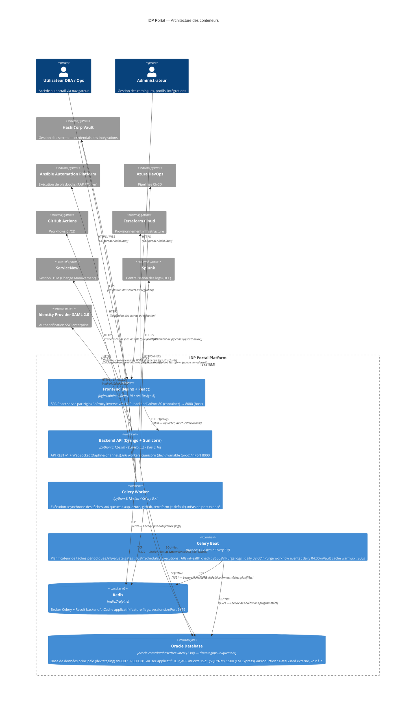
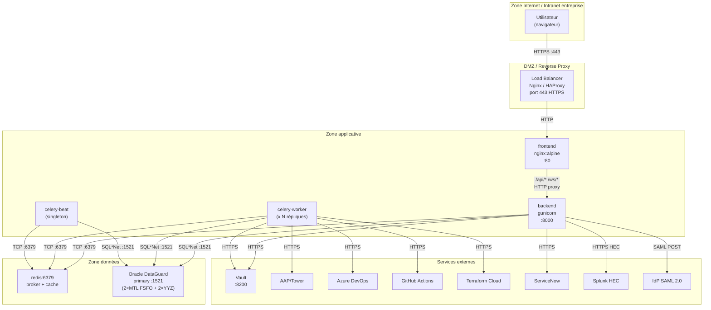
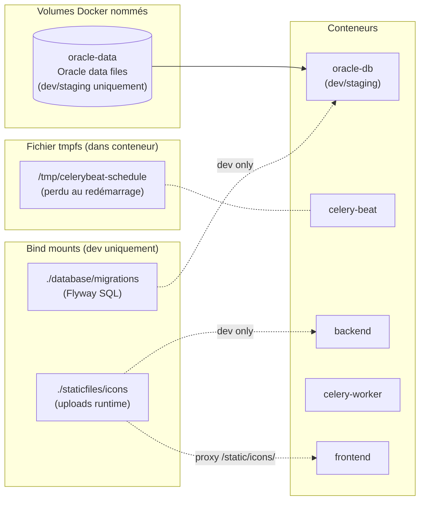
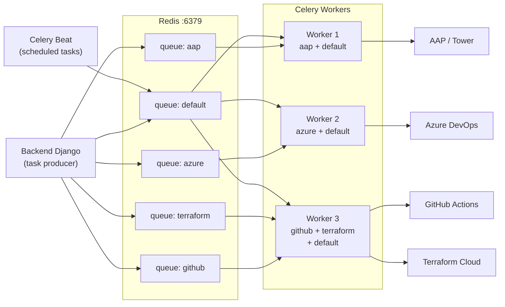
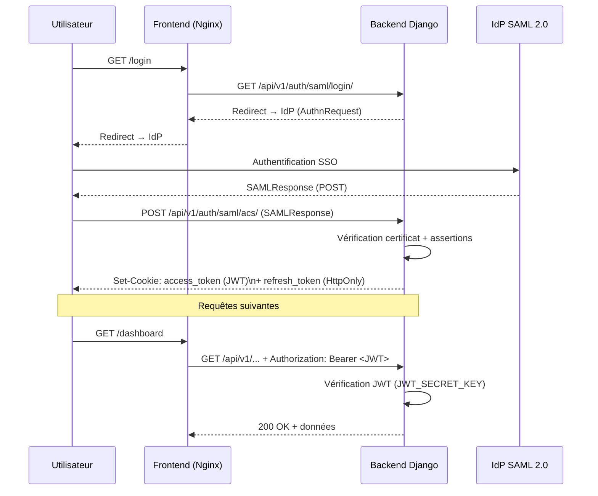
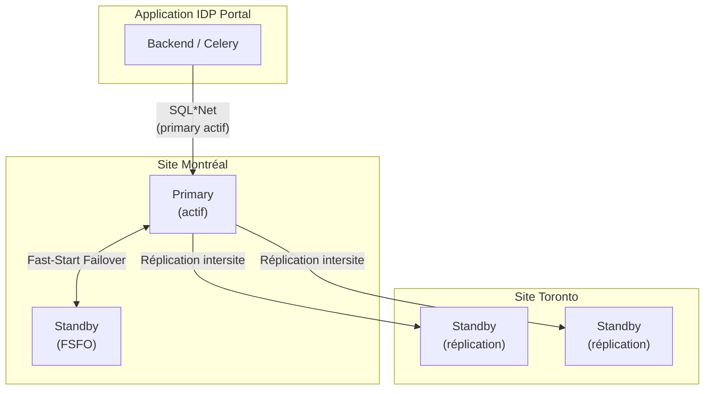

# Architecture des conteneurs — IDP Portal

> Document généré le 2026-03-01
> Audience : équipes Architecture, DevOps, Support production

---

## Contexte : Production vs Dev/Staging

| Environnement | Base de données Oracle |
|---------------|------------------------|
| **Dev / Staging** | Conteneur `oracle-db` (oracle.com/database/free:latest) |
| **Production** | **Pas de conteneur** — Oracle DataGuard (4 instances : 2 Montréal + 2 Toronto) |

Voir [§ 7. Architecture base de données production](#7-architecture-base-de-données-production) pour les détails de la configuration DataGuard.

---

## 1. Vue d'ensemble — Diagramme C4 niveau Container



---

## 2. Diagramme des flux réseau (production)

> **Production :** Oracle est externe (DataGuard). Le bloc `ORA` représente le primary DataGuard, non un conteneur.



---

## 3. Diagramme des volumes et persistance

> **Production :** Pas de volume `oracle-data` — Oracle DataGuard est externe.

> **Correction :** Le volume `celery-beat-data` mentionné dans d'anciennes versions de ce document **n'existe pas** dans le `docker-compose.yml`. Le fichier schedule de Celery Beat est stocké en `/tmp/celerybeat-schedule` à l'intérieur du conteneur (tmpfs) — non persisté entre les redémarrages.



---

## 4. Diagramme des files Celery



---

## 5. Diagramme d'authentification SAML + JWT



---

## 6. Décisions architecturales clés

| # | Décision | Justification |
|---|----------|---------------|
| 1 | Django 5.2 + DRF | Migration depuis FastAPI (fév. 2026) — meilleure intégration ORM/Admin/RBAC |
| 2 | Oracle 23ai | Contrainte d'entreprise — compatibilité avec parc DB existant |
| 3 | Gunicorn sync workers | Stabilité pour requêtes longues (exécutions > 60s) |
| 4 | Daphne/Channels ASGI | WebSocket pour timeline d'exécution temps-réel |
| 5 | Celery + Redis | Découplage exécutions longues (AAP, Terraform) du cycle HTTP |
| 6 | Files par plateforme | Isolation des pannes inter-plateforme, QoS différenciée |
| 7 | HashiCorp Vault | Aucun secret en base (NFR7, NFR21) |
| 8 | Feature flags Redis pub/sub | Invalidation cache cohérente multi-instance |
| 9 | Flyway pour migrations | Gestion versionnée du schéma Oracle indépendante du framework |
| 10 | Nginx SPA + proxy | Pas de CORS en production, routing unifié |
| 11 | Oracle DataGuard (prod) | Pas de conteneur DB en prod — 2× Montréal (FSFO) + 2× Toronto (réplication intersite) |

---

## 7. Architecture base de données production

En production, la base de données Oracle **n'est pas conteneurisée**. Elle repose sur une configuration **Oracle DataGuard** :



| Site | Nombre d'instances | Configuration | Rôle |
|------|-------------------|---------------|------|
| **Montréal** | 2 | FSFO (Fast-Start Failover) | Primary + Standby local — basculement automatique rapide |
| **Toronto** | 2 | Réplication intersite | Standby distant — continuité d'activité (DR) |

**Points clés :**
- L'application se connecte au **primary actif** via `ORACLE_HOST` / `ORACLE_SERVICE_NAME` (résolu par le DBA ou TNS)
- En cas de panne du primary à Montréal : FSFO bascule vers le standby local
- En cas de perte du site Montréal : basculement DR vers Toronto (géré par DBA)

---

## 8. Description détaillée des conteneurs

> Cette section décrit précisément le rôle, la configuration et les interactions de chaque conteneur du `docker-compose.yml`. Elle est destinée aux ops, administrateurs et nouveaux contributeurs souhaitant comprendre l'architecture sans lire les fichiers sources.

### 8.0 Réseau Docker — `idp-network`

**Driver :** `bridge`
**Nom :** `idp-network`

Tous les conteneurs sont connectés au même réseau bridge `idp-network`. Docker fournit une résolution DNS interne : chaque conteneur est accessible depuis les autres via son **nom de service** (ou son `hostname` si explicitement défini).

| Service | Hostname Docker | Port interne | Accès depuis l'hôte |
|---------|----------------|-------------|---------------------|
| `redis` | `redis` | 6379 | `127.0.0.1:6379` (accès local uniquement) |
| `oracle-db` | `oracle-db` | 1521 / 5500 | `127.0.0.1:1521`, `127.0.0.1:5500` (accès local uniquement) |
| `backend` | `backend` | 8000 | `0.0.0.0:8000` (accessible depuis l'extérieur en dev) |
| `celery-worker` | — (pas de hostname) | — | — (pas de port exposé) |
| `celery-beat` | — (pas de hostname) | — | — (pas de port exposé) |
| `frontend` | `frontend` | 8080 | `0.0.0.0:8080` (accessible depuis l'extérieur en dev) |

**Points importants :**
- `redis` et `oracle-db` sont liés à `127.0.0.1` côté hôte (sécurité — accès local dev uniquement, pas d'exposition réseau).
- `backend` et `frontend` sont exposés sur `0.0.0.0` en dev — en production, l'accès passe par un Load Balancer externe (HAProxy / Nginx).
- `oracle-db` possède un `hostname` explicite (`oracle-db`) car les autres conteneurs l'utilisent dans leur DSN : `ORACLE_DSN=oracle-db:1521/FREEPDB1`.

---

### 8.1 Conteneur `redis`

**Image :** `redis:7.4-alpine`
**Nom :** `idp-redis`
**Port :** `127.0.0.1:6379:6379`
**Restart :** `unless-stopped`
**Health check :** `redis-cli ping` (interval 10s, timeout 5s, retries 5, start_period 10s)

#### Rôle

Redis est le **bus de communication asynchrone** central de la plateforme. Il remplit trois fonctions distinctes, chacune isolée dans une base Redis séparée :

| Base Redis | URL | Utilisation |
|-----------|-----|-------------|
| **DB 0** | `redis://redis:6379/0` | **Broker Celery** (`CELERY_BROKER_URL`) + **Result backend** (`CELERY_RESULT_BACKEND`) — files d'attente des tâches et stockage des résultats |
| **DB 1** | `redis://redis:6379/1` | **Cache applicatif Django** (`REDIS_URL`) — feature flags, sessions, cache de vues |
| **DB 2** | `redis://redis:6379/2` | **Django Channels layer** (`CHANNEL_REDIS_URL`) — pub/sub WebSocket pour les mises à jour d'exécution en temps réel |

#### Persistance

Redis **ne persiste pas les données sur disque** (aucun volume configuré). En cas de redémarrage du conteneur :
- Les files Celery sont vidées — les workers doivent re-consommer les tâches en attente depuis Oracle (via la colonne `status = RUNNABLE_STEPS`).
- Le cache applicatif est réinitialisé (impact faible : les données sont recalculées à la demande).
- Le layer Channels est réinitialisé (les WebSockets ouverts se déconnectent et se reconnectent automatiquement côté client).

---

### 8.2 Conteneur `oracle-db`

**Image :** `container-registry.oracle.com/database/free:${ORACLE_IMAGE_TAG:-latest}` (Oracle 23ai Free)
**Nom :** `dbops-oracle`
**Hostname Docker :** `oracle-db`
**Ports :** `127.0.0.1:1521:1521` (SQL\*Net), `127.0.0.1:5500:5500` (EM Express)
**Volume :** `oracle-data` → `/opt/oracle/oradata` (volume nommé `dbops-oracle-data`)
**Restart :** `unless-stopped`
**Health check :** `sqlplus echo SELECT 1` (interval 30s, retries 20, **start_period 300s**)

#### Rôle

Oracle 23ai Free est la **base de données relationnelle principale** en environnement de développement et staging. En production, elle est remplacée par une configuration Oracle DataGuard externe (voir §7).

#### Points clés

- **Dev/staging uniquement** — Oracle DataGuard externe est utilisé en production (géré par les DBA).
- **PDB (Pluggable Database) :** `FREEPDB1` — l'application se connecte via `oracle-db:1521/FREEPDB1`.
- **Utilisateur applicatif :** `IDP_APP` — schéma dédié à l'application.
- **Migrations :** gérées par **Flyway** (scripts versionnés dans `database/migrations/`, bind-mounté en dev).
- **`start_period: 300s`** — Oracle 23ai Free peut prendre jusqu'à 5 minutes au premier démarrage (initialisation des datafiles). Ne pas modifier cette valeur, sous peine de health checks prématurément échoués.
- **EM Express (port 5500) :** interface d'administration web Oracle — dev uniquement, ne pas exposer en production.

#### Dépendances amont

Les conteneurs `backend`, `celery-worker` et `celery-beat` déclarent `condition: service_healthy` sur `oracle-db`, ce qui signifie qu'ils **attendent** qu'Oracle soit opérationnel avant de démarrer.

---

### 8.3 Conteneur `backend`

**Image :** Build multi-stage depuis `idp-portal/django_backend/Dockerfile`
**Nom :** `idp-backend`
**Hostname Docker :** `backend`
**Port :** `8000:8000`
**Restart :** `unless-stopped`
**Health check :** `curl -f http://localhost:8000/api/v1/health/`
**Dépend de :** `oracle-db` (healthy), `redis` (healthy)

#### Architecture de l'image (build multi-stage)

| Stage | Image de base | Rôle |
|-------|--------------|------|
| **builder** | `python:3.12-slim` | Compilation des dépendances natives (`lxml`, `xmlsec`, `cryptography`) — outils système : `libxml2-dev`, `libxmlsec1-dev` |
| **runtime** | `python:3.12-slim` | Image finale sans outils de build — utilisateur non-root `idp:1000` |

#### Serveur ASGI

```
gunicorn idp_backend.asgi:application \
  --worker-class uvicorn.workers.UvicornWorker \
  --workers 6 \
  --timeout 60 \
  --graceful-timeout 30 \
  --keep-alive 5
```

> **⚠️ Important :** Le worker class est `uvicorn.workers.UvicornWorker`, **pas** le mode ASGI natif de Gunicorn. Ce choix est délibéré : le mode ASGI natif Gunicorn présente des bugs connus (code de fermeture WebSocket 1005 + channel layer non livré). UvicornWorker est requis pour HTTP + WebSocket Django Channels via ASGI.

- **6 workers** en dev (docker-compose) — la configuration prod peut différer.
- Les workers gèrent à la fois les **requêtes HTTP REST** (`/api/v1/...`) et les **connexions WebSocket** (`/ws/executions/{id}`).

#### Fonctions exposées

- **API REST :** `GET/POST /api/v1/...` — Django REST Framework (DRF 3.16)
- **WebSocket :** `ws[s]://host/ws/executions/{id}` — Django Channels + Redis pub/sub (DB 2)
- **Statiques :** `collectstatic` exécuté au build — icônes des intégrations dans `/staticfiles/icons/`

#### Variables d'environnement clés

| Variable | Valeur dev | Description |
|---------|-----------|-------------|
| `DEBUG` | `true` | Mode debug Django + CORS localhost — **`false` impératif en prod** |
| `AUTH_DEV_BYPASS` | `true` | Login sans LDAP/SAML — **`false` impératif en prod** |
| `SECRET_KEY` | **requis** | Clé de sécurité Django (erreur si absent : `:?`) |
| `JWT_SECRET_KEY` | **requis** | Clé de signature JWT (erreur si absent : `:?`) |
| `ORACLE_DSN` | `oracle-db:1521/FREEPDB1` | Connexion Oracle via hostname Docker |
| `CACHE_BACKEND` | `redis` | Backend du cache applicatif (`redis` ou `locmem`) |
| `REDIS_URL` | `redis://redis:6379/1` | Cache applicatif (DB 1) |
| `CELERY_BROKER_URL` | `redis://redis:6379/0` | Broker Celery (DB 0) |
| `CHANNEL_REDIS_URL` | `redis://redis:6379/2` | Channels WebSocket (DB 2) |
| `RATELIMIT_ENABLED` | `false` | Rate limiting désactivé en dev — **`true` requis en prod** |
| `SIMULATE_EXECUTION_DEV` | `true` | Simule les exécutions (sans AAP/Azure réels) — **`false` en prod** |
| `CELERY_TASK_ALWAYS_EAGER` | `false` | Tâches async (pas synchrones) — évite les timeouts 504 sur `approve` |

> 🔗 Voir la story 87-6 pour la référence exhaustive de toutes les variables d'environnement.

---

### 8.4 Conteneur `celery-worker`

**Image :** Même build multi-stage que `backend` (`idp-portal/django_backend/Dockerfile`)
**Nom :** `idp-celery-worker`
**Port :** Aucun (pas d'exposition réseau)
**Restart :** `unless-stopped`
**Health check :** `celery -A idp_backend inspect ping -d worker@%h --timeout=5`
**Dépend de :** `oracle-db` (healthy), `redis` (healthy)
**Commande :** `celery -A idp_backend worker -Q aap,azure,github,terraform,default --concurrency=8 -n worker@%h`

#### Rôle

Le worker Celery exécute toutes les **tâches asynchrones longues** déclenchées par le backend ou par Celery Beat : déclenchement de jobs AAP/Tower, pipelines Azure DevOps, workflows GitHub Actions, plans Terraform Cloud.

#### Architecture des queues (bulkhead pattern)

Les queues sont isolées par plateforme cible pour éviter qu'une surcharge d'une intégration ne bloque les autres :

| Queue | Plateforme | Tâches principales |
|-------|-----------|-------------------|
| `aap` | Ansible Automation Platform | `trigger_platform_job`, `poll_platform_job_status` |
| `azure` | Azure DevOps | Déclenchement et polling pipelines CI/CD |
| `github` | GitHub Actions | Déclenchement et polling workflows |
| `terraform` | Terraform Cloud | Application de plans Terraform |
| `default` | Interne | Résumés d'exécution, évaluation de gates, cleanup |

**Configuration actuelle :** Un seul worker consomme les 5 queues avec `--concurrency=8` (8 processus Celery).

#### Option workers dédiés (commentée dans docker-compose.yml)

Pour une isolation stricte par plateforme, des workers dédiés peuvent être activés via docker-compose override :

```bash
# Isolation par plateforme — décommenter et adapter via docker-compose.override.yml
celery -A idp_backend worker -Q aap --concurrency=4 -n worker-aap@%h
celery -A idp_backend worker -Q azure --concurrency=2 -n worker-azure@%h
celery -A idp_backend worker -Q github --concurrency=2 -n worker-github@%h
celery -A idp_backend worker -Q terraform --concurrency=2 -n worker-terraform@%h
```

---

### 8.5 Conteneur `celery-beat`

**Image :** Même build multi-stage que `backend` (`idp-portal/django_backend/Dockerfile`)
**Nom :** `idp-celery-beat`
**Port :** Aucun (pas d'exposition réseau)
**Restart :** `unless-stopped`
**Health check :** `pgrep -f 'celery.*beat'`
**Dépend de :** `oracle-db` (healthy), `redis` (healthy)
**Commande :** `celery -A idp_backend beat --loglevel=info --schedule=/tmp/celerybeat-schedule`

#### ⚠️ Contrainte SINGLETON — une seule instance DOIT être active

Celery Beat est le **planificateur de tâches périodiques**. Une seule instance doit être active à tout moment :
- **2 instances actives simultanément → doublon de tâches** : double évaluation des gates (approval, maintenance_window), double déclenchement des exécutions planifiées.
- En développement : Docker Compose garantit l'unicité (1 conteneur).
- En production (Kubernetes) : configurer `replicas: 1` et **ne pas activer HPA** sur ce déploiement.

#### Tâches planifiées

| Tâche | Intervalle par défaut | Variable de configuration | Description |
|-------|----------------------|--------------------------|-------------|
| `evaluate-waiting-gates` | 60s | `CELERY_BEAT_EVALUATE_GATES_INTERVAL` | Évalue les gates en attente (approval, maintenance_window) |
| `process-pending-scheduled-executions` | 60s | `CELERY_BEAT_PROCESS_SCHEDULED_EXECUTIONS_INTERVAL` | Déclenche les exécutions planifiées arrivées à échéance |
| `health-check-all-integrations` | 3600s | `CELERY_BEAT_HEALTH_CHECK_INTERVAL` | Vérifie l'état des intégrations (Vault, AAP, etc.) |
| `warmup-vault-secrets-cache` | 300s | `CELERY_BEAT_VAULT_WARMUP_INTERVAL` | Préchauffe le cache des secrets Vault pour éviter les appels Vault en cours d'exécution |
| `purge-old-platform-logs` | quotidien 03h00 | `CELERY_BEAT_PURGE_LOGS_CRONTAB` | Purge les vieux logs de plateforme (AAP, Azure, etc.) au-delà de la rétention configurée |
| `purge-old-workflow-events` | quotidien 04h00 | `CELERY_BEAT_PURGE_WORKFLOW_EVENTS_CRONTAB` | Purge les événements de workflow de synchronisation UI (rétention : `WORKFLOW_EVENT_RETENTION_DAYS`) |
| `reconcile-stale-executions` | 300s | `CELERY_BEAT_RECONCILE_INTERVAL` | Récupération après crash : réconcilie les exécutions RUNNING orphelines |
| `process-outbox-entries` | 10s | `CELERY_BEAT_OUTBOX_INTERVAL` | Dispatcher outbox : traite les entrées en attente pour une livraison fiable des effets de bord |
| `flush-splunk-logging-handler` | 30s | `CELERY_BEAT_SPLUNK_FLUSH_INTERVAL` | Flush périodique du handler Splunk batch pour les workers Celery |

Les intervalles sont configurables via variables d'environnement (`*_INTERVAL` en secondes) ou **crontab** (variable `CELERY_BEAT_*_CRONTAB` — prioritaire sur `*_INTERVAL` si définie). Mettre l'intervalle à `0` désactive la tâche périodique (`reconcile-stale-executions`, `process-outbox-entries`, `flush-splunk-logging-handler`).

#### Schedule file

`/tmp/celerybeat-schedule` — stocké dans le tmpfs du conteneur, **non persisté** entre les redémarrages. C'est le comportement normal : Beat recrée le schedule au démarrage à partir de la configuration Python.

> **Correction :** Ce fichier n'est **pas** stocké dans un volume nommé `celery-beat-data` (référence erronée dans d'anciennes versions de ce document — corrigée au §3).

---

### 8.6 Conteneur `frontend`

**Image :** Build multi-stage depuis `idp-portal/frontend/Dockerfile`
**Nom :** `idp-frontend`
**Hostname Docker :** `frontend`
**Port :** `8080:8080`
**Restart :** `unless-stopped`
**Health check :** `wget -q --spider http://localhost:8080/`
**Dépend de :** `backend`

#### Architecture de l'image (build multi-stage)

| Stage | Image de base | Rôle |
|-------|--------------|------|
| **builder** | `node:20-alpine` | `npm ci` + `npx vite build --mode docker` — compile les assets React/TypeScript |
| **runtime** | `nginx:alpine` | Sert les assets compilés + proxy vers le backend — utilisateur non-root `nginx` |

> **Mode `docker` vs `production` :** Le mode Vite `docker` configure les URLs d'API sur le même host (sans CORS), contrairement au mode `production` qui peut pointer vers des URLs différentes.

#### Configuration Nginx — Règles de proxy

| Route | Destination | Notes |
|-------|------------|-------|
| `/api/` | `http://backend:8000` | API REST Django — proxy standard |
| `/static/icons/` | `http://backend:8000` | Icônes des intégrations — uploadées à runtime, hors build frontend |
| `/ws/` | `http://backend:8000` | WebSocket — `Upgrade: websocket`, `proxy_read_timeout 7d` (connexions longue durée) |
| `/assets/` | Local nginx | Assets Vite hashés — `Cache-Control: max-age=31536000, immutable` (1 an) |
| `/` (fallback) | Local → `/index.html` | SPA fallback React Router (`try_files $uri /index.html`) |

#### Headers de sécurité

```nginx
X-Frame-Options: SAMEORIGIN
X-Content-Type-Options: nosniff
Referrer-Policy: strict-origin-when-cross-origin
```

#### Compression Gzip

Activée pour : `text/plain`, `text/css`, `text/javascript`, `application/javascript`, `application/json`, `application/xml`, `image/svg+xml`
- Taille minimale : 1024 bytes
- Niveau : 6

#### Headers transmis au backend

- Standard : `Host`, `X-Real-IP`, `X-Forwarded-For`, `X-Forwarded-Proto`
- WebSocket : `Upgrade`, `Connection: upgrade`

---

### 8.7 Tableau récapitulatif — Volumes et persistance

| Chemin / Volume | Type | Utilisé par | Contenu | Persisté ? |
|----------------|------|-------------|---------|------------|
| `oracle-data` (`dbops-oracle-data`) | Named volume | `oracle-db` | Fichiers de données Oracle (`/opt/oracle/oradata`) | ✅ Oui |
| `/tmp/celerybeat-schedule` | Fichier tmpfs conteneur | `celery-beat` | Schedule Celery Beat | ❌ Non (perdu au restart) |
| `./database/migrations` | Bind mount (dev) | `oracle-db` | Scripts SQL Flyway | N/A (source control) |
| `./staticfiles/icons` | Bind mount (dev) | `backend`, `frontend` | Icônes intégrations uploadées à runtime | ❌ Dev uniquement |

---

### 8.8 Différences Dev / Staging vs Production

| Aspect | Dev / Staging | Production |
|--------|-------------|-----------|
| **Base de données Oracle** | Conteneur `oracle-db` (23ai Free) | Oracle DataGuard externe (2×MTL + 2×YYZ) — voir §7 |
| **Volume Oracle** | `oracle-data` (local) | N/A — Oracle géré par DBA |
| **Workers Gunicorn** | 6 (docker-compose) | Variable (configuration prod externe) |
| **`DEBUG`** | `true` | `false` — **impératif** |
| **`AUTH_DEV_BYPASS`** | `true` (login libre) | `false` — **impératif** (SAML/LDAP) |
| **`RATELIMIT_ENABLED`** | `false` | `true` — **impératif** |
| **`SIMULATE_EXECUTION_DEV`** | `true` | `false` — **impératif** |
| **CORS** | `http://localhost:8080` | URL HTTPS production |
| **Load Balancer / TLS** | Direct ports 8080/8000 | LB externe (HAProxy/Nginx) + TLS 443 |
| **Celery workers** | 1 worker multi-queue | Scalable (K8s Deployment, HPA possible) |
| **Celery Beat** | 1 instance Docker | 1 instance K8s (`replicas: 1`, **pas de HPA**) |
| **Exposition réseau** | Ports sur `0.0.0.0` | Derrière LB — conteneurs non exposés directement |

---

> 🔗 **Référence complète des variables d'environnement :** voir la story 87-6 — `docs/operations/environment-variables-reference.md` (à créer).
