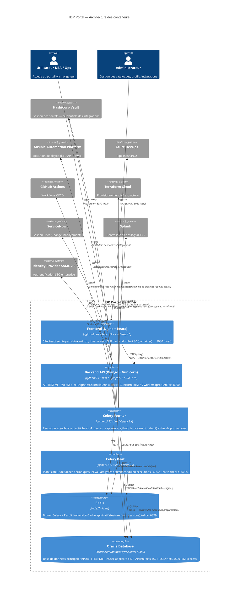
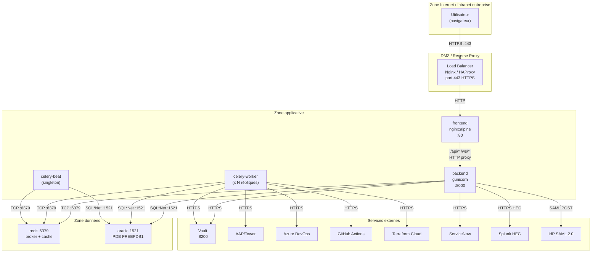
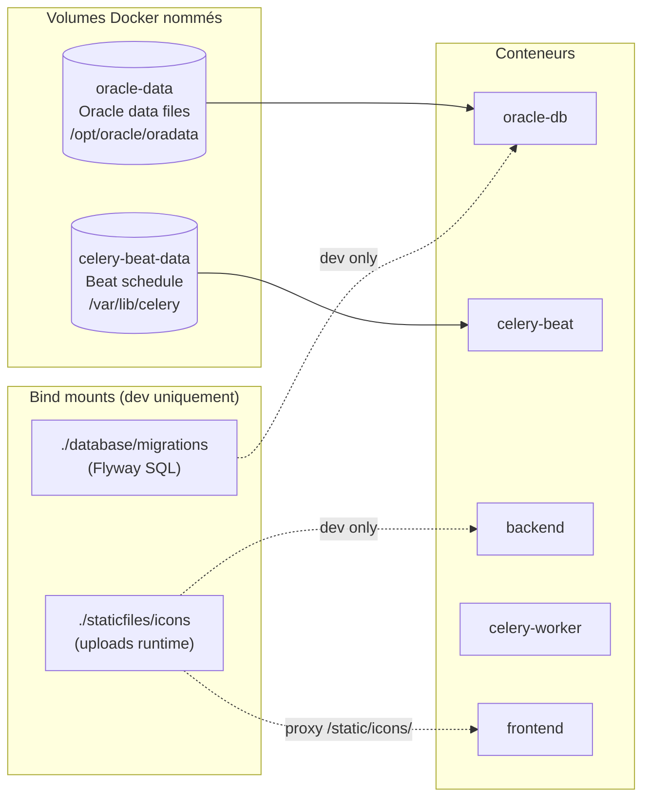
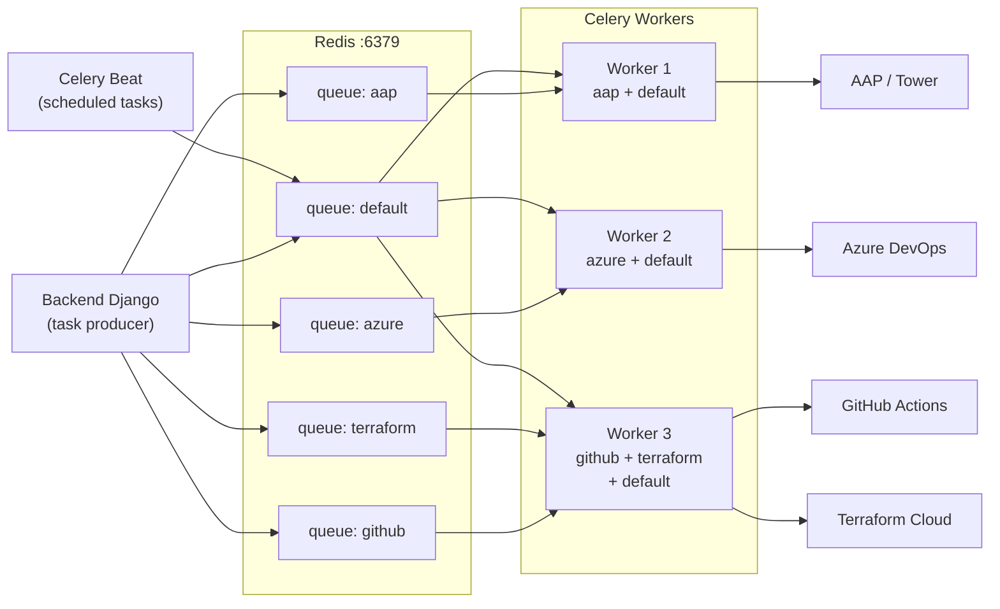
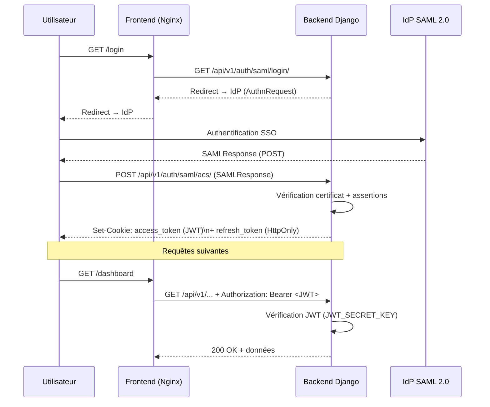

# Architecture des conteneurs — IDP Portal

> Document généré le 2026-03-01
> Audience : équipes Architecture, DevOps, Support production

---

## 1. Vue d'ensemble — Diagramme C4 niveau Container

---

## 2. Diagramme des flux réseau (production)

---

## 3. Diagramme des volumes et persistance

---

## 4. Diagramme des files Celery

---

## 5. Diagramme d'authentification SAML + JWT

---

## 6. Décisions architecturales clés

| # | Décision | Justification |
|---|----------|---------------|
| 1 | Django 5.2 + DRF | Migration depuis FastAPI (fév. 2026) — meilleure intégration ORM/Admin/RBAC |
| 2 | Oracle 23ai | Contrainte d'entreprise — compatibilité avec parc DB existant |
| 3 | Gunicorn sync workers | Stabilité pour requêtes longues (exécutions > 60s) |
| 4 | Daphne/Channels ASGI | WebSocket pour timeline d'exécution temps-réel |
| 5 | Celery + Redis | Découplage exécutions longues (AAP, Terraform) du cycle HTTP |
| 6 | Files par plateforme | Isolation des pannes inter-plateforme, QoS différenciée |
| 7 | HashiCorp Vault | Aucun secret en base (NFR7, NFR21) |
| 8 | Feature flags Redis pub/sub | Invalidation cache cohérente multi-instance |
| 9 | Flyway pour migrations | Gestion versionnée du schéma Oracle indépendante du framework |
| 10 | Nginx SPA + proxy | Pas de CORS en production, routing unifié |
