# Guide Développeur - IDP Portal

Guide de référence pour les développeurs qui supportent et maintiennent l'IDP Portal.

---

## Table des matières

1. [Stack technique](#stack-technique)
2. [Structure du projet](#structure-du-projet)
3. [Backend - Modules Django](#backend---modules-django)
4. [Moteur de workflow (Container Workflow Runtime)](#moteur-de-workflow-container-workflow-runtime)
5. [Step Handlers](#step-handlers)
6. [Système de Gates](#système-de-gates)
7. [Tâches Celery](#tâches-celery)
8. [Frontend - Architecture React](#frontend---architecture-react)
9. [Authentification et RBAC](#authentification-et-rbac)
10. [Base de données et migrations](#base-de-données-et-migrations)
11. [WebSocket et temps réel](#websocket-et-temps-réel)
12. [Mode simulation](#mode-simulation)
13. [Debugging et dépannage](#debugging-et-dépannage)

---

## Stack technique

| Couche | Technologies |
|--------|-------------|
| Frontend | React 19, TypeScript 5.9, Vite 7, Ant Design 6, XYFlow, Recharts |
| Backend | Django 5.2, Django REST Framework, Django Channels 4.3 |
| Async | Celery 5.6, Redis (broker) |
| BD | Oracle 19c+, Flyway (migrations) |
| Auth | SAML 2.0 (python3-saml), JWT, API Keys |
| Logging | structlog (JSON) → Splunk |
| Tests | pytest (backend), vitest + React Testing Library (frontend) |
| Qualité | mypy (strict), ruff, bandit (pre-commit) |

---

## Structure du projet

```
idp-portal/
├── frontend/                      # React SPA
│   ├── src/
│   │   ├── pages/                 # Composants de page (lazy-loaded)
│   │   ├── components/            # Composants UI organisés par feature
│   │   │   ├── catalog/           # Catalogue d'actions
│   │   │   ├── executions/        # Liste d'exécutions
│   │   │   ├── execution/         # Détail d'une exécution
│   │   │   ├── workflow/          # Visualisation de workflow (XYFlow)
│   │   │   ├── admin/             # Gestion admin
│   │   │   ├── audit/             # Journal d'audit
│   │   │   ├── calendar/          # Exécutions planifiées
│   │   │   ├── dashboard/         # Analytics
│   │   │   ├── common/            # Composants réutilisables
│   │   │   ├── layout/            # Header, sidebar, navigation
│   │   │   └── auth/              # Login, routes protégées
│   │   ├── services/              # Clients API (Axios)
│   │   ├── contexts/              # React Context (Auth, Theme, FeatureFlags)
│   │   ├── hooks/                 # Custom hooks (useAuth, useWebSocket, etc.)
│   │   └── types/api/             # Types TypeScript des réponses API
│   └── package.json
│
├── django_backend/                # Django REST API
│   ├── idp_backend/               # Projet Django principal
│   │   ├── settings.py            # Configuration (39KB, très complète)
│   │   ├── urls.py                # Routage principal /api/v1/
│   │   ├── celery.py              # Configuration Celery + Beat schedule
│   │   └── asgi.py                # Point d'entrée ASGI (Daphne)
│   │
│   ├── catalog/                   # Module catalogue d'actions
│   ├── executions/                # Module exécutions (le plus volumineux)
│   ├── integrations/              # Module intégrations externes
│   ├── profiles/                  # Module RBAC et profils
│   ├── idp_auth/                  # Module authentification
│   ├── inventory/                 # Module inventaire/cibles
│   ├── core/                      # Module transversal (audit, DI, middleware)
│   ├── output_schemas/            # Schémas de sortie YAML
│   ├── reference/                 # Données de référence
│   └── capabilities/              # Capacités système
│
├── database/                      # Schéma Oracle
│   ├── baseline/                  # baseline_flyway.sql (schéma complet)
│   ├── migrations/                # V000.sql à V136.sql (incrémentales)
│   └── init/                      # Scripts d'initialisation
│
└── docker-compose.yml             # Orchestration locale
```

---

## Backend - Modules Django

### Vue d'ensemble des modules et leurs interactions

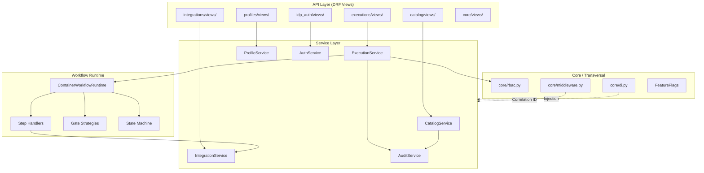

### Catalogue (`catalog/`)

**Responsabilité** : Gestion du cycle de vie des actions et de leurs définitions de workflow.

| Fichier | Rôle |
|---------|------|
| `models.py` | Modèle `Action` (ACTIONS_CATALOG), `ActionTag`, `Tag` |
| `models_workflow_definition.py` | Modèles `WorkflowDefinition`, `WorkflowStep`, `WorkflowStepEdge` |
| `services.py` | `CatalogService` - CRUD actions, sync tags, import/export YAML |
| `workflow_definition_repository.py` | Accès aux définitions de workflow (pattern Repository) |
| `views/` | ViewSets DRF pour l'API catalogue |
| `urls.py` | Routes `/api/v1/catalog/` et `/api/v1/admin/actions/` |

**Points clés** :
- Une `Action` peut être simple (un seul job plateforme) ou container (workflow multi-étapes)
- Le champ `is_container` détermine si l'action utilise le Container Workflow Runtime
- Les actions ont un statut `DRAFT` / `PUBLISHED` — seules les publiées sont exécutables
- L'import/export YAML permet la gestion Config-as-Code

### Exécutions (`executions/`)

**Responsabilité** : Le coeur du système — orchestration, exécution et suivi des workflows.

```
executions/
├── models.py                      # Execution, ExecutionStep, WorkflowEvent, etc.
├── services.py                    # ExecutionService principal
├── container_workflow_runtime.py   # Moteur de workflow DAG (83KB, fichier central)
├── container_routing.py           # Résolution des chemins dans le DAG
├── container_parallel.py          # Gestion des branches parallèles et join policies
├── simulation_service.py          # Mode simulation (dev)
├── cancellation_cache.py          # Cache Redis pour cascades d'annulation
├── output_extractor.py            # Extraction des outputs de plateforme
├── template_resolver.py           # Résolution Jinja2 des mappings input/output
├── dtos.py                        # Data Transfer Objects
│
├── domain/
│   └── state_machine.py           # Validation des transitions d'état
│
├── services/                      # Sous-services spécialisés
│   ├── event_service.py           # Event sourcing (WORKFLOW_EVENTS)
│   ├── command_service.py         # Commands durables (WORKFLOW_COMMANDS)
│   └── runnable_steps_service.py  # Work queue (RUNNABLE_STEPS)
│
├── step_handlers/                 # Exécuteurs par type d'étape
│   ├── registry.py                # Registre des handlers
│   ├── gate_handler.py            # Traitement des gates
│   ├── evaluation_handler.py      # Évaluation Jinja2
│   ├── http_request_handler.py    # Appels HTTP externes
│   ├── service_call_handler.py    # Invocation d'actions enfants
│   └── condition_evaluator.py     # Évaluation des conditions d'étape
│
├── gates/                         # Système de gates
│   ├── definitions.py             # Types de gates (Approval, Condition, Sensor)
│   ├── strategies.py              # Stratégies d'évaluation par type
│   └── registry.py                # Registre des stratégies
│
├── tasks/                         # Tâches Celery asynchrones
│   ├── trigger.py                 # trigger_action_execution, trigger_platform_job
│   ├── gates.py                   # evaluate_waiting_gates
│   ├── polling.py                 # poll_execution_status, poll_platform_output
│   ├── scheduled.py               # process_pending_scheduled_executions
│   ├── reconcile.py               # reconcile_workflow (réparation)
│   ├── outbox_dispatcher.py       # dispatch_outbox_events
│   ├── orchestration_worker.py    # Worker d'orchestration
│   └── cleanup.py                 # Nettoyage des données expirées
│
├── views/                         # ViewSets DRF
├── utils/
│   ├── websocket_broadcast.py     # Diffusion WebSocket
│   └── workflow_parsing.py        # Parsing de DAG, détection d'entrées
│
└── tests/                         # 100+ fichiers de tests
```

### Intégrations (`integrations/`)

**Responsabilité** : Connexion et communication avec les plateformes externes.

| Fichier | Rôle |
|---------|------|
| `models.py` | Modèle `Integration`, `IntegrationTypeCatalogue` |
| `services.py` | `IntegrationService` - CRUD, health checks, appels API plateformes |
| `tasks.py` | Tâche Celery pour health checks périodiques |

**Types d'intégration supportés** : AAP, Tower, ServiceNow, GitHub Actions, Azure DevOps, Terraform Cloud, Vault.

Les credentials sont stockés chiffrés. Chaque intégration expose des opérations spécifiques (launch job, get status, etc.) mappées aux actions via `INTEGRATION_ACTIONS`.

### Profils (`profiles/`)

**Responsabilité** : Gestion RBAC — qui peut faire quoi sur quelles cibles.

| Fichier | Rôle |
|---------|------|
| `models.py` | Modèle `Profile` (rôles, flags admin/auditor/approver) |
| `models_action_normalized.py` | `ProfileActionPermission` (V130-V131) |
| `models_target_normalized.py` | `ProfileTargetPermission` (V132-V136) |
| `services.py` | `ProfileService` - Gestion des permissions |

### Authentification (`idp_auth/`)

| Fichier | Rôle |
|---------|------|
| `authentication.py` | Classes d'authentification DRF (JWT, API Key) |
| `services.py` | `AuthService` - SAML flow, JWT issuing, API key exchange |
| `saml_config.py` | Configuration SAML 2.0 |
| `models.py` | Modèle `User`, `ApiKey` |

### Core (`core/`)

| Fichier | Rôle |
|---------|------|
| `services.py` | `AuditService` - Écriture audit log |
| `rbac.py` | Vérification des permissions RBAC |
| `di.py` | Container d'injection de dépendances |
| `middleware.py` | Correlation ID, DB resilience, rate limiting |
| `models.py` | `AuditLog`, `FeatureFlag` |
| `fields.py` | `OracleJSONField` (champ JSON pour Oracle) |

---

## Moteur de workflow (Container Workflow Runtime)

Le fichier `container_workflow_runtime.py` est le coeur du système. C'est lui qui orchestre l'exécution des workflows multi-étapes.

### Fonctionnement

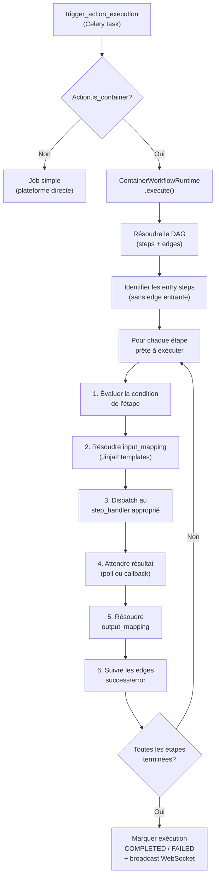

### Concepts clés

**DAG (Directed Acyclic Graph)** : Le workflow est un graphe orienté sans cycle. Les étapes sont les noeuds, les edges définissent les transitions (success/error).

**Entry Steps** : Les étapes sans edge entrante sont les points d'entrée du workflow. Elles sont exécutées en premier.

**Join Policy** : Quand plusieurs branches convergent vers une même étape, la `join_policy` détermine quand l'étape peut s'exécuter (toutes les branches terminées vs. première branche terminée).

**Exécutions enfants** : Pour les étapes `service_call`, le runtime crée une exécution enfant (avec `parent_execution_id`) qui est elle-même un workflow complet. Cela permet la traçabilité et l'annulation en cascade.

**Loop Detection** : Le runtime détecte les boucles infinies pour éviter les exécutions récursives.

### Exemple de workflow DAG

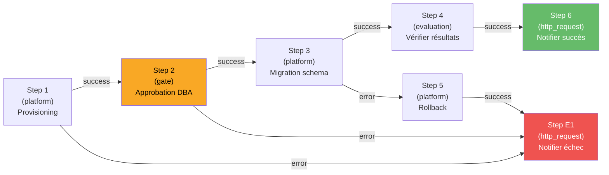

---

## Step Handlers

Chaque type d'étape de workflow a un handler dédié, enregistré dans le registre `step_handler_registry`.

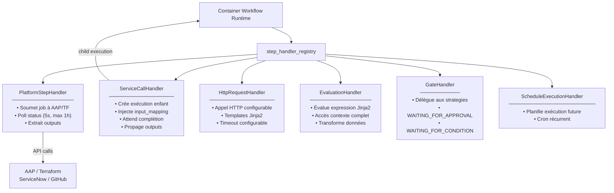

---

## Système de Gates

### Architecture

```
gates/
├── definitions.py    # GateType enum (APPROVAL, CONDITION, SENSOR)
├── strategies.py     # GateStrategy (interface) + implémentations
└── registry.py       # Mapping type → stratégie
```

### Flux des gates

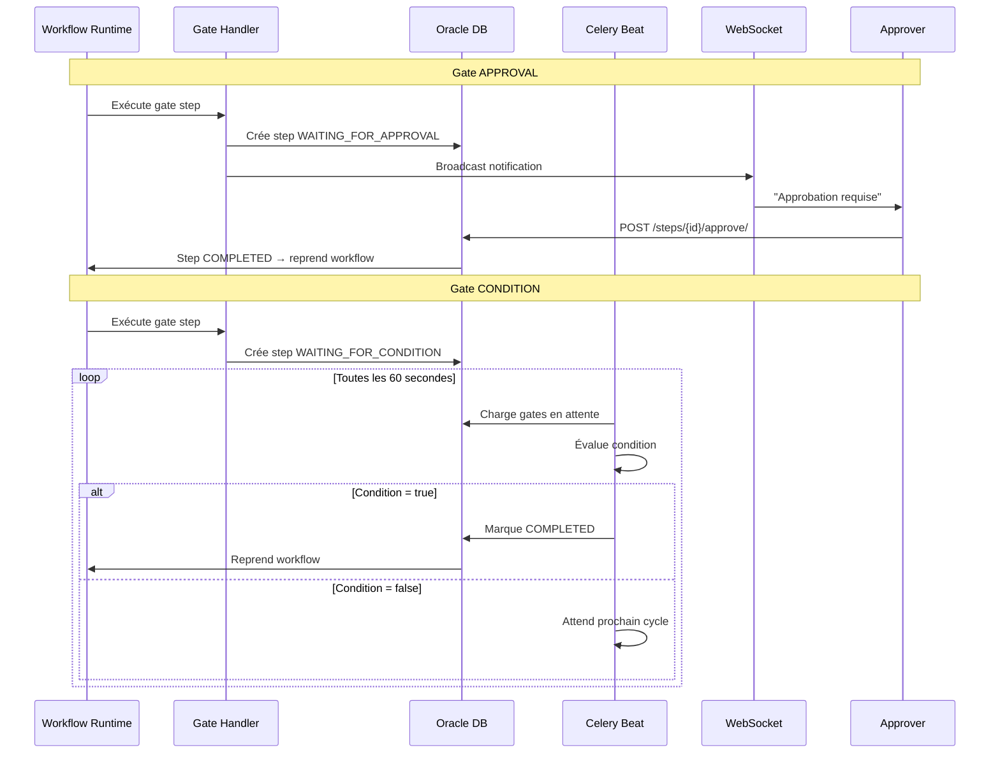

---

## Tâches Celery

### Vue d'ensemble

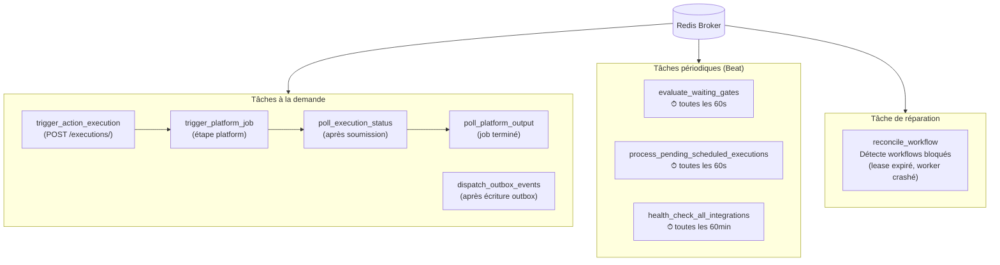

### Tâches déclenchées à la demande

| Tâche | Déclencheur | Rôle |
|-------|-------------|------|
| `trigger_action_execution` | POST /executions/ | Exécute une action complète |
| `trigger_platform_job` | Étape platform | Soumet un job à la plateforme |
| `poll_execution_status` | Après soumission | Poll le statut d'un job plateforme |
| `poll_platform_output` | Job terminé | Récupère les outputs de la plateforme |
| `dispatch_outbox_events` | Après écriture outbox | Publie les événements en attente |

### Tâches périodiques (Celery Beat)

| Tâche | Fréquence | Rôle |
|-------|-----------|------|
| `evaluate_waiting_gates` | 60 secondes | Évalue les gates CONDITION/SENSOR |
| `process_pending_scheduled_executions` | 60 secondes | Déclenche les exécutions planifiées |
| `health_check_all_integrations` | 60 minutes | Vérifie la connectivité des intégrations |

### Tâche de réparation

| Tâche | Rôle |
|-------|------|
| `reconcile_workflow` | Détecte et répare les workflows bloqués (lease expiré, worker crashé) |

---

## Frontend - Architecture React

### Architecture des composants

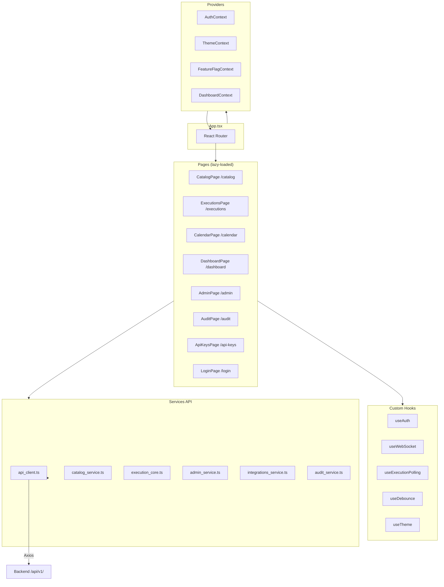

### Pages principales

| Page | Route | Accès |
|------|-------|-------|
| `CatalogPage` | `/catalog` | Tous |
| `ExecutionsPage` | `/executions` | Tous |
| `CalendarPage` | `/calendar` | Admin |
| `DashboardPage` | `/dashboard` | Admin |
| `AdminPage` | `/admin` | Admin |
| `AuditPage` | `/audit` | Auditor+ |
| `ApiKeysPage` | `/api-keys` | Tous |
| `LoginPage` | `/login` | Public |

### Services API (`services/`)

Chaque module backend a un service frontend correspondant :

| Service | Endpoint | Fichier |
|---------|----------|---------|
| `api_client.ts` | Base HTTP (retry, throttle, auth headers) | Client générique |
| `catalog_service.ts` | `/api/v1/catalog/*` | Actions & tags |
| `execution_core.ts` | `/api/v1/executions/*` | Exécutions & steps |
| `admin_service.ts` | `/api/v1/admin/*` | Administration |
| `profiles_service.ts` | `/api/v1/admin/profiles/*` | Profils RBAC |
| `integrations_service.ts` | `/api/v1/integrations/*` | Intégrations |
| `audit_service.ts` | `/api/v1/audit/*` | Audit log |
| `dashboard_service.ts` | Analytics | Statistiques |
| `scheduled_execution_service.ts` | `/api/v1/scheduled-executions/*` | Planification |

### Contexts React

| Context | Rôle | Données |
|---------|------|---------|
| `AuthContext` | État d'authentification | user, permissions, navigation_tabs |
| `ThemeContext` | Thème clair/sombre | mode, toggle() |
| `DashboardContext` | Stats temps réel | compteurs, rafraîchissement auto |
| `FeatureFlagContext` | Feature toggles | flags actifs depuis l'API |

### Hooks personnalisés

| Hook | Rôle |
|------|------|
| `useAuth()` | Accès à l'utilisateur courant, permissions, état de connexion |
| `useWebSocket()` | Connexion WebSocket pour les mises à jour temps réel |
| `useExecutionPolling()` | Polling de statut d'exécution (fallback si WebSocket indisponible) |
| `useDebounce()` | Anti-rebond pour les champs de recherche |
| `useTheme()` | Gestion du thème et mode effectif |

---

## Authentification et RBAC

### Flux d'authentification

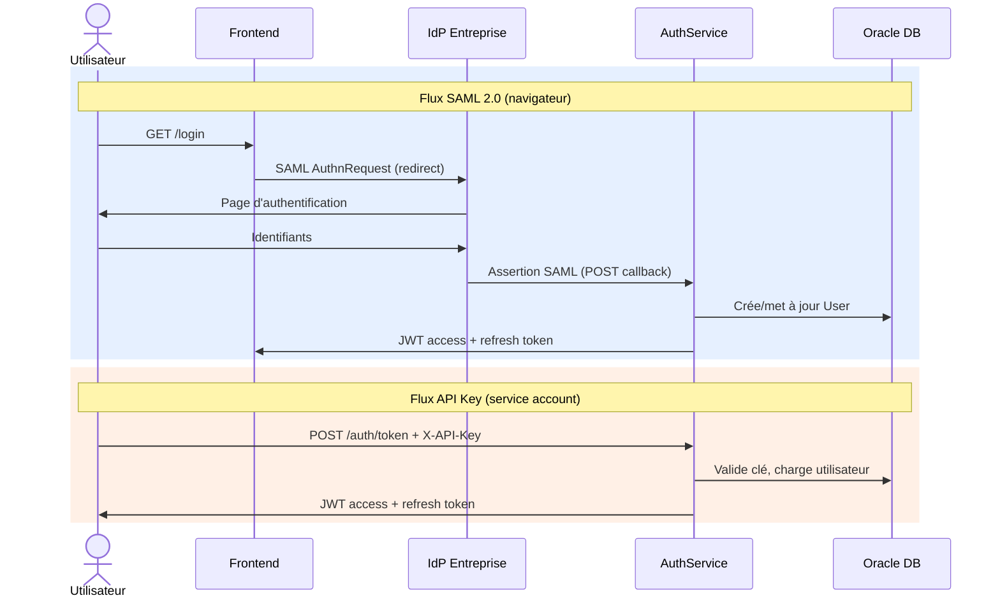

### Vérification RBAC

La vérification se fait à deux niveaux :
1. **Permission d'action** : L'utilisateur (via son profil) a-t-il le droit d'exécuter cette action ?
2. **Permission de cible** : L'utilisateur a-t-il le droit d'opérer sur cette cible/serveur ?

Le RBAC est vérifié dans `ExecutionService.validate_execution_context()` avant chaque exécution.

### Dev Bypass

En développement local (`AUTH_DEV_BYPASS=true`), l'authentification est contournée pour faciliter le dev. Ne jamais activer en production.

---

## Base de données et migrations

### Flyway

Les migrations sont dans `database/migrations/V*.sql` (V000 à V136). Chaque migration est idempotente.

**Conventions** :
- Nommage : `V{numéro}__{description}.sql`
- Le baseline complet est dans `database/baseline/baseline_flyway.sql`
- Les modèles Django sont `managed = False` (le schéma est géré par Flyway, pas par Django)

### Partitionnement Oracle

| Table | Stratégie | Clé |
|-------|-----------|-----|
| `EXECUTIONS` | Range mensuel | `CREATED_AT` |
| `EXECUTION_STEPS` | Reference-partitioned | FK vers `EXECUTIONS` |
| `AUDIT_LOG` | Range mensuel | `TIMESTAMP` |

Le partitionnement permet des performances de requête constantes même avec des millions d'enregistrements.

### OracleJSONField

Le champ `core.fields.OracleJSONField` gère la sérialisation/désérialisation JSON pour les colonnes Oracle JSON (paramètres, mappings, outputs).

---

## WebSocket et temps réel

### Architecture

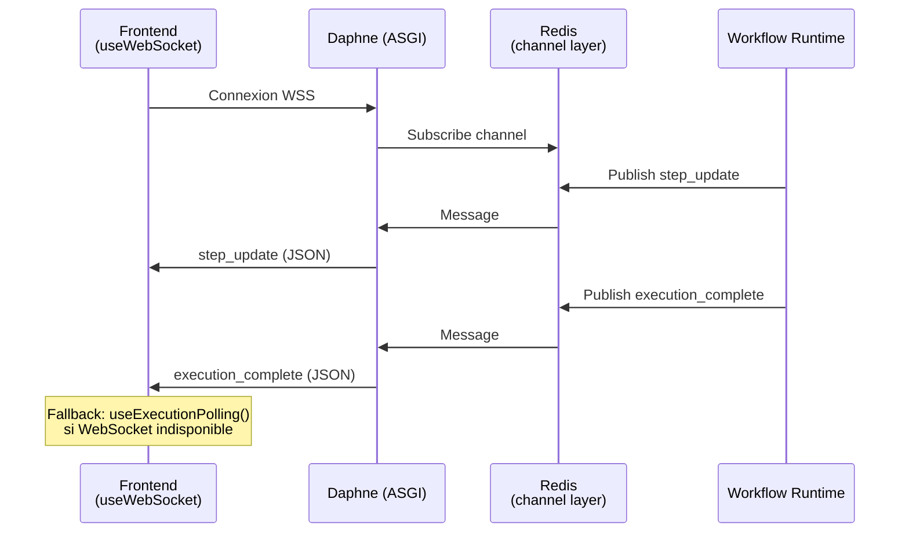

### Événements diffusés

| Événement | Déclencheur | Données |
|-----------|-------------|---------|
| `step_update` | Changement de statut d'une étape | step_id, status, output |
| `execution_complete` | Exécution terminée avec succès | execution_id, status |
| `execution_failed` | Exécution en échec | execution_id, error |

### Implémentation

- Le broadcast est best-effort (ne bloque jamais le runtime en cas d'erreur)
- Le frontend utilise `useWebSocket()` pour écouter les mises à jour
- Fallback : `useExecutionPolling()` si WebSocket est indisponible

---

## Mode simulation

Pour le développement local sans plateformes réelles.

**Variables d'environnement** :
- `SIMULATE_EXECUTION_DEV=true` : Active la simulation
- `SIMULATE_EXECUTION_STEP_DURATION=4` : Durée simulée par étape (secondes)

**Comportement** :
- `SimulationService` remplace les appels réels aux plateformes
- Simule le cycle complet : soumission → running → completed/failed
- Injection aléatoire d'erreurs pour tester la résilience
- Les gates fonctionnent normalement (approbations réelles requises)

---

## Debugging et dépannage

### Arbre de décision diagnostic

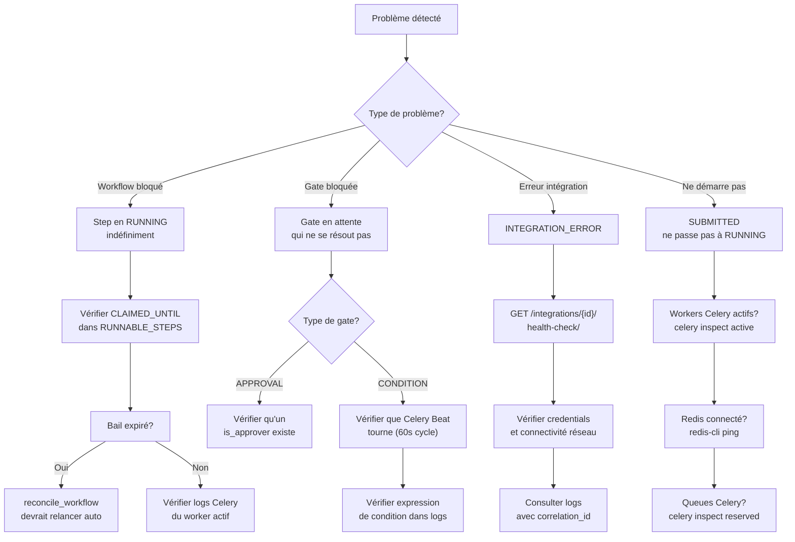

### Outils de diagnostic

| Outil | Commande / URL | Usage |
|-------|----------------|-------|
| Logs structurés | Splunk ou `docker logs` | Recherche par `correlation_id` |
| Celery inspect | `celery -A idp_backend inspect active` | Workers actifs |
| Redis monitoring | `redis-cli monitor` | Activité broker/cache |
| Django admin | `/admin/` (Jazzmin) | Inspection directe des données |
| Swagger UI | `/api/schema/swagger-ui/` | Test interactif des endpoints |
| Audit log | `GET /api/v1/audit/?correlation_id={id}` | Trace complète d'une opération |

### Correlation ID

Chaque requête HTTP reçoit un UUID unique (`correlation_id`) qui est propagé à travers toute la chaîne :

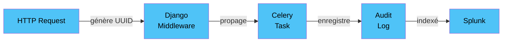

Pour tracer un problème, récupérer le `correlation_id` depuis le header de réponse HTTP ou l'audit log, puis rechercher dans les logs Splunk.

### Variables d'environnement utiles pour le debug

| Variable | Valeur | Effet |
|----------|--------|-------|
| `DEBUG=true` | Dev seulement | Stack traces détaillées |
| `LOG_LEVEL=DEBUG` | | Logs verbeux |
| `SIMULATE_EXECUTION_DEV=true` | | Pas d'appels plateformes réels |
| `AUTH_DEV_BYPASS=true` | Dev seulement | Pas d'authentification requise |
| `RATELIMIT_ENABLED=false` | Dev seulement | Désactive le rate limiting |
