# Architecture des Workflows - IDP Portal

> **Documentation détaillée :** Pour le flow complet avec diagrammes de séquence, opérations BD étape par étape, et implémentation des patterns, voir [workflow-execution-flow.md](./workflow-execution-flow.md).

## Vue d'ensemble

L'IDP Portal est un portail interne de développeur (Internal Developer Platform) conçu pour orchestrer des opérations de bases de données à travers un système de workflows. Il permet aux équipes de déclencher, planifier, approuver et surveiller des actions automatisées sur l'infrastructure de bases de données.

### Architecture globale

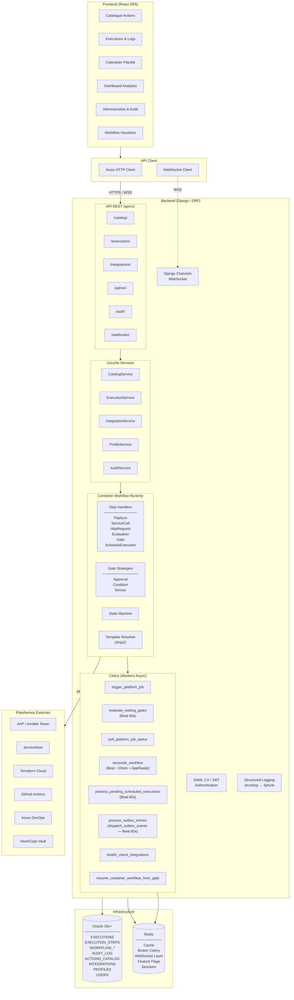

---

## Composants principaux

### 1. Frontend (React SPA)

| Composant | Rôle |
|-----------|------|
| **Catalogue** | Navigation, recherche et filtrage des actions disponibles |
| **Exécutions** | Suivi en temps réel des exécutions, logs par étape, approbations |
| **Calendrier** | Vue calendrier des exécutions planifiées (FullCalendar) |
| **Dashboard** | Analytiques, tendances et statistiques (Recharts) |
| **Administration** | Gestion des actions, profils, intégrations (admin seulement) |
| **Audit** | Consultation et export du journal d'audit (auditeur+) |
| **Workflow Visualizer** | Diagramme interactif du DAG de workflow (XYFlow) |

Technologies : React 19, TypeScript 5.9, Vite 7, Ant Design 6

### 2. Backend (Django REST Framework)

| Module | Rôle |
|--------|------|
| **catalog** | Gestion du catalogue d'actions et définitions de workflows |
| **executions** | Moteur d'exécution, runtime de workflows, gates, step handlers |
| **integrations** | Connexions aux plateformes externes (AAP, ServiceNow, Terraform, etc.) |
| **profiles** | Gestion des profils RBAC et permissions |
| **idp_auth** | Authentification SAML 2.0, JWT, clés API |
| **inventory** | Synchronisation et validation des cibles/hôtes |
| **core** | Audit, feature flags, middleware, injection de dépendances |

Technologies : Django 5.2, DRF, Celery 5.6, Django Channels 4.3

### 3. Base de données (Oracle 19c+)

Migrations gérées par Flyway (V000 à V136). Tables partitionnées mensuellement pour les données volumineuses.

---

## Schéma de la base de données

### Tables principales et leurs relations

```mermaid
erDiagram
    USERS {
        number ID PK
        varchar USERNAME
        varchar EMAIL
        varchar SAML_NAME_ID
        number IS_ACTIVE
        timestamp LAST_LOGIN
    }

    PROFILES {
        number ID PK
        varchar NAME
        number IS_ADMIN
        number IS_AUDITOR
        number IS_APPROVER
        json NAVIGATION_TABS
    }

    PROFILE_ACTION_PERMISSIONS {
        number PROFILE_ID FK
        number ACTION_ID FK
        varchar PERMISSION "ALLOW | DENY"
    }

    PROFILE_TARGET_PERMISSIONS {
        number PROFILE_ID FK
        varchar TARGET_PATTERN
        varchar PERMISSION "ALLOW | DENY"
    }

    ACTIONS_CATALOG {
        number ID PK
        varchar NAME
        clob DESCRIPTION
        varchar ITEM_TYPE
        varchar STATUS "DRAFT | PUBLISHED"
        number IS_CONTAINER
        number INTEGRATION_ID FK
        clob WORKFLOW_TEMPLATE
        number CREATED_BY FK
    }

    INTEGRATIONS {
        number ID PK
        varchar NAME
        varchar INTEGRATION_TYPE
        varchar BASE_URL
        blob CREDENTIALS "encrypted"
        varchar HEALTH_STATUS
        timestamp LAST_HEALTH_CHECK
    }

    WORKFLOW_DEFINITIONS {
        number ID PK
        number ACTION_ID FK "UNIQUE"
        number VERSION
        timestamp CREATED_AT
        timestamp UPDATED_AT
    }

    WORKFLOW_STEPS {
        number ID PK
        number WORKFLOW_DEFINITION_ID FK
        varchar STEP_ID "unique per wf"
        number STEP_ORDER
        varchar STEP_NAME
        varchar STEP_TYPE "platform | service_call | http_request | evaluation | gate | schedule_execution"
        number REFERENCED_ACTION_ID FK
        varchar INTEGRATION_TYPE
        varchar OPERATION
        json INPUT_MAPPING
        json OUTPUT_MAPPING
        varchar CONDITION
        number RETRY_ENABLED
        number RETRY_MAX_ATTEMPTS
        number RETRY_INTERVAL_SECONDS
        number RETRY_BACKOFF_MULTIPLIER
        varchar JOIN_POLICY
    }

    WORKFLOW_STEP_EDGES {
        number ID PK
        number FROM_STEP_ID FK
        number TO_STEP_ID FK
        varchar EDGE_TYPE "success | error"
    }

    EXECUTIONS {
        number ID PK
        number ACTION_ID FK
        number USER_ID FK
        varchar STATUS "SUBMITTED | RUNNING | COMPLETED | FAILED | CANCELLED | REJECTED | INTEGRATION_ERROR"
        number PARENT_EXECUTION_ID FK
        json PARAMETERS
        varchar CORRELATION_ID
        timestamp CREATED_AT
        timestamp UPDATED_AT
    }

    EXECUTION_STEPS {
        number ID PK
        number EXECUTION_ID FK
        varchar STEP_ID
        varchar STEP_TYPE
        varchar STEP_NAME
        varchar CONFIG_STEP_ID "UUID depuis action.execution_steps"
        number STEP_ORDER
        varchar STATUS
        varchar PLATFORM_JOB_ID "ID du job côté plateforme"
        timestamp STARTED_AT
        timestamp COMPLETED_AT
        json OUTPUT
        varchar ERROR_MESSAGE
        number ATTEMPT_NUMBER
    }

    WORKFLOW_EVENTS {
        number ID PK
        number EXECUTION_ID FK
        varchar EVENT_TYPE
        varchar ENTITY_TYPE "execution|step"
        number ENTITY_ID
        json PAYLOAD
        number SEQUENCE_NUM "monotone par execution_id"
        timestamp CREATED_AT
    }

    WORKFLOW_EVENT_COUNTER {
        number EXECUTION_ID PK
        number LAST_SEQUENCE_NUM "SELECT FOR UPDATE pour atomicité"
    }

    RUNNABLE_STEPS {
        number ID PK
        number EXECUTION_STEP_ID FK "UNIQUE"
        number EXECUTION_ID FK
        number PRIORITY
        number STEP_ORDER
        varchar STEP_TYPE
        timestamp CLAIMED_AT
        varchar CLAIMED_BY "worker hostname+pid"
        timestamp CLAIMED_UNTIL "lease expiry = now + 300s"
        number ATTEMPT_NO
        number MAX_ATTEMPTS
        timestamp ELIGIBLE_AT "not-before timestamp"
    }

    EXECUTION_OUTBOX {
        number ID PK
        number EXECUTION_ID FK
        varchar EVENT_TYPE "step_broadcast|execution_notification|approval_granted|..."
        json PAYLOAD
        varchar STATUS "pending|dispatched|failed"
        varchar IDEMPOTENCY_KEY UK "{exec_id}:{event_type}:{discriminator}"
        number ATTEMPT_NO
        number MAX_ATTEMPTS
        text LAST_ERROR
        timestamp DISPATCHED_AT
        timestamp CREATED_AT
    }

    AUDIT_LOG {
        number ID PK
        number USER_ID
        varchar ACTION_TYPE
        varchar ENTITY_TYPE
        number ENTITY_ID
        json CHANGES
        varchar CORRELATION_ID
        timestamp TIMESTAMP
    }

    SCHEDULED_EXECUTIONS {
        number ID PK
        number ACTION_ID FK
        number USER_ID FK
        json PARAMETERS
        timestamp SCHEDULED_AT
        varchar STATUS "pending|executed|cancelled"
        varchar CORRELATION_ID
        number EXECUTION_ID "FK → EXECUTIONS (après exécution)"
        number SOURCE_EXECUTION_ID "FK → EXECUTIONS (si créée via schedule_execution step)"
        timestamp CREATED_AT
    }

    RECURRING_PATTERNS {
        number ID PK
        number SCHEDULED_EXECUTION_ID FK "OneToOne → SCHEDULED_EXECUTIONS"
        varchar PATTERN_TYPE "one_time|daily|weekly|cron"
        clob PATTERN_CONFIG "JSON (cron expression, interval_seconds…)"
        timestamp NEXT_EXECUTION_DATE
        number IS_ACTIVE "0=suspendu, 1=actif"
        timestamp CREATED_AT
    }

    CORE_FEATURE_FLAGS {
        varchar KEY PK
        number IS_ENABLED
        varchar DESCRIPTION
    }

    USERS ||--o{ EXECUTIONS : "déclenche"
    USERS ||--o{ ACTIONS_CATALOG : "crée"
    PROFILES ||--o{ PROFILE_ACTION_PERMISSIONS : "définit"
    PROFILES ||--o{ PROFILE_TARGET_PERMISSIONS : "définit"
    ACTIONS_CATALOG ||--o{ PROFILE_ACTION_PERMISSIONS : "soumise à"
    ACTIONS_CATALOG ||--o| INTEGRATIONS : "utilise"
    ACTIONS_CATALOG ||--o| WORKFLOW_DEFINITIONS : "a une"
    WORKFLOW_DEFINITIONS ||--o{ WORKFLOW_STEPS : "contient"
    WORKFLOW_STEPS ||--o{ WORKFLOW_STEP_EDGES : "from"
    WORKFLOW_STEPS ||--o{ WORKFLOW_STEP_EDGES : "to"
    ACTIONS_CATALOG ||--o{ EXECUTIONS : "exécutée via"
    EXECUTIONS ||--o{ EXECUTION_STEPS : "contient"
    EXECUTIONS ||--o{ WORKFLOW_EVENTS : "génère"
    EXECUTIONS ||--|| WORKFLOW_EVENT_COUNTER : "compteur séquence"
    EXECUTIONS ||--o{ RUNNABLE_STEPS : "planifie"
    EXECUTION_STEPS ||--o| RUNNABLE_STEPS : "step enqueued"
    EXECUTIONS ||--o{ EXECUTION_OUTBOX : "émet"
    EXECUTIONS ||--o| EXECUTIONS : "parent/enfant"
    RECURRING_PATTERNS ||--|| SCHEDULED_EXECUTIONS : "récurrence"
    ACTIONS_CATALOG ||--o{ SCHEDULED_EXECUTIONS : "planifiée pour"
```

> **Note** : Les tables `EXECUTIONS`, `EXECUTION_STEPS` et `AUDIT_LOG` sont partitionnées mensuellement dans Oracle pour les performances.

---

## Cycle de vie d'un workflow

### Processus complet : de la demande à la complétion

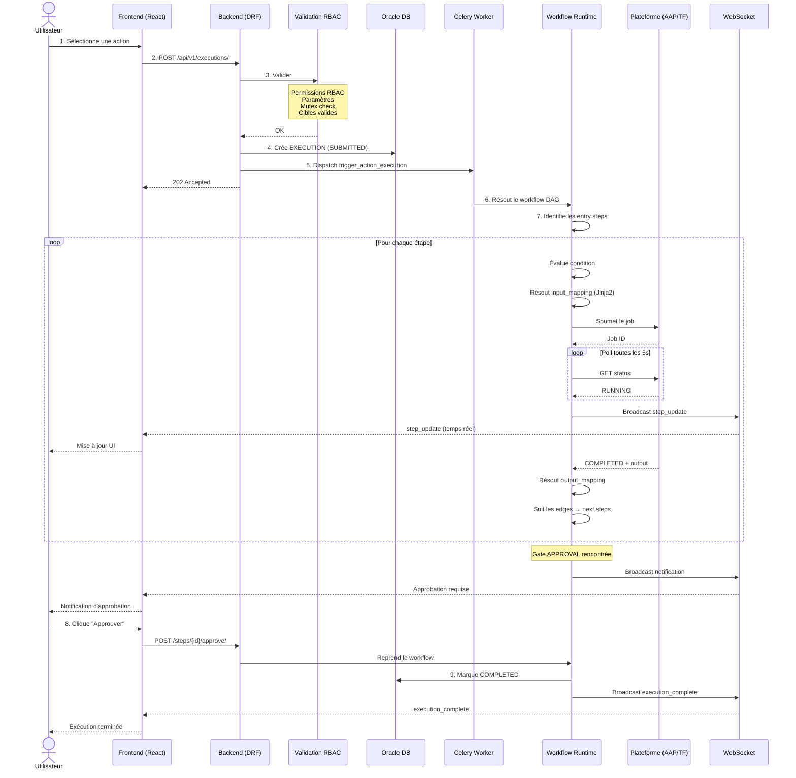

---

## Machine à états des exécutions

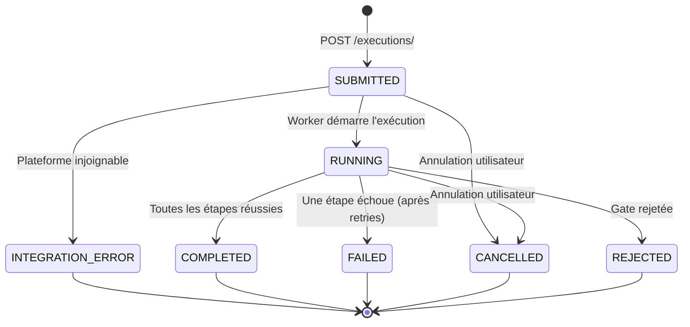

---

## Types d'étapes de workflow

| Type | Description | Exemple |
|------|-------------|---------|
| **platform** | Soumet un job à une plateforme d'automatisation (AAP, Tower, Terraform) | Exécuter un playbook Ansible |
| **service_call** | Invoque une autre action du catalogue (crée une exécution enfant) | Appeler un sous-workflow |
| **http_request** | Effectue un appel HTTP/HTTPS externe | Notifier un webhook |
| **evaluation** | Évalue une expression Jinja2 pour calcul ou transformation | Filtrer des résultats |
| **gate** | Pause l'exécution jusqu'à satisfaction d'une condition | Approbation manuelle |
| **schedule_execution** | Planifie une exécution future | Maintenance planifiée |

---

## Système de Gates (approbations et conditions)

Les gates sont des points de contrôle dans un workflow qui pausent l'exécution :

| Type de Gate | Déclencheur de reprise | Cas d'usage |
|-------------|------------------------|-------------|
| **APPROVAL** | Action humaine (approver clique « Approuver ») | Validation DBA avant migration |
| **CONDITION** | Évaluation automatique toutes les 60s | Attendre qu'un créneau de maintenance soit atteint |
| **SENSOR** | Événement externe (webhook, poll) | Attendre un déploiement CI/CD terminé |

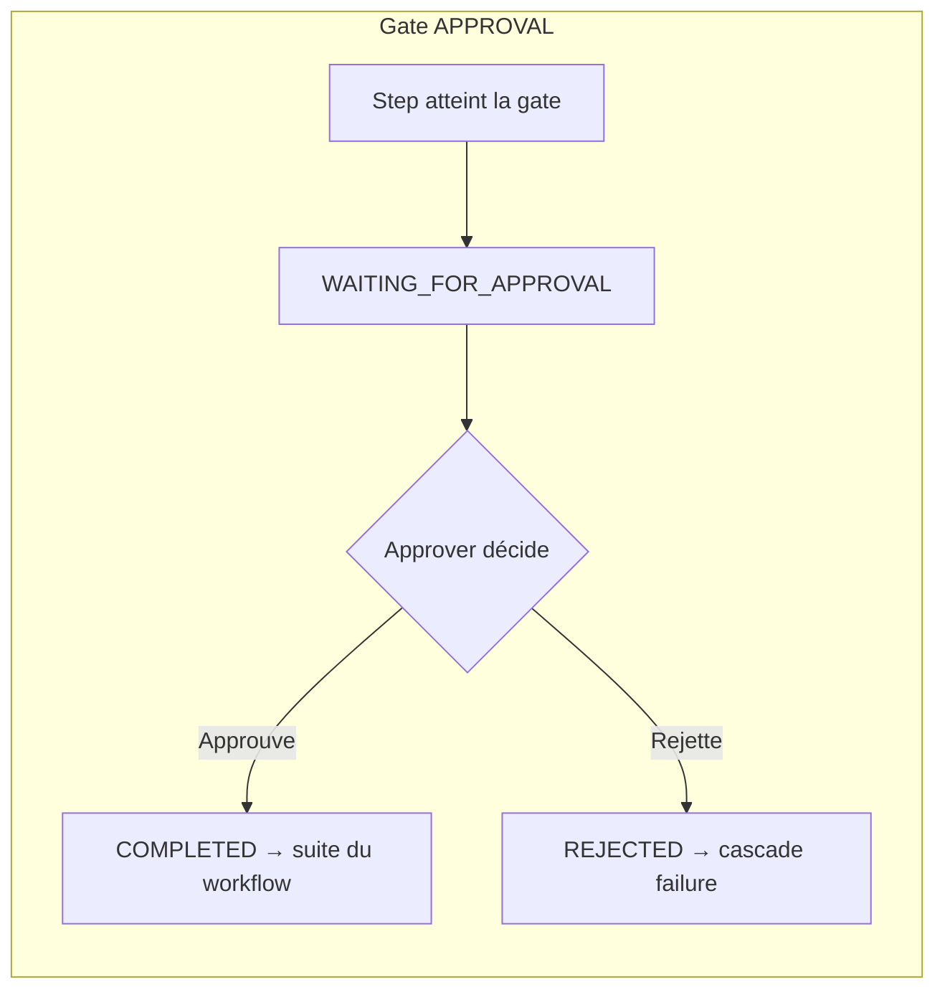

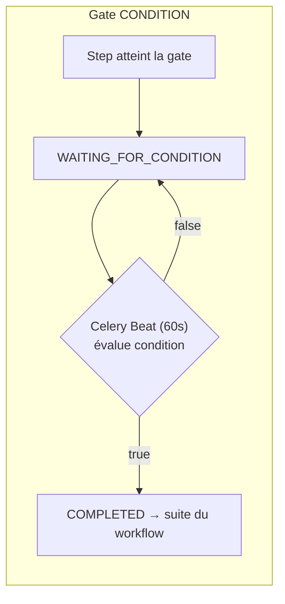

Le Celery Beat évalue les gates en attente toutes les 60 secondes via la tâche `evaluate_waiting_gates`.

---

## Mécanisme de retry

Chaque étape de workflow peut être configurée avec un mécanisme de retry :

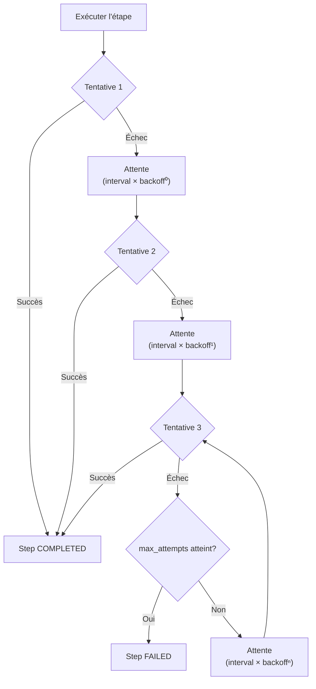

- **retry_max_attempts** : nombre maximum de tentatives
- **retry_interval_seconds** : délai initial entre les tentatives
- **retry_backoff_multiplier** : multiplicateur exponentiel

---

## Exécutions planifiées

Les exécutions peuvent être planifiées pour un moment futur ou de façon récurrente :

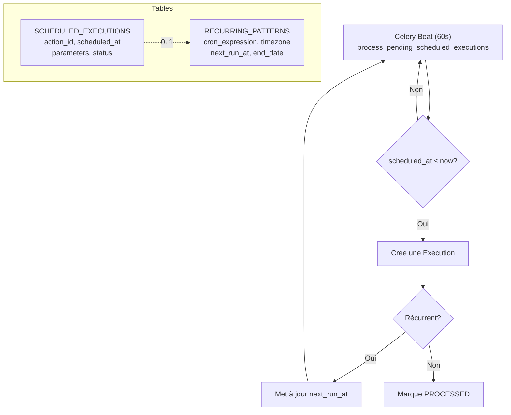

---

## Patterns d'architecture

> Pour le détail complet de chaque pattern (code, séquences, tables BD), voir [workflow-execution-flow.md](./workflow-execution-flow.md).

### Pattern 1 — Event Sourcing (WORKFLOW_EVENTS)

**Problème résolu :** Le WebSocket fire-and-forget — si l'UI se reconnecte, les événements intermédiaires sont perdus.

**Implémentation** : `executions/services/workflow_events.py` — migrations V113 + V122

Chaque changement d'état produit une ligne dans `WORKFLOW_EVENTS` (append-only) avec un numéro de séquence monotone alloué via `SELECT FOR UPDATE` sur `WORKFLOW_EVENT_COUNTER` :

```python
# Allocation atomique (V122 — évite les races sur steps parallèles)
counter = WorkflowEventCounter.objects.select_for_update().get(execution_id=execution_id)
new_seq = counter.last_sequence_num + 1
WorkflowEvent.objects.create(execution_id=execution_id, sequence_num=new_seq, ...)
```

**Catch-up UI sur reconnexion :**
```sql
SELECT * FROM WORKFLOW_EVENTS
WHERE execution_id = 42 AND sequence_num > {last_known_seq}
ORDER BY sequence_num
```

**Criticité des événements :**
- **Critiques** (exception propagée si échec) : `EXECUTION_STATUS_CHANGED`, `STEP_COMPLETED`, `APPROVAL_GRANTED`, etc.
- **Best-effort** (erreur loguée, swallowed) : `STEP_OUTPUT_UPDATED`, `TARGET_ADDED`

### Pattern 2 — Transactional Outbox (EXECUTION_OUTBOX)

**Problème résolu :** Un crash entre l'écriture BD et l'envoi WebSocket laisserait l'UI désynchronisée.

**Implémentation :** `executions/infra/outbox.py` — migration V135

```python
# OBLIGATOIRE : dans transaction.atomic()
with transaction.atomic():
    # 1. Mutation métier
    step.status = 'COMPLETED'
    step.save()
    # 2. Side-effect dans la même transaction
    OutboxService.write_entry(
        execution_id=42,
        event_type='step_broadcast',
        payload={'step_id': 15, 'status': 'COMPLETED'},
        idempotency_key='42:step_broadcast:step_15'  # évite les doublons
    )
# → COMMIT atomique : mutation + outbox entry ensemble
```

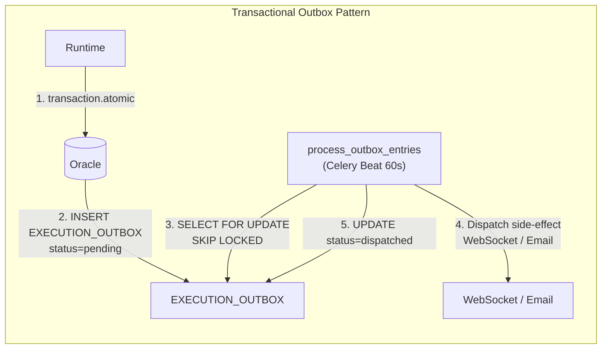

**Garanties :**
- Rollback transaction → outbox entry rollbackée → pas de side-effect orphelin
- `idempotency_key` unique → pas de doublon sur retry
- `attempt_no / max_attempts` → circuit breaker (3 tentatives par défaut)

### Pattern 3 — Work Queue distribué (RUNNABLE_STEPS)

**Problème résolu :** Un worker Celery peut crasher entre le claim et la completion d'une étape.

**Implémentation :** `executions/services/runnable_steps.py` — migration V113

```
Cycle :
  1. ENQUEUE : get_or_create() — idempotent
  2. CLAIM   : SELECT FOR UPDATE SKIP LOCKED WHERE eligible_at <= now
               → claimed_until = now + 300s (RUNNABLE_STEP_LEASE_SECONDS)
               → attempt_no++
  3. EXECUTE : Worker traite l'étape
  4. RELEASE : DELETE (succès)
  5. RECLAIM : Si lease expiré (crash) → autre worker reclaim automatiquement
```

**Garanties :**
- `SKIP LOCKED` : workers concurrents ne se bloquent pas (Oracle 12c+)
- `max_attempts` : circuit breaker contre boucles infinies
- `eligible_at` : not-before semantics (délai d'exécution)

### State Machine
Les transitions d'état des exécutions et étapes sont validées par une machine à états stricte (`domain/state_machine.py`), empêchant les transitions invalides.

---

## Intégrations supportées

| Plateforme | Usage | Protocole |
|------------|-------|-----------|
| **AAP / Ansible Tower** | Exécution de playbooks et job templates | REST API + Token |
| **ServiceNow** | Gestion des changements (ITSM) | REST API + OAuth2 |
| **Terraform Cloud** | Infrastructure as Code | REST API + Token |
| **GitHub Actions** | Workflows CI/CD | Webhooks + PAT |
| **Azure DevOps** | Pipelines | REST API + PAT |
| **HashiCorp Vault** | Récupération de secrets | REST API + Token/AppRole |

Chaque intégration dispose d'un health check automatique toutes les 60 minutes.

---

## Authentification et autorisations

### Flux d'authentification

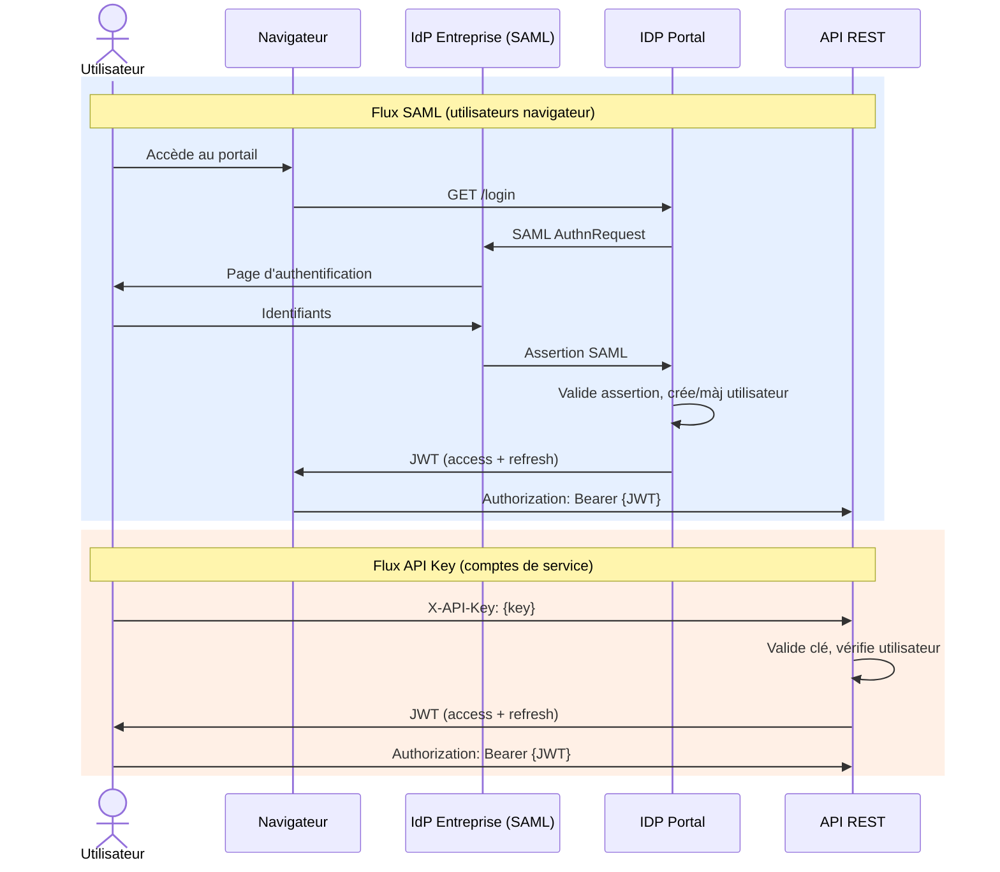

### Modèle RBAC

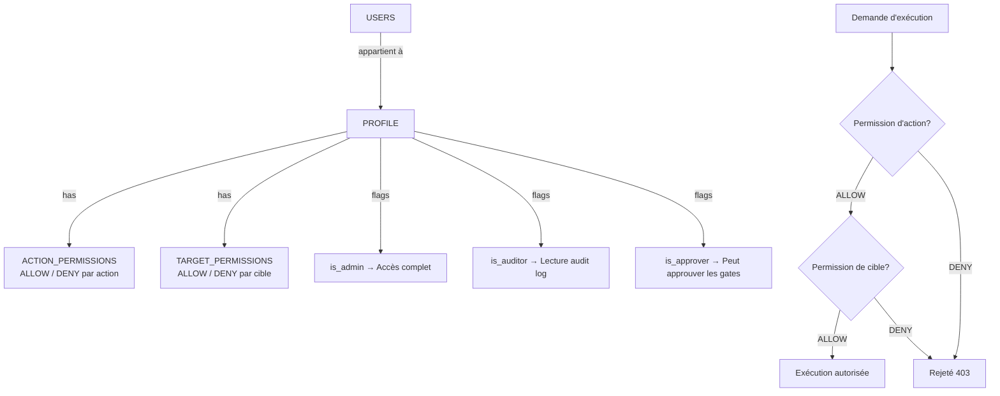

---

## Observabilité

| Aspect | Solution |
|--------|----------|
| **Logs structurés** | structlog → format JSON → Splunk |
| **Correlation ID** | UUID propagé de la requête HTTP → Celery → Audit |
| **Audit Trail** | Table AUDIT_LOG partitionnée, immuable, exportable CSV |
| **WebSocket** | Mises à jour temps réel des statuts d'exécution |
| **Health Checks** | Vérification périodique des intégrations |
| **Feature Flags** | Activation/désactivation de fonctionnalités sans déploiement |

---

## Infrastructure

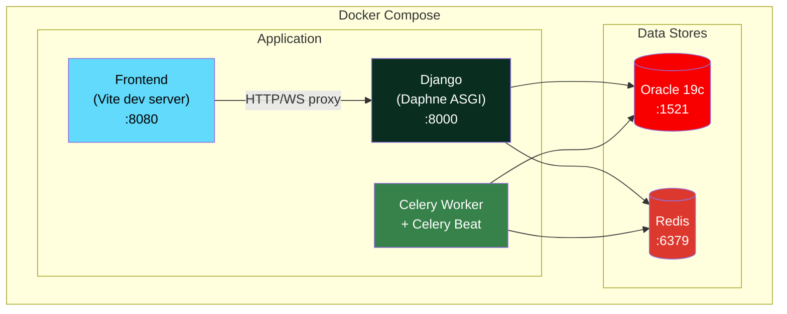

- **Daphne** : Serveur ASGI pour HTTP et WebSocket
- **Celery Worker** : Traitement asynchrone des workflows
- **Celery Beat** : Planificateur de tâches périodiques (gates, schedules)
- **Redis** : Broker Celery, cache, couche WebSocket, feature flags
- **Oracle 19c+** : Base de données principale avec partitionnement et Data Guard
