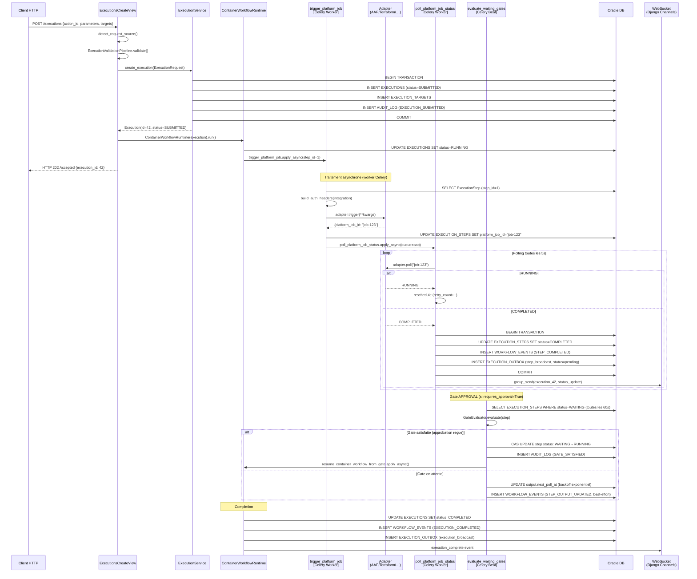
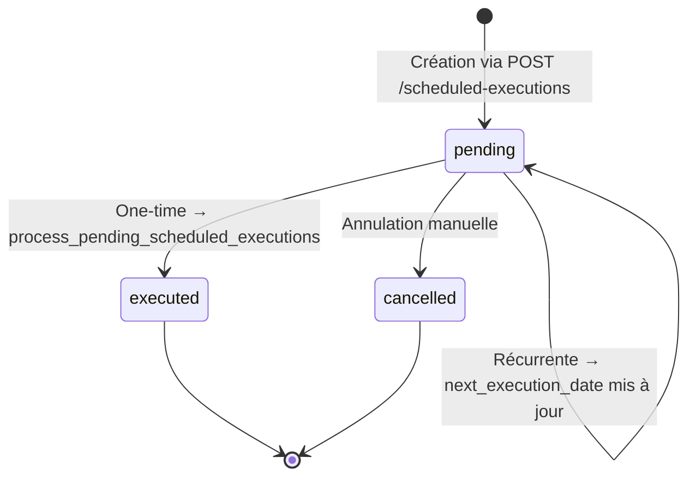

# Flow d'exécution des workflows

**Dernière mise à jour :** 2026-03-16
**Auteur :** Documentation automatique — Story 87-1
**Fichiers source :** `executions/views/execution_views.py`, `executions/tasks/`, `executions/services/`, `executions/infra/`, `adapters/registry.py`

---

## Sommaire

1. [Vue d'ensemble](#1-vue-densemble)
2. [Mise en queue des jobs (POST /executions)](#2-mise-en-queue-des-jobs-post-executions)
3. [Traitement asynchrone Celery](#3-traitement-asynchrone-celery)
4. [Évaluation des gates](#4-évaluation-des-gates)
5. [Diagramme de séquence complet](#5-diagramme-de-séquence-complet)
6. [Opérations de base de données par étape](#6-opérations-de-base-de-données-par-étape)
7. [Pattern RUNNABLE_STEPS (Work Queue distribué)](#7-pattern-runnable_steps-work-queue-distribué)
8. [Pattern EXECUTION_OUTBOX (Transactional Outbox)](#8-pattern-execution_outbox-transactional-outbox)
9. [Pattern WORKFLOW_EVENTS (Event Sourcing)](#9-pattern-workflow_events-event-sourcing)
10. [Exécutions planifiées](#10-exécutions-planifiées)

---

## 1. Vue d'ensemble

Une exécution dans IDP Portal suit un parcours multi-étapes orchestré par Django, Celery et Oracle DB :

```
Client HTTP
    │  POST /executions
    ▼
ExecutionsCreateView       ← validation RBAC, paramètres, mutex
    │  transaction.atomic()
    ▼
ExecutionService           ← INSERTs en BD (EXECUTIONS, EXECUTION_STEPS, AUDIT_LOG)
    │  apply_async()
    ▼
ContainerWorkflowRuntime   ← orchestration des étapes du workflow
    │  pour chaque étape
    ▼
trigger_platform_job       ← appel adapter externe (AAP, Terraform…)
    │
    ▼
poll_platform_job_status   ← boucle de surveillance toutes les 5s
    │
    ▼
[gate WAITING?] ──── evaluate_waiting_gates (Celery Beat 60s)
    │
    ▼
Exécution terminée (COMPLETED / FAILED)
```

**Principes clés :**
- La requête HTTP retourne immédiatement (HTTP 202 Accepted) — le traitement est 100% asynchrone via Celery
- Toute mutation métier est atomique (transactions Oracle)
- Les side-effects (WebSocket, notifications) sont découplés via le pattern Transactional Outbox
- Les events durables (WORKFLOW_EVENTS) permettent la resynchronisation UI après reconnexion WebSocket

---

## 2. Mise en queue des jobs (POST /executions)

**Fichier source :** `executions/views/execution_views.py` — `ExecutionsCreateView.post`

### 2.1 Séquence d'opérations

```
POST /executions
    │
    ├─ 1. detect_request_source(request)
    │      → Détecte le contexte : 'api' | 'ui' | 'celery_beat'
    │      → Extraction de l'IP client (get_client_ip)
    │
    ├─ 2. ExecutionValidationPipeline.validate(request_data, request, user, ip_address)
    │      → RBAC : vérification permissions de l'utilisateur sur l'action
    │      → Validation des paramètres (JSON Schema sur parameters_schema)
    │      → Mutex : détection d'exécutions concurrentes si mutex_enabled=True
    │      → Cibles : résolution des target_names, vérification requires_target
    │
    ├─ 3. Injection page_me (si page_me=true)
    │      → Ajoute __page_me=True, __page_me_user_id, __page_me_user_name
    │      → Permet à l'adapter de paginer l'utilisateur courant
    │
    ├─ 4. Construction ExecutionRequest (DTO)
    │      → Champs : user, action, environment, parameters, correlation_id,
    │                  source, ip_address, targets, delegated_referenced_action_ids
    │
    ├─ 5. ExecutionService.create_execution(exec_req)  ← transaction.atomic()
    │      → INSERT EXECUTIONS (status=SUBMITTED, correlation_id, parameters)
    │      → INSERT EXECUTION_TARGETS (si targets fournis)
    │      → INSERT EXECUTION_STEPS (gate step si requires_approval=True)
    │      → INSERT AUDIT_LOG (action=EXECUTION_SUBMITTED)
    │
    ├─ 6. _launch_execution() — si pas en attente d'approbation
    │      → workflow  : ContainerWorkflowRuntime(execution).run()
    │      → simulation: SimulationService.create_simulated_steps(execution)
    │
    └─ 7. HTTP 202 Accepted  (retour immédiat)
```

### 2.2 Comportement sur requires_approval

Si l'action a `requires_approval=True`, un EXECUTION_STEP de type `gate` est créé en `status=WAITING`. L'exécution ne démarre pas tant qu'une approbation n'est pas reçue via `POST /steps/{id}/approve/`. Ce mécanisme est documenté dans [ADR-007](../backend/decisions/adr-007-workflow-step-based-change-management.md).

### 2.3 ContainerWorkflowRuntime

Pour les actions de type `workflow`, c'est `ContainerWorkflowRuntime` qui orchestre les étapes :
- Lecture du DAG `action.execution_steps` (liste JSON d'étapes ordonnées)
- Dispatche les tâches Celery dans l'ordre (ou en parallèle pour les `parallel_group`)
- Gère les outputs inter-étapes via `output_mapping` (résolution Jinja2)

---

## 3. Traitement asynchrone Celery

### 3.1 Trigger (`executions/tasks/trigger.py`)

**Tâche :** `executions.tasks.trigger_platform_job`

```
trigger_platform_job(execution_step_id, execution_id, integration_id, trigger_kwargs)
    │
    ├─ Guard idempotence
    │    → Si execution_step.platform_job_id déjà défini → skip (safe pour retry)
    │
    ├─ Résolution de l'adapter
    │    → build_auth_headers(integration, correlation_id)
    │       Gère : Vault (secret fetch), OAuth2, token Bearer, Basic Auth
    │    → platform_registry.resolve_alias(integration.type)
    │       Résout les alias (ex: 'tower' → 'aap')
    │    → get_platform_adapter(platform_type, base_url, auth_headers, **platform_kwargs)
    │       Délègue à AdapterRegistry.get()
    │
    ├─ Appel adapter
    │    → async_to_sync(adapter.trigger)(**trigger_kwargs)
    │    → Retourne {'platform_job_id': '12345'}
    │
    ├─ Persistance
    │    → UPDATE EXECUTION_STEPS SET platform_job_id = '12345'
    │
    ├─ Schedule du premier poll
    │    → poll_platform_job_status.apply_async(
    │         args=[execution_id, platform_job_id, platform_type],
    │         queue=get_platform_queue(platform_type)  ← queue dédiée par plateforme
    │      )
    │
    └─ Gestion d'erreurs
         → SoftTimeLimitExceeded    : EXECUTION_STEP FAILED + EXECUTION INTEGRATION_ERROR
         → AdapterTimeoutError      : idem + AUDIT_LOG EXECUTION_INTEGRATION_ERROR
         → Exception générale       : idem + audit complet (fail-fast)
```

### 3.2 AdapterRegistry

**Fichier :** `adapters/registry.py`

Pattern **Factory + Registry** (OCP — Open/Closed Principle). Ajouter une plateforme ne nécessite aucune modification de la logique de dispatche.

```python
# Enregistrement (adapters/__init__.py)
adapter_registry.register(
    platform_type='aap',
    factory=lambda **kwargs: AAPAdapter(**kwargs),
    queue='aap'   # queue Celery dédiée
)

# Résolution (à l'exécution)
adapter = adapter_registry.get(platform_type='aap', base_url='...', auth_headers={...})
queue   = adapter_registry.get_queue('aap')  # → 'aap'
```

**Plateformes enregistrées** dans `adapters/__init__.py` :

| platform_type | Queue Celery | Description |
|---------------|-------------|-------------|
| `aap`         | `aap`       | Ansible Automation Platform |
| `tower`       | `aap`       | Alias pour AAP (Tower legacy) |
| `servicenow`  | `servicenow`| ServiceNow (tickets, CAB) |
| `terraform`   | `terraform` | Terraform Cloud/Enterprise |
| `github`      | `github`    | GitHub Actions |
| `azure`       | `azure`     | Azure DevOps / Azure Pipelines |
| `vault`       | `default`   | HashiCorp Vault (secrets) |

### 3.3 Poll (`executions/tasks/polling.py`)

**Tâche :** `executions.tasks.poll_platform_job_status`

```
poll_platform_job_status(execution_id, platform_job_id, platform_type, poll_interval=5, retry_count=0)
    │
    ├─ Vérification état terminal (exécution déjà COMPLETED/FAILED → stop)
    │
    ├─ Appel adapter.poll(platform_job_id)
    │    → Retourne : RUNNING | COMPLETED | FAILED | CANCELLED
    │
    ├─ Si RUNNING : reschedule après poll_interval secondes
    │    → retry_count++ (max MAX_POLLING_RETRIES = 20)
    │    → Si retry_count >= MAX_POLLING_RETRIES → EXECUTION_POLLING_EXHAUSTED (FAILED)
    │
    ├─ Si COMPLETED :
    │    → adapter.get_output() → résolution output_mapping (Jinja2)
    │    → UPDATE EXECUTION_STEPS SET status=COMPLETED, extracted_output=...
    │    → RUNNABLE_STEPS : delete (release)
    │    → WorkflowEventService.emit_step_status_changed() → WORKFLOW_EVENTS INSERT
    │    → OutboxService.write_entry() → EXECUTION_OUTBOX INSERT (step_broadcast)
    │    → Avance le DAG workflow (next step ou terminal)
    │
    ├─ Si FAILED :
    │    → UPDATE EXECUTION_STEPS SET status=FAILED, error_message
    │    → EXECUTION FAILED si step critique
    │    → WorkflowEventService.emit_step_status_changed()
    │    → OutboxService pour broadcast UI
    │
    └─ _broadcast_execution_update()  ← WebSocket temps réel via Django Channels
         group_name = f"execution_{execution_id}"
         Events : status_update, log_update, execution_complete / execution_failed
```

---

## 4. Évaluation des gates

**Fichier :** `executions/tasks/gates.py`
**Tâche :** `executions.tasks.evaluate_waiting_gates` (Celery Beat, toutes les 60s)

### 4.1 Types de gates

| Type | Déclenchement | Implémentation |
|------|--------------|----------------|
| `APPROVAL` | Manuel — POST /steps/{id}/approve/ ou /reject/ | Résolution immédiate sur appel REST |
| `CONDITION` | Automatique — évaluation Jinja2 (ex: créneau maintenance) | evaluate_waiting_gates toutes les 60s |
| `SENSOR` | Automatique — événement externe (webhook entrant) | Résolution à réception du webhook |

### 4.2 Séquence evaluate_waiting_gates

```
[Celery Beat — toutes les 60s]
evaluate_waiting_gates()
    │
    ├─ SELECT EXECUTION_STEPS
    │    WHERE status='WAITING'
    │    AND execution.status='RUNNING'
    │    ORDER BY created_at
    │    LIMIT max_steps_per_batch (défaut: 100, var: CELERY_BEAT_EVALUATE_GATES_MAX_STEPS)
    │
    ├─ Pour chaque step :
    │    │
    │    ├─ [Backoff story 86-3] Lire output.next_poll_at
    │    │    → Si next_poll_at > now : SKIP (éviter polling storm)
    │    │
    │    ├─ GateEvaluator.evaluate(step) → (all_satisfied, gate_status)
    │    │
    │    ├─ Si gate_status.timeout_triggered :
    │    │    → _handle_gate_timeout() → FAILED ou SKIPPED (selon on_timeout)
    │    │
    │    ├─ Si all_satisfied :
    │    │    → _transition_step_to_running() [transaction.atomic()]
    │    │       ├─ CAS UPDATE : status WAITING → RUNNING, started_at = now
    │    │       ├─ AUDIT_LOG : EXECUTION_STEP_GATE_SATISFIED
    │    │       └─ _resume_workflow_after_gate()
    │    │           → resume_container_workflow_from_gate.apply_async()
    │    │
    │    └─ Si en attente :
    │         → _update_waiting_context()
    │             ├─ UPDATE output.gate_status (dernier état)
    │             ├─ Calcul backoff : interval = min(base × factor^poll_attempt, max_interval)
    │             │    Défauts : base=30s, factor=1.5, max=300s (configurables)
    │             ├─ UPDATE output.next_poll_at = now + interval
    │             ├─ UPDATE output.poll_attempt++
    │             └─ WorkflowEventService.emit_step_output_updated() (best-effort, non-manuel)
    │
    └─ Retour : {waiting_steps, unblocked, still_waiting, skipped, errors}
```

### 4.3 Backoff exponentiel (Story 86-3)

Le backoff est calculé pour chaque gate en attente :

```
interval = min(GATE_BASE_POLL_INTERVAL × GATE_POLL_BACKOFF_FACTOR^poll_attempt, GATE_MAX_POLL_INTERVAL)
```

Variables d'environnement :

| Variable | Défaut | Description |
|----------|--------|-------------|
| `GATE_BASE_POLL_INTERVAL` | `30.0` | Intervalle de base (secondes) |
| `GATE_POLL_BACKOFF_FACTOR` | `1.5` | Facteur multiplicateur |
| `GATE_MAX_POLL_INTERVAL` | `300.0` | Intervalle maximum (5 minutes) |

**Exemple de progression :**

| Tentative | Intervalle (s) |
|-----------|---------------|
| 0         | 30            |
| 1         | 45            |
| 2         | 67            |
| 3         | 101           |
| 4         | 152           |
| 5+        | 300 (max)     |

### 4.4 Reprise après gate satisfaite

```
_resume_workflow_after_gate(step, action, step_def, correlation_id)
    │
    ├─ Récupère on_success_step_ids depuis step_def (config du gate)
    │    → Fallback : step suivant dans l'ordre si on_success_step_ids absent
    │
    ├─ Si gate a des on_success_step_ids :
    │    → resume_container_workflow_from_gate.apply_async(
    │         [execution_id, on_success_step_ids], queue='default'
    │      )
    │
    └─ Si gate est la dernière étape :
         → _complete_execution_on_last_step()
             CAS UPDATE : EXECUTIONS status=COMPLETED
```

---

## 5. Diagramme de séquence complet



---

## 6. Opérations de base de données par étape

### Tableau récapitulatif

| Étape | Table | Opération | Champs clés |
|-------|-------|-----------|-------------|
| **POST /executions** | `EXECUTIONS` | INSERT | `id`, `status='SUBMITTED'`, `correlation_id`, `parameters`, `source`, `ip_address` |
| | `EXECUTION_TARGETS` | INSERT | `execution_id`, `target_name`, `target_type`, `target_metadata` |
| | `EXECUTION_STEPS` | INSERT (si `requires_approval`) | `step_type='gate'`, `status='WAITING'`, `output.gate_conditions` |
| | `AUDIT_LOG` | INSERT | `action='EXECUTION_SUBMITTED'`, `ip_address`, `source` |
| **Lancement workflow** | `EXECUTIONS` | UPDATE | `status='RUNNING'` |
| | `RUNNABLE_STEPS` | INSERT | `execution_step_id`, `priority`, `eligible_at` |
| **trigger_platform_job** | `EXECUTION_STEPS` | UPDATE | `platform_job_id='job-123'` |
| | `EXECUTIONS` | UPDATE (si erreur) | `status='INTEGRATION_ERROR'` |
| | `AUDIT_LOG` | INSERT (si erreur) | `action='EXECUTION_INTEGRATION_ERROR'` |
| **poll → RUNNING** | — | (reschedule uniquement) | — |
| **poll → COMPLETED** | `EXECUTION_STEPS` | UPDATE | `status='COMPLETED'`, `completed_at`, `output.extracted_output` |
| | `RUNNABLE_STEPS` | DELETE | `execution_step_id` (release du lease) |
| | `WORKFLOW_EVENTS` | INSERT | `event_type='STEP_COMPLETED'`, `sequence_num++` |
| | `WORKFLOW_EVENT_COUNTER` | UPDATE | `last_sequence_num++` |
| | `EXECUTION_OUTBOX` | INSERT | `event_type='step_broadcast'`, `status='pending'`, `idempotency_key` |
| **poll → FAILED** | `EXECUTION_STEPS` | UPDATE | `status='FAILED'`, `error_message` |
| | `EXECUTIONS` | UPDATE | `status='FAILED'` (si step critique) |
| | `WORKFLOW_EVENTS` | INSERT | `event_type='STEP_FAILED'` |
| **Gate → satisfaite** | `EXECUTION_STEPS` | CAS UPDATE | `status='RUNNING'`, `started_at=now` |
| | `WORKFLOW_EVENTS` | INSERT | `event_type='APPROVAL_GRANTED'` ou `'GATE_SATISFIED'` |
| | `AUDIT_LOG` | INSERT | `action='EXECUTION_STEP_GATE_SATISFIED'` |
| **Gate → en attente** | `EXECUTION_STEPS` | CAS UPDATE | `output.gate_status`, `output.next_poll_at`, `output.poll_attempt` |
| | `WORKFLOW_EVENTS` | INSERT (best-effort) | `event_type='STEP_OUTPUT_UPDATED'` |
| **Gate → timeout** | `EXECUTION_STEPS` | CAS UPDATE | `status='FAILED'` ou `'SKIPPED'`, `error_message`, `completed_at` |
| | `AUDIT_LOG` | INSERT | `action='EXECUTION_STEP_GATE_TIMEOUT'` |
| | `EXECUTIONS` | UPDATE (si FAILED) | `status='FAILED'`, `completed_at` |
| **Exécution terminée** | `EXECUTIONS` | UPDATE | `status='COMPLETED'` ou `'FAILED'`, `completed_at` |
| | `WORKFLOW_EVENTS` | INSERT | `event_type='EXECUTION_COMPLETED'` ou `'EXECUTION_FAILED'` |
| | `EXECUTION_OUTBOX` | INSERT | `event_type='execution_broadcast'` |
| **Exécution planifiée** | `EXECUTIONS` | INSERT | `source='celery_beat'`, `parent_execution_id=null` |
| | `SCHEDULED_EXECUTIONS` | UPDATE | `status='executed'`, `execution_id` (one-time) |
| | `RECURRING_PATTERNS` | UPDATE | `next_execution_date` (si récurrente active) |
| | `AUDIT_LOG` | INSERT | `action='SCHEDULED_EXECUTION_CELERY_TRIGGERED'` |

---

## 7. Pattern RUNNABLE_STEPS (Work Queue distribué)

**Fichiers :** `executions/services/runnable_steps.py`, `executions/infra/work_queue.py`
**Migration :** Flyway V113

### 7.1 Objectif

RUNNABLE_STEPS est une **work queue distribuée** intégrée à Oracle DB. Elle évite la perte de tâches si un worker Celery crashe, en utilisant un mécanisme de **lease** (bail temporaire).

### 7.2 Structure de la table

```sql
RUNNABLE_STEPS (
    id                BIGINT PRIMARY KEY,
    execution_step_id BIGINT UNIQUE NOT NULL,  -- FK → EXECUTION_STEPS (1:1)
    execution_id      BIGINT NOT NULL,          -- FK → EXECUTIONS (cascade delete)
    priority          INT DEFAULT 0,
    step_order        INT DEFAULT 0,
    step_type         VARCHAR(50),
    claimed_at        TIMESTAMP,               -- Quand le lease a été pris
    claimed_by        VARCHAR(255),            -- Worker ID
    claimed_until     TIMESTAMP,               -- Expiration du lease (now + 300s)
    attempt_no        INT DEFAULT 0,           -- Compteur de tentatives
    max_attempts      INT DEFAULT 3,
    eligible_at       TIMESTAMP               -- Not-before timestamp
)
```

### 7.3 Cycle de vie

```
1. ENQUEUE (idempotent)
   RunnableStep.objects.get_or_create(execution_step=step, ...)
   → Ajoute l'étape à la queue avec eligible_at=now

2. CLAIM (exclusif, distribué)
   SELECT FOR UPDATE SKIP LOCKED
   WHERE eligible_at <= now
     AND (claimed_until IS NULL OR claimed_until < now)
   → UPDATE SET claimed_at=now, claimed_by='worker-1', claimed_until=now+300s
               attempt_no=attempt_no+1

3. EXECUTE
   Le worker traite l'étape (trigger, poll, etc.)

4. RELEASE (succès)
   RunnableStep.objects.filter(execution_step_id=id).delete()
   → Suppression définitive après traitement réussi

5. RECLAIM EXPIRED (crash recovery)
   Si worker crash : claimed_until expire après 300s
   → Autre worker : CAS reset claimed_* à NULL, attempt_no conservé
   → L'étape redevient eligible pour un autre worker
```

### 7.4 Garanties

- **At-least-once delivery** : si le worker crashe, un autre worker reprend l'étape
- **Idempotence** : guards dans trigger_platform_job (vérification `platform_job_id` déjà défini)
- **SKIP LOCKED** : les workers ne se bloquent pas mutuellement (compatible Oracle)
- **max_attempts** : évite les boucles infinies sur erreurs persistantes

---

## 8. Pattern EXECUTION_OUTBOX (Transactional Outbox)

**Fichier :** `executions/infra/outbox.py`
**Migration :** Flyway V135

### 8.1 Objectif

Le pattern **Transactional Outbox** garantit que les side-effects (broadcast WebSocket, notifications) sont **atomiques avec la mutation métier**. Sans ce pattern, un crash entre l'UPDATE en BD et l'envoi WebSocket laisserait l'UI désynchronisée.

### 8.2 Structure de la table

```sql
EXECUTION_OUTBOX (
    id               BIGINT PRIMARY KEY,
    execution_id     BIGINT NOT NULL,          -- FK → EXECUTIONS
    event_type       VARCHAR(100) NOT NULL,     -- 'step_broadcast', 'execution_notification', …
    payload          CLOB,                      -- JSON sérialisé
    status           VARCHAR(20) DEFAULT 'pending',  -- pending | dispatched | failed
    idempotency_key  VARCHAR(255) UNIQUE,       -- Contrainte unique
    attempt_no       INT DEFAULT 0,
    max_attempts     INT DEFAULT 3,
    last_error       TEXT,
    dispatched_at    TIMESTAMP
)
```

### 8.3 Cycle

```
1. ÉCRITURE (dans transaction.atomic())
   OutboxService.write_entry(
       execution_id=42,
       event_type='step_broadcast',
       payload={'step_id': 15, 'status': 'COMPLETED'},
       idempotency_key='42:step_broadcast:step_15'
   )
   → get_or_create sur idempotency_key
   → Écrit dans la même transaction que la mutation métier

2. DISPATCH (Celery Beat — process_outbox_entries)
   SELECT * FROM EXECUTION_OUTBOX WHERE status='pending'
   → Pour chaque entrée : exécute le side-effect (WebSocket, email, etc.)
   → UPDATE status='dispatched' sur succès
   → UPDATE attempt_no++, last_error sur échec (retry jusqu'à max_attempts)

3. GARANTIE
   → Si transaction rollback : l'entrée outbox est également rollbackée → pas de side-effect orphelin
   → Si worker crash après COMMIT mais avant dispatch : l'entrée reste 'pending' → retraitement au prochain cycle Beat
```

### 8.4 Format de l'idempotency_key

```
{execution_id}:{event_type}:{discriminator}

Exemples :
  42:approval_granted:step_15
  42:step_broadcast:step_15
  42:execution_notification:complete
```

### 8.5 Types d'événements

| Constante | Valeur | Déclencheur |
|-----------|--------|-------------|
| `APPROVAL_GRANTED` | `"approval_granted"` | POST /steps/{id}/approve/ |
| `APPROVAL_REJECTED` | `"approval_rejected"` | POST /steps/{id}/reject/ |
| `STEP_BROADCAST` | `"step_broadcast"` | Fin de poll (COMPLETED/FAILED) |
| `EXECUTION_NOTIFICATION` | `"execution_notification"` | Fin d'exécution |
| `APPROVAL_NOTIFICATION` | `"approval_notification"` | Gate APPROVAL créée |

---

## 9. Pattern WORKFLOW_EVENTS (Event Sourcing)

**Fichier :** `executions/services/workflow_events.py`
**Migrations :** Flyway V113 (WORKFLOW_EVENTS), V122 (WORKFLOW_EVENT_COUNTER)

### 9.1 Objectif

WORKFLOW_EVENTS est un **log append-only** de tous les changements d'état d'une exécution. Il permet à l'UI de se resynchroniser après une déconnexion WebSocket en fetchant les events manqués.

### 9.2 Tables

**WORKFLOW_EVENTS** :
```sql
WORKFLOW_EVENTS (
    id            BIGINT PRIMARY KEY,
    execution_id  BIGINT NOT NULL,          -- FK → EXECUTIONS
    event_type    VARCHAR(100) NOT NULL,
    entity_type   VARCHAR(50),              -- 'execution' | 'step'
    entity_id     BIGINT,                   -- ID de l'entité concernée
    sequence_num  INT NOT NULL,             -- Monotone par execution_id
    payload       CLOB,                     -- Contexte JSON
    created_at    TIMESTAMP NOT NULL,
    CONSTRAINT UK_WORKFLOW_EVENTS UNIQUE (execution_id, sequence_num)
)
```

**WORKFLOW_EVENT_COUNTER** (V122) :
```sql
WORKFLOW_EVENT_COUNTER (
    execution_id      BIGINT PRIMARY KEY,
    last_sequence_num INT DEFAULT 0
)
```

### 9.3 Allocation atomique des numéros de séquence

```python
# SELECT FOR UPDATE → garantit l'unicité sous concurrence parallèle
counter = WorkflowEventCounter.objects.select_for_update().get(execution_id=execution_id)
new_seq = counter.last_sequence_num + 1
WorkflowEventCounter.objects.filter(execution_id=execution_id).update(last_sequence_num=new_seq)
WorkflowEvent.objects.create(execution_id=execution_id, sequence_num=new_seq, ...)
```

### 9.4 Types d'événements

**Critiques** (propagent l'exception si échec) :

| Event Type | Déclencheur |
|------------|-------------|
| `EXECUTION_STATUS_CHANGED` | Tout changement de statut de l'exécution |
| `EXECUTION_COMPLETED` | Exécution terminée avec succès |
| `EXECUTION_FAILED` | Exécution échouée |
| `STEP_STATUS_CHANGED` | Changement de statut d'un step |
| `STEP_STARTED` | Step commence |
| `STEP_COMPLETED` | Step terminé avec succès |
| `STEP_FAILED` | Step en erreur |
| `APPROVAL_REQUESTED` | Gate d'approbation créée |
| `APPROVAL_GRANTED` | Approbation accordée |
| `APPROVAL_REJECTED` | Approbation rejetée |

**Best-effort** (erreur loguée mais non propagée) :

| Event Type | Déclencheur |
|------------|-------------|
| `STEP_OUTPUT_UPDATED` | Mise à jour état gate pendant attente |
| `TARGET_ADDED` | Cible ajoutée à l'exécution |

### 9.5 Mécanisme de catch-up UI

```
Client WebSocket se reconnecte :
    1. Consumer WebSocket lit last_sequence_num depuis la session client
    2. SELECT * FROM WORKFLOW_EVENTS
       WHERE execution_id = 42
         AND sequence_num > {last_sequence_num}
       ORDER BY sequence_num
    3. Rejoue les events manqués → UI à jour
```

---

## 10. Exécutions planifiées

**Fichier :** `executions/tasks/scheduled.py`
**Tâche :** `executions.tasks.process_pending_scheduled_executions` (Celery Beat, toutes les 60s)

### 10.1 Séquence de traitement

```
process_pending_scheduled_executions()
    │
    ├─ now = timezone.now()
    │
    ├─ [Transaction 1 — SELECT FOR UPDATE]
    │    pending_ids = ScheduledExecution.objects.list_pending(now)
    │                  .values_list('id')[:max_batch]
    │    Oracle ne supporte pas LIMIT + SELECT FOR UPDATE → deux étapes
    │
    ├─ se_list = ScheduledExecution.objects
    │             .filter(id__in=pending_ids)
    │             .select_for_update(skip_locked=True)  ← workers concurrents safe
    │             .select_related('action', 'user', 'recurringpattern')
    │
    └─ Pour chaque ScheduledExecution :
         │
         ├─ ExecutionService().create_execution(ExecutionRequest(source='celery_beat'))
         │    → INSERT EXECUTIONS (status=SUBMITTED → RUNNING)
         │
         ├─ Lancement :
         │    → workflow : ContainerWorkflowRuntime(execution).run()
         │    → simulation : SimulationService.create_simulated_steps()
         │
         ├─ Si récurrente active (RecurringPattern.is_active=1) :
         │    → _update_recurring_scheduled_execution() [transaction.atomic()]
         │        ├─ calculate_next_execution_date(pattern_type, pattern_config, now)
         │        ├─ UPDATE RECURRING_PATTERNS SET next_execution_date=next_date
         │        └─ INSERT AUDIT_LOG (SCHEDULED_EXECUTION_CELERY_TRIGGERED)
         │
         └─ Si one-time (ou récurrente inactive) :
              → transaction.atomic()
                  ├─ CAS UPDATE SCHEDULED_EXECUTIONS SET status='executed', execution_id
                  └─ INSERT AUDIT_LOG (SCHEDULED_EXECUTION_CELERY_TRIGGERED)
```

### 10.2 Tables impliquées

**SCHEDULED_EXECUTIONS** :
```sql
SCHEDULED_EXECUTIONS (
    id                    BIGINT PRIMARY KEY,
    action_id             BIGINT NOT NULL,
    user_id               BIGINT NOT NULL,
    environment           VARCHAR(50),
    parameters            CLOB,               -- JSON paramètres
    scheduled_at          TIMESTAMP,          -- Date/heure de déclenchement
    status                VARCHAR(20),        -- pending | executed | cancelled
    execution_id          BIGINT,             -- FK → EXECUTIONS (après exécution)
    source_execution_id   BIGINT,             -- FK → EXECUTIONS (si créée via schedule_execution step)
    correlation_id        VARCHAR(64),
    created_at            TIMESTAMP,
    updated_at            TIMESTAMP
)
```

**RECURRING_PATTERNS** :
```sql
RECURRING_PATTERNS (
    id                    BIGINT PRIMARY KEY,
    scheduled_execution_id BIGINT NOT NULL,  -- FK → SCHEDULED_EXECUTIONS
    pattern_type          VARCHAR(50),        -- 'cron' | 'interval'
    pattern_config        CLOB,              -- JSON config (cron expression, interval_seconds)
    next_execution_date   TIMESTAMP,         -- Prochaine date calculée
    is_active             INT DEFAULT 1,     -- 0 = suspendu
    created_at            TIMESTAMP
)
```

### 10.3 Diagramme d'état des exécutions planifiées



### 10.4 Protection contre les doublons

- `SELECT FOR UPDATE SKIP LOCKED` : seul un worker Celery traite chaque ScheduledExecution
- CAS UPDATE avec `WHERE status='pending'` : si un autre worker a déjà traité → `updated=0` → skip
- `max_batch` (défaut: 50, var: `CELERY_BEAT_PROCESS_SCHEDULED_MAX_BATCH`) : évite les timeouts sur gros volumes

---

## Voir aussi

- [Architecture générale des workflows](./workflow-architecture.md) — Vue d'ensemble, diagrammes, patterns
- [ADR-007 : Workflow step-based change management](../backend/decisions/adr-007-workflow-step-based-change-management.md)
- [ADR-008 : Architecture Celery](../backend/decisions/adr-008-celery-architecture.md)
- [Schéma de base de données](../backend/database-schema.md)
- [Documentation Splunk & observabilité](../backend/logging-conventions.md)
