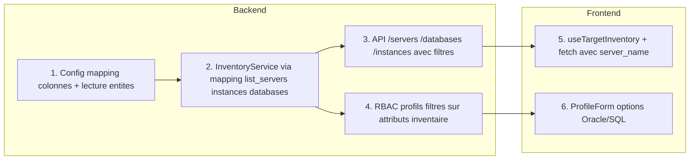

# Plan : Inventaire multi-tables (SERVER, INSTANCE, DB) et UX cibles

**Résumé** : Étendre l'inventaire pour supporter les tables SERVER, INSTANCE et DB avec relations, filtrer les listes instance/DB par serveur choisi dans le wizard, permettre aux profils d'accorder l'accès "tous les serveurs Oracle" ou "tous les serveurs SQL", avec un modèle d'accès évolutif (mapping colonnes) et un RBAC intimement lié aux données d'inventaire.

---

## Contexte actuel

- **Inventaire** : une source unique (table/synonyme type `DBOPS_INVENTORY`) avec colonnes `NAME`, `ENVIRONMENT`, `TYPE` (voir `idp-portal/django_backend/inventory/services.py` — `_read_oracle_inventory`). Les types cibles existants : server, database, group, cluster, other (`idp-portal/django_backend/inventory/models.py`).
- **Profils** : `ProfileTargetPermission` (`idp-portal/django_backend/profiles/models.py`) avec `LIST` (noms de cibles), `PATTERN`, ou `ALL`. Aucun filtre par type de moteur (Oracle / SQL).
- **Wizard d'exécution** : étape 1 = choix des cibles (liste/pattern/manuel), étape 2 = paramètres. Les champs paramètres peuvent avoir `inventorySource: 'databases' | 'servers'` (dérivé de `parameters_schema` via `idp-portal/frontend/src/hooks/useDynamicForm.ts` — `source: 'inventory'`, `inventory_type`). L'inventaire pour les dropdowns est chargé par **environnement** uniquement (`idp-portal/frontend/src/hooks/useTargetInventory.ts`), sans prise en compte du serveur sélectionné.
- **API** : `GET /api/v1/inventory/targets` (RBAC) et `GET /api/v1/inventory/environments`. Le front appelle aussi `/api/v1/inventory/databases` et `/api/v1/inventory/servers` (`idp-portal/frontend/src/services/execution_service.ts`) en attendant `{ data: [...] }` — à aligner ou exposer côté backend.

## Objectifs

1. **Données** : Utiliser plusieurs tables d'inventaire (SERVER, INSTANCE, DB) avec relations : Serveur 1–N Instance, Instance → 1 DB, DB 1–N Instances (RAC, DataGuard, AlwaysOn).
2. **UX exécution** : Si l'utilisateur choisit un **serveur** comme cible, les listes des paramètres de type instance ou base de données doivent être restreintes aux **instances (ou DB) liées à ce serveur**.
3. **Profils** : Pouvoir donner accès à « tous les serveurs Oracle » ou « tous les serveurs SQL » (filtre par type de moteur).
4. **Évolutivité** : Modèle d'accès inventaire **facilement évolutif** via une **configuration** qui mappe les besoins métier aux colonnes réelles (pas de colonnes en dur). **RBAC des profils intimement lié aux données d'inventaire** : les règles de permission s'appuient sur les attributs exposés par l'inventaire (colonnes mappées) ; une nouvelle colonne en inventaire peut servir de critère RBAC sans refonte du modèle de profils.

---

## 1. Modèle d'accès inventaire évolutif (mapping colonnes)

- **Principe** : aucune colonne ou table en dur. Une **configuration de mapping** (config d'intégration `inventory_db` ou module dédié) décrit :
  - **Entités** : quelles tables/vues = serveur, instance, base de données.
  - **Colonnes** : pour chaque entité, mapping **concept métier → nom de colonne réel** (ex. `name` → `HOSTNAME`, `environment` → `ENV`, `engine_type` → `ENGINE`, `server_ref` → `SERVER_NAME` pour instances).
  - **Relations** : clés de liaison entre entités (instance → serveur, instance → DB).
- **Format de config** (ex. dans `integration.config`) : `entities.servers` / `entities.instances` / `entities.databases` avec `table`, `columns`, `id_column` ; **table plate (fallback)** = une entité avec `columns: { name: "NAME", environment: "ENVIRONMENT", type: "TYPE" }`.
- **Code** : layer « InventoryMapper » qui lit la config et construit les requêtes SQL (SELECT avec alias, WHERE sur colonnes mappées). Nouvelle colonne = mise à jour config (+ règles RBAC si besoin) ; pas de changement de code.
- **Sécurité** : tous les noms tables/colonnes validés (whitelist type `SAFE_TABLE_NAME_PATTERN` dans `idp-portal/django_backend/inventory/services.py`) avant usage en SQL.

Fichiers : `idp-portal/django_backend/integrations/models.py`, `idp-portal/django_backend/inventory/services.py` (mapping + construction requêtes).

---

## 2. Modèle de données inventaire (backend)

- **Décision de source** : soit schéma Oracle avec 3 tables/vues (SERVER, INSTANCE, DB), soit configuration d'intégration `inventory_db` étendue pour pointer vers ces tables (ex. `config.tables.servers`, `config.tables.instances`, `config.tables.databases`).
- **Structure cible** :
  - **SERVER** : identifiant (name ou id), environment, optionnellement `engine_type` (Oracle, SQL Server, etc.) pour les profils.
  - **INSTANCE** : identifiant, lien vers serveur (server_id / server_name), lien vers DB (db_id / db_name), environment.
  - **DB** : identifiant, environment (optionnel selon modèle).
- **Rétrocompatibilité** : conserver le fallback actuel (une seule table/synonyme avec NAME, ENVIRONMENT, TYPE) pour le dev ; si seule la table plate est configurée, comportement inchangé.

Fichiers : `idp-portal/django_backend/inventory/services.py`, `idp-portal/django_backend/integrations/models.py`.

---

## 3. Service inventaire et lecture multi-tables

- **InventoryService** :
  - Ajouter des méthodes dérivées de la source configurée : `list_servers(environment=..., engine_type=...)`, `list_instances(environment=..., server_name=...)`, `list_databases(environment=..., server_name=...)`.
  - Pour le mode multi-tables : requêtes SQL sur les vues/tables SERVER, INSTANCE, DB avec jointures (ex. instances par server_name).
  - Pour le mode table plate (fallback) : garder `_read_oracle_inventory` ; `list_servers` = filtre TYPE=server, `list_instances` / `list_databases` = selon colonnes ou retour vide/équivalent si non disponibles.
- **RBAC** : `list_targets_for_user` continue de s'appuyer sur les **serveurs** comme cibles d'exécution (éventuellement étendre plus tard aux instances/DB comme cibles). Les listes instance/DB pour paramètres sont filtrées par environnement + serveur(s) choisi(s), et ne doivent exposer que des données cohérentes avec les serveurs autorisés (ex. ne retourner que les instances dont le serveur est dans la liste autorisée).

Fichiers : `idp-portal/django_backend/inventory/services.py`.

---

## 4. API inventaire par type et contexte

- **Endpoints** (ou évolution des existants) :
  - **Serveurs** : déjà couvert par `GET /inventory/targets?target_type=server` ; ajouter si besoin un alias `GET /inventory/servers` retournant `{ data: [ { id, name, environment, engine_type? } ] }` pour compatibilité avec `fetchInventoryItems('servers', env)`.
  - **Bases / Instances** : exposer `GET /inventory/databases` et `GET /inventory/instances` avec query params `environment` et optionnellement `server_name` (ou `server_names` pour multi-sélection). Réponse au format attendu par le front (ex. `{ data: [...] }` avec `id`, `name`, `environment`).
- **Sérialisation** : réutiliser ou étendre `idp-portal/django_backend/inventory/serializers.py` et renvoyer un format cohérent (id = name ou identifiant technique).

Fichiers : `idp-portal/django_backend/inventory/views.py`, `idp-portal/django_backend/inventory/urls.py`.

---

## 5. RBAC profils intimement lié aux données d'inventaire

- **Principe** : les règles RBAC s'appuient uniquement sur les données et attributs mappés retournés par l'inventaire (§1). Les filtres (LIST, PATTERN, ou par attribut) sont évalués sur ces attributs.
  - **Implémentation** : ajouter des filtres par attribut (ex. `filter_by_attribute: { "engine_type": ["oracle"] }` en JSON dans ProfileTargetPermission). Dans `list_targets_for_user`, appliquer ces filtres sur les champs mappés. La colonne réelle est dans la config de mapping ; le profil référence le concept métier.
- **UI** : `idp-portal/frontend/src/components/admin/ProfileForm.tsx` — options Tous / Tous Oracle / Tous SQL ; possibilité d'étendre à d'autres attributs mappés (ex. zone) sans changement de schéma.

Fichiers : `idp-portal/django_backend/profiles/models.py` (champ JSON filtres par attribut), `idp-portal/django_backend/inventory/services.py` (appliquer filtres dans list_targets_for_user), `idp-portal/django_backend/profiles/views.py`, frontend ProfileForm.

---

## 6. Frontend : listes instance/DB filtrées par serveur choisi

- **Wizard** : à l'étape 1, les cibles sélectionnées restent des **serveurs** (comportement actuel). À l'étape 2, pour chaque champ dont `inventorySource` est `instances` ou `databases`, transmettre le **contexte serveur** : par ex. le premier serveur sélectionné ou la liste des noms de serveurs.
- **useTargetInventory** : étendre pour accepter `selectedServerNames: string[]` (ou `selectedTargets`) en plus de `environment`. Selon `inventorySource` :
  - `servers` : inchangé (liste par environnement).
  - `databases` / `instances` : appeler l'API avec `environment` et `server_name` (ou `server_names`) pour ne récupérer que les instances/DB liées au(x) serveur(s) choisi(s).
- **fetchInventoryItems** (ou nouveau helper) : ajouter les paramètres optionnels `server_name` / `server_names` et les types `instances` et `databases` si ce n'est pas déjà le cas ; appeler les nouveaux endpoints.
- **Schéma des paramètres** : étendre le schéma des actions pour permettre `inventory_type: 'instances'` en plus de `servers` / `databases` (`useDynamicForm.ts`, `parametersSchema.ts` si besoin). Les éditeurs d'actions (Admin) doivent pouvoir choisir « Instance » ou « Base de données » comme source inventaire.

Fichiers : `idp-portal/frontend/src/components/catalog/ExecutionWizard.tsx`, `idp-portal/frontend/src/hooks/useTargetInventory.ts`, `idp-portal/frontend/src/services/execution_service.ts`, `idp-portal/frontend/src/components/catalog/renderFieldInput.tsx`, types API (InventoryItem, ParameterField).

---

## 7. Ordre de mise en œuvre suggéré

1. **Backend** : Config de **mapping** (entités, colonnes, relations) + layer de lecture inventaire piloté par la config ; fallback table plate.
2. **Backend** : Endpoints `GET /inventory/servers`, `/inventory/databases`, `/inventory/instances` avec query params `environment` et `server_name`, format `{ data: [...] }`.
3. **Backend** : RBAC profils — filtres par attribut (JSON) sur les données inventaire mappées dans `list_targets_for_user` ; exposition en API profils.
4. **Frontend** : Étendre `useTargetInventory` et les appels inventaire pour passer les serveurs sélectionnés et supporter `instances` / `databases`.
5. **Frontend** : ProfileForm — options Tous / Tous Oracle / Tous SQL (et extension à d'autres attributs mappés).

---

## 8. Points d'attention

- **Sécurité** : validation stricte des noms de tables/vues (pattern existant SAFE_TABLE_NAME_PATTERN) et des paramètres `server_name` (éviter injection).
- **Perf** : pour les grosses inventaires, garder la pagination et, si besoin, limiter le nombre de serveurs passés pour le filtre instance/DB (ex. premier serveur ou max N).
- **Rétrocompatibilité** : en dev sans tables INSTANCE/DB, les endpoints instances/databases peuvent retourner une liste vide ou la liste plate existante selon la config.
- **Tests** : ajouter des tests unitaires et d'intégration pour la lecture pilotée par le mapping, les filtres RBAC sur attributs inventaire, et les appels API avec `server_name`.
- **Évolutivité** : toute évolution des colonnes ou tables en inventaire se reflète dans la config de mapping (et éventuellement les filtres RBAC par attribut) sans changement de code ; le RBAC reste intimement lié aux données exposées par l'inventaire.
