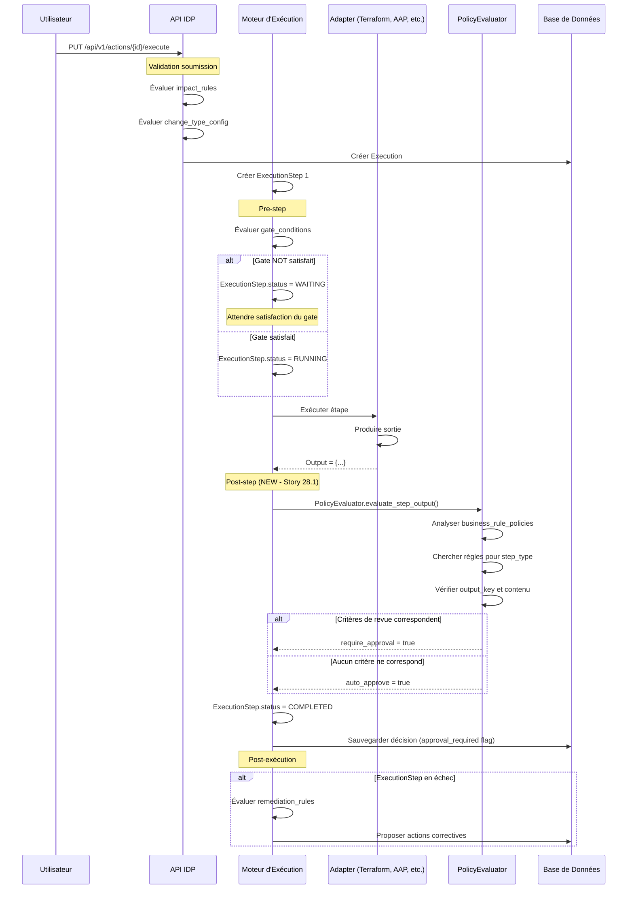
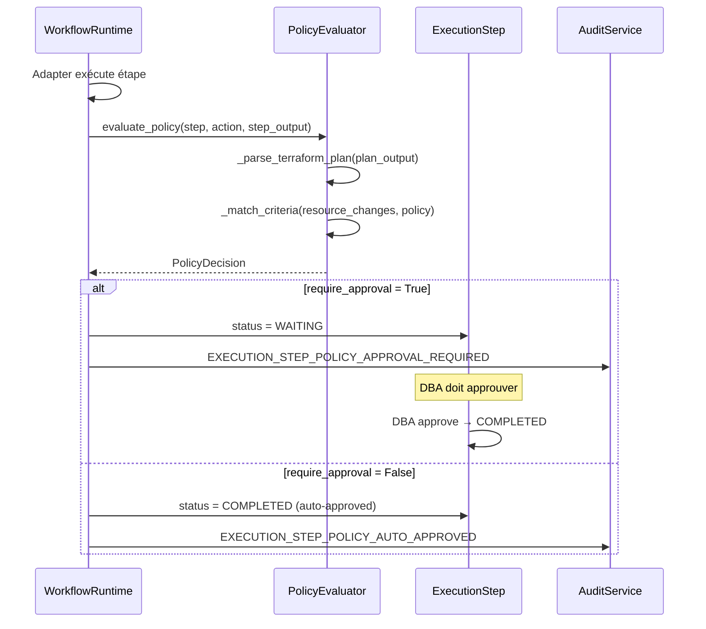
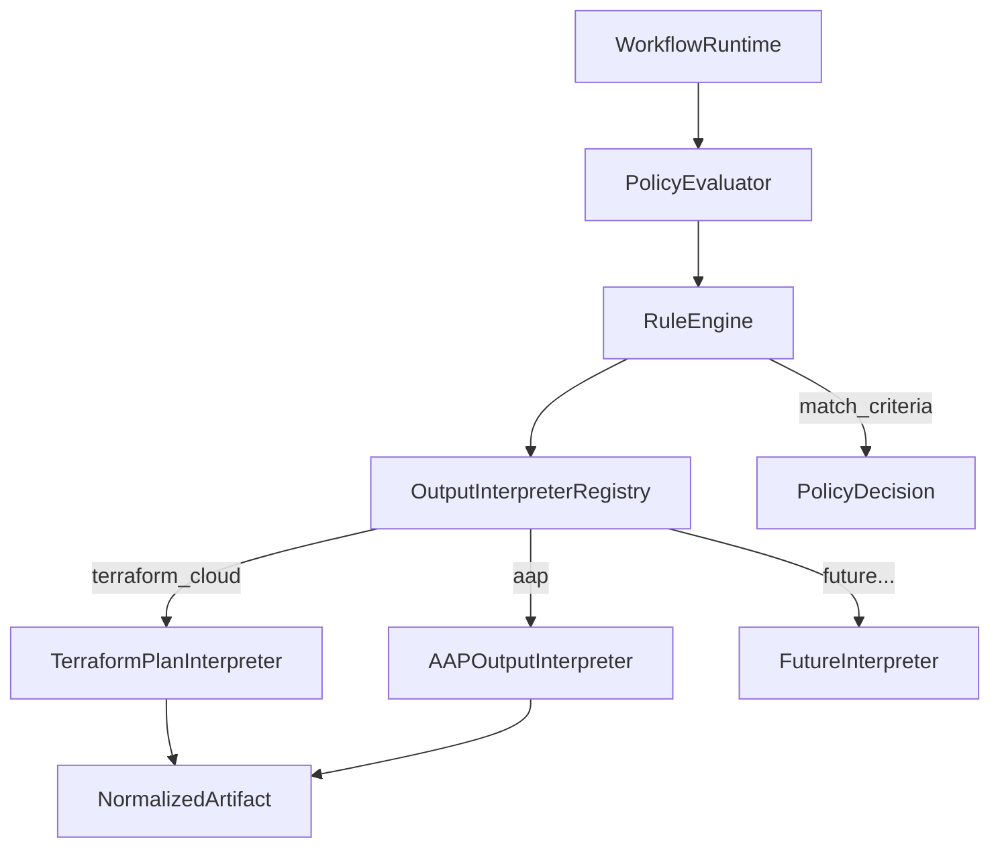
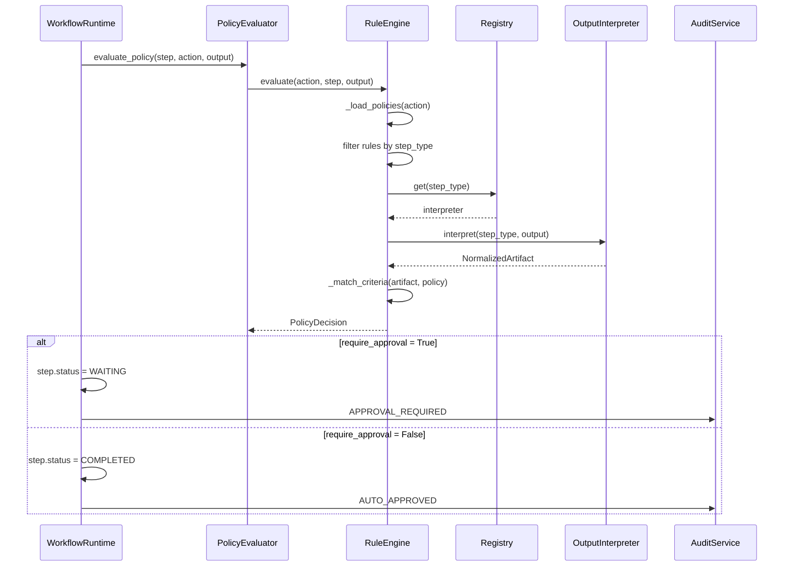

# Politiques de Règles Métier — business_rule_policies (Story 28.1)

**Date :** 2026-02-14
**Version :** 1.0
**Story :** 28.1 — Implement business_rule_policies on step output
**Statut :** En cours de développement

---

## Table des Matières

1. [Introduction](#introduction)
2. [Définition et Objectif](#définition-et-objectif)
3. [Typologie des Règles Métier dans le Système](#typologie-des-règles-métier-dans-le-système)
4. [Quand sont Évaluées les Règles](#quand-sont-évaluées-les-règles)
5. [Structure du Schéma JSON](#structure-du-schéma-json)
6. [Types de Politique Supportés](#types-de-politique-supportés)
7. [Exemples Concrets](#exemples-concrets)
8. [Référence API](#référence-api)
9. [Validation](#validation)

---

## Introduction

### Définition

Les **business_rule_policies** (politiques de règles métier) sont des règles évaluées **après l'exécution d'une étape**, avant l'évaluation des gates (portes conditionnelles). Elles permettent de décider automatiquement si un changement apporté par l'étape requiert une **révision DBA** ou peut être **auto-approuvé** en fonction du contenu de la sortie de l'étape.

### Objectif

Automatiser la prise de décision concernant l'approbation d'une étape basée sur :
- **Quel type d'étape** a été exécutée (ex. Terraform plan, AAP job)
- **Quel contenu** la sortie contient (ex. modifications de SKU, tâches échouées)
- **Quelles ressources ou attributs** ont été modifiés

Ce mécanisme permet aux administrateurs de définir des règles métier pour :
- **Déclencher une revue DBA** si certaines modifications critiques sont détectées
- **Passer en auto-approbation** si aucune modification critique n'est présente
- **Adapter le flux d'approbation** en fonction du contexte de l'action

### Positionnement dans le Flux d'Exécution

```
┌────────────────────────────────────────────────────────────────────┐
│ Soumission de l'action                                             │
│  • impact_rules évalués → impact_level déterminé                   │
│  • change_type_config validé → ServiceNow requis ?                 │
└────────────────────────────────────────────────────────────────────┘
                                   │
                                   ▼
┌────────────────────────────────────────────────────────────────────┐
│ Avant chaque étape (Pre-step)                                       │
│  • gate_conditions évaluées → étape peut-elle démarrer ?            │
│    (maintenance_window, time_window, approval_granted, target_state)│
└────────────────────────────────────────────────────────────────────┘
                                   │
                                   ▼
┌────────────────────────────────────────────────────────────────────┐
│ Exécution de l'étape                                                │
│  • Adapter (Terraform, AAP, GitHub, etc.) produit une sortie       │
└────────────────────────────────────────────────────────────────────┘
                                   │
                                   ▼
┌────────────────────────────────────────────────────────────────────┐
│ APRÈS l'étape (Post-step) — Story 28.1 NEW                         │
│  • business_rule_policies évaluées → Revue ? Auto-approbation ?    │
│  • PolicyEvaluator analyse la sortie                                │
│  • Décision : require_approval ou auto_approve                      │
└────────────────────────────────────────────────────────────────────┘
                                   │
                                   ▼
┌────────────────────────────────────────────────────────────────────┐
│ Après exécution (Post-execution)                                    │
│  • remediation_rules évaluées sur échecs                            │
│  • Suggestions d'actions correctives proposées                      │
└────────────────────────────────────────────────────────────────────┘
```

---

## Définition et Objectif {#définition-et-objectif}

### Cas d'Usage Métier

**Exemple 1 : Terraform Plan**
```
Sortie Terraform : plan avec modification du SKU Azure SQL Database
Règle métier : "Si sku_name modifié → Revue obligatoire"
Décision : Appraisal requis → DBA doit vérifier le changement
```

**Exemple 2 : Ansible Automation Platform**
```
Sortie AAP : job completed avec 5 tâches échouées
Règle métier : "Si failed_tasks présent → Revue obligatoire"
Décision : Appraisal requis → DBA analyse les erreurs
```

**Exemple 3 : Pipeline Azure DevOps**
```
Sortie pipeline : déploiement sur staging (sans changement de cible de prod)
Règle métier : "Si deployment_target reste = staging → Auto-approbation"
Décision : Auto-approuvé → Aucune revue supplémentaire
```

### Avantages

- **Automatisation** : Réduire l'intervention DBA sur les changements routiniers
- **Contrôle granulaire** : Définir des règles spécifiques par type d'étape et contenu
- **Traçabilité** : Audit de pourquoi une approbation a été octroyée ou refusée
- **Flexibilité** : Adapter les règles sans modifier le code

---

## Typologie des Règles Métier dans le Système {#typologie-des-règles-métier-dans-le-système}

Le système IDP Portal contient plusieurs niveaux de règles métier, évaluées à différents moments du cycle de vie de l'exécution :

| Règle | Champ Django | Évaluée | Contexte | Décision | Story |
|-------|--------------|---------|---------|----------|-------|
| **impact_rules** | `Action.impact_rules` | À la **soumission** | Action globale | Détermine `impact_level` (low/medium/high/critical) | 20.x |
| **change_type_config** | `Action.change_type_config` | À la **soumission** | Par environnement | Détermine si changement ServiceNow requis | 25.4 |
| **gate_conditions** | `ExecutionStep.gate_conditions` | **Pré-étape** (runtime) | Étape avant exécution | Maintenance window ? Approbation ? → WAITING ou RUNNING | 25.2/25.3 |
| **business_rule_policies** | `Action.business_rule_policies` | **Post-étape** (runtime) | Sortie d'étape | Revue requise ? Auto-approuvée ? → require_approval/auto_approve | **28.1** |
| **remediation_rules** | `Action.remediation_rules` | **Post-exécution** | Étape en échec | Suggestions d'actions correctives | 21.x |

### Points Clés de Différenciation

```
┌─────────────────────────┬──────────────────┬────────────────────┐
│ Règle                   │ Quand évaluée    │ Sur quelle base     │
├─────────────────────────┼──────────────────┼────────────────────┤
│ impact_rules            │ Soumission       │ Définition action   │
│ change_type_config      │ Soumission       │ Environnement cible │
│ gate_conditions         │ Avant étape      │ Conditions système  │
│ business_rule_policies  │ Après étape      │ Sortie étape ✨     │
│ remediation_rules       │ Après exécution  │ Statut échec        │
└─────────────────────────┴──────────────────┴────────────────────┘
```

**L'innovation de la Story 28.1** : évaluation de règles basées sur la **sortie réelle de l'étape** (post-step), permettant une prise de décision contextuelle et nuancée.

---

## Quand sont Évaluées les Règles {#quand-sont-évaluées-les-règles}

### Diagramme de Séquence d'Évaluation



### Étapes Clés du Timeline

| Étape | Quand | Quoi | Qui | Résultat |
|-------|-------|------|-----|----------|
| **1. Soumission** | User submit action | impact_rules + change_type_config | API validation | ExecutionParameters définis |
| **2. Pré-step** | Avant exécution étape | gate_conditions | GateEvaluator | ExecutionStep → WAITING ou RUNNING |
| **3. Exécution** | Pendant étape | Adapter produit output | External system | ExecutionStep.output rempli |
| **4. Post-step (NEW)** | Après exécution | business_rule_policies | PolicyEvaluator | Flag : approval_required ou auto_approve |
| **5. Post-exécution** | Après succès/échec | remediation_rules | RemediationEvaluator | Actions correctives proposées |

---

## Structure du Schéma JSON {#structure-du-schéma-json}

### Vue d'Ensemble

```json
{
  "on_step_output": [
    {
      "when": {
        "step_type": "string (required)",
        "output_key": "string (optional)"
      },
      "policy": {
        "type": "review_if_modified (string, required)",
        "require_review_if_modified": [
          {
            "resource_type": "string (optional, but at least one of resource_type or attribute_paths)",
            "attribute_paths": ["string", "string..."]
          }
        ],
        "auto_approve_if_none_match": "boolean (optional, default: false)"
      }
    }
  ]
}
```

### Description Complète

#### 1. Racine : `on_step_output`

**Type :** Array d'objets
**Requis :** Oui (la clé `on_step_output` est obligatoire)
**Description :** Liste des règles à évaluer après l'exécution d'une étape. Chaque élément contient une condition (`when`) et une politique d'action (`policy`).

```json
{
  "on_step_output": [
    { /* Rule 1 */ },
    { /* Rule 2 */ }
  ]
}
```

---

#### 2. Élément de Règle : `on_step_output[i]`

**Type :** Object
**Requis :** Oui
**Champs obligatoires :** `when`, `policy`

---

#### 3. Condition : `when`

**Type :** Object
**Requis :** Oui
**Description :** Détermine **quand** cette règle s'applique (quel type d'étape, quel contenu).

##### Champs de `when`

| Champ | Type | Requis | Description |
|-------|------|--------|-------------|
| `step_type` | string | **Oui** | Type d'étape cible (ex. `terraform_plan`, `aap_job`, `azure_pipeline`, `github_workflow`). Doit être non-vide. |
| `output_key` | string | Non | Clé spécifique dans la sortie à examiner. Si omis, toute sortie du `step_type` correspond. |

##### Exemples de `when`

```json
// S'applique à toute sortie Terraform
{
  "when": {
    "step_type": "terraform_plan"
  }
}

// S'applique uniquement si 'plan_output' existe dans la sortie AAP
{
  "when": {
    "step_type": "aap_job",
    "output_key": "plan_output"
  }
}
```

---

#### 4. Politique : `policy`

**Type :** Object
**Requis :** Oui
**Description :** Définit **comment décider** si une revue est requise en fonction de la sortie.

##### Champs de `policy`

| Champ | Type | Requis | Description |
|-------|------|--------|-------------|
| `type` | string | **Oui** | Type de politique. Actuellement supporté : `review_if_modified` |
| `require_review_if_modified` | array | Si `type=review_if_modified` | Critères déclenchant la revue (voir section 4.1) |
| `auto_approve_if_none_match` | boolean | Non (défaut: `false`) | Si `true` et aucun critère ne match, auto-approbation; sinon, revue requise |

---

#### 4.1 Critères de Revue : `require_review_if_modified`

**Type :** Array d'objets
**Requis pour `type: "review_if_modified"`**
**Description :** Liste de critères. Si **au moins un correspond**, une revue est déclenchée.

##### Champs d'un critère

| Champ | Type | Requis | Description |
|-------|------|--------|-------------|
| `resource_type` | string | Au moins un de `resource_type` ou `attribute_paths` | Type de ressource à surveiller (ex. `azurerm_sql_database`, `azurerm_storage_account`) |
| `attribute_paths` | array<string> | Au moins un de `resource_type` ou `attribute_paths` | Chemins d'attributs dans la sortie (ex. `["failed_tasks", "changes.sku_name"]`). Utilise la notation pointée. |

**Logique :**
- Si `resource_type` est fourni → Déclenche revue si cette ressource est présente/modifiée dans la sortie
- Si `attribute_paths` est fourni → Déclenche revue si ces chemins existent dans la sortie
- Si les deux sont fournis → Déclenche revue si **l'une ou l'autre** condition est vraie

##### Exemples de Critères

```json
// Revue si la ressource azurerm_sql_database est modifiée
{
  "resource_type": "azurerm_sql_database"
}

// Revue si l'attribut 'failed_tasks' existe (AAP)
{
  "attribute_paths": ["failed_tasks"]
}

// Revue si sku_name de la DB est modifié (chemin imbriqué)
{
  "attribute_paths": ["changes.sku_name", "changes.storage_size_gb"]
}

// Revue si ressource AND attribut (l'une ou l'autre)
{
  "resource_type": "aws_ec2_instance",
  "attribute_paths": ["instance_type", "security_groups"]
}
```

---

#### 4.2 Auto-approbation : `auto_approve_if_none_match`

**Type :** boolean
**Requis :** Non (défaut: `false`)
**Description :** Détermine le comportement par défaut.

**Logique :**
- `false` (par défaut) : Si **aucun critère** de `require_review_if_modified` ne correspond → revue requise
- `true` : Si **aucun critère** de `require_review_if_modified` ne correspond → auto-approbation

**Exemple :**
```json
{
  "type": "review_if_modified",
  "require_review_if_modified": [
    { "attribute_paths": ["failed_tasks"] }
  ],
  "auto_approve_if_none_match": true
}
// Logique : Revue si failed_tasks présent, SINON auto-approbation
```

---

## Types de Politique Supportés {#types-de-politique-supportés}

### 1. `review_if_modified` (Story 28.1–28.2)

**Statut :** ✅ Implémenté
**Description :** Déclenche une revue si certaines ressources ou attributs sont modifiés/présents dans la sortie.

**Schéma :**
```json
{
  "type": "review_if_modified",
  "require_review_if_modified": [
    {
      "resource_type": "string (optional)",
      "attribute_paths": ["string..."]
    }
  ],
  "auto_approve_if_none_match": boolean
}
```

**Comportement :**
```
SI Au moins 1 critère matchs :
  → Décision = require_approval
SINON Si auto_approve_if_none_match = true :
  → Décision = auto_approve
SINON :
  → Décision = require_approval (défaut sûr)
```

**Exemples d'utilisation :**
- Terraform : revue si critical resources modifiées
- AAP : revue si tâches échouées
- Azure DevOps : revue si cible de déploiement change

---

### 2. Types Futurs (Story 28.3+)

**Planifié :**
- `escalate_to_senior_dba` : Si condition → escalade à DBA senior
- `request_approval_from_team` : Si condition → demande au team lead
- `auto_reject_if_detected` : Si condition → rejet automatique
- `conditional_gate` : Si condition → insérer gate supplémentaire

**Extensibilité :** Le système est conçu pour permettre l'ajout de nouveaux types sans modification du code critique.

---

## Exemples Concrets

### Exemple 1 : Terraform Plan — Surveillance des SKU

**Contexte :**
Action Terraform déployant infrastructure Azure. Changement de SKU (taille) = changement critique requérant revue.

**Configuration :**
```json
{
  "on_step_output": [
    {
      "when": {
        "step_type": "terraform_plan",
        "output_key": "plan_summary"
      },
      "policy": {
        "type": "review_if_modified",
        "require_review_if_modified": [
          {
            "resource_type": "azurerm_sql_database"
          },
          {
            "attribute_paths": ["changes.sku_name", "changes.compute_tier"]
          }
        ],
        "auto_approve_if_none_match": false
      }
    }
  ]
}
```

**Logique d'Évaluation :**
1. Étape `terraform_plan` exécutée
2. Sortie contient `plan_summary`
3. PolicyEvaluator cherche modification de `azurerm_sql_database` OU `sku_name`/`compute_tier`
4. Si trouvé → `require_approval = true` (revue obligatoire)
5. Si non trouvé → `require_approval = true` (défaut sûr, car `auto_approve_if_none_match = false`)

---

### Exemple 2 : Ansible Automation Platform — Tâches Échouées

**Contexte :**
Workflow AAP déployant patches. Des tâches échouées = problème à analyser avant suite.

**Configuration :**
```json
{
  "on_step_output": [
    {
      "when": {
        "step_type": "aap_job"
      },
      "policy": {
        "type": "review_if_modified",
        "require_review_if_modified": [
          {
            "attribute_paths": ["failed_tasks", "failed_tasks_count"]
          }
        ],
        "auto_approve_if_none_match": true
      }
    }
  ]
}
```

**Logique d'Évaluation :**
1. Étape `aap_job` exécutée, sortie contient liste de tâches
2. PolicyEvaluator cherche `failed_tasks` ou `failed_tasks_count`
3. Si trouvé → `require_approval = true` (revue pour analyser l'échec)
4. Si non trouvé → `auto_approve = true` (aucun échec détecté, approuvé automatiquement)

---

### Exemple 3 : Azure DevOps Pipeline — Changement de Cible

**Contexte :**
Pipeline déploie sur staging par défaut. Déployer en prod = requête de revue. Déployer en staging = auto-approuvé.

**Configuration :**
```json
{
  "on_step_output": [
    {
      "when": {
        "step_type": "azure_pipeline",
        "output_key": "deployment_result"
      },
      "policy": {
        "type": "review_if_modified",
        "require_review_if_modified": [
          {
            "attribute_paths": [
              "target_environment:production",
              "target_region:us-west"
            ]
          }
        ],
        "auto_approve_if_none_match": true
      }
    }
  ]
}
```

**Logique d'Évaluation :**
1. Étape `azure_pipeline` exécutée
2. Sortie contient `deployment_result`
3. PolicyEvaluator cherche déploiement en prod ou us-west
4. Si trouvé → `require_approval = true` (prod = changement critique)
5. Si non trouvé (staging, europe) → `auto_approve = true` (environnement non-critique)

---

### Exemple 4 : GitHub Actions — Permutations d'Authentification

**Contexte :**
Workflow met à jour credentials. Changement de secrets = requête de revue.

**Configuration :**
```json
{
  "on_step_output": [
    {
      "when": {
        "step_type": "github_workflow"
      },
      "policy": {
        "type": "review_if_modified",
        "require_review_if_modified": [
          {
            "attribute_paths": [
              "secrets_modified",
              "credentials_rotated",
              "api_keys_changed"
            ]
          }
        ],
        "auto_approve_if_none_match": true
      }
    }
  ]
}
```

**Logique :**
- Si n'importe quel secret modifié → revue
- Sinon → auto-approbation

---

## Référence API {#référence-api}

### Endpoint : Mettre à Jour les Politiques de Règles Métier

**URL :** `PATCH /api/v1/admin/actions/{id}/`

**Description :** Met à jour l'action incluant le champ `business_rule_policies`. Utilise PATCH pour modification partielle (Story 28.1, AC3).

#### Requête

**Méthode :** `PATCH`

**Headers :**
```
Authorization: Bearer {jwt_token}
Content-Type: application/json
```

**Payload :**
```json
{
  "business_rule_policies": {
    "on_step_output": [
      {
        "when": {
          "step_type": "terraform_plan"
        },
        "policy": {
          "type": "review_if_modified",
          "require_review_if_modified": [
            { "resource_type": "azurerm_sql_database" }
          ],
          "auto_approve_if_none_match": false
        }
      }
    ]
  }
}
```

**Ou pour supprimer les politiques :**
```json
{
  "business_rule_policies": null
}
```

---

#### Réponse — Succès (200 OK)

```json
{
  "data": {
    "id": 42,
    "name": "Terraform Deploy Azure",
    "status": "published",
    "business_rule_policies": {
      "on_step_output": [
        {
          "when": {
            "step_type": "terraform_plan"
          },
          "policy": {
            "type": "review_if_modified",
            "require_review_if_modified": [
              { "resource_type": "azurerm_sql_database" }
            ],
            "auto_approve_if_none_match": false
          }
        }
      ]
    },
    "created_at": "2026-02-10T10:00:00Z",
    "updated_at": "2026-02-14T15:30:00Z"
  }
}
```

---

#### Réponse — Erreur (400 Bad Request)

**Validation Schema :**
```json
{
  "error": {
    "code": "VALIDATION_ERROR",
    "message": "business_rule_policies validation failed",
    "details": [
      "on_step_output[0].when.step_type must be a non-empty string",
      "on_step_output[0].policy.type must be one of: review_if_modified"
    ]
  }
}
```

---

### Endpoint : Récupérer l'Action avec Politiques

**URL :** `GET /api/v1/admin/actions/{id}/`

**Description :** Retourne l'action incluant les `business_rule_policies`.

#### Réponse

```json
{
  "data": {
    "id": 42,
    "name": "Terraform Deploy",
    "business_rule_policies": {
      "on_step_output": [...]
    }
  }
}
```

---

## Validation

### Validation côté Serveur

Toutes les politiques sont validées via le validateur `catalog.validators.validate_business_rule_policies()`.

#### Règles de Validation

| Règle | Condition | Erreur |
|-------|-----------|--------|
| Structure JSON | `business_rule_policies` doit être objet ou null | `must be a JSON object` |
| Clé `on_step_output` | Obligatoire si non-null | `must contain 'on_step_output' key` |
| Type `on_step_output` | Doit être array | `on_step_output must be an array` |
| Élément règle | Doit être objet | `on_step_output[{idx}] must be an object` |
| Clé `when` | Obligatoire | `on_step_output[{idx}] must contain 'when' key` |
| Type `when` | Doit être objet | `on_step_output[{idx}].when must be an object` |
| `step_type` | Obligatoire, non-vide | `on_step_output[{idx}].when.step_type must be a non-empty string` |
| `output_key` | Si présent, doit être string | `on_step_output[{idx}].when.output_key must be a string` |
| Clé `policy` | Obligatoire | `on_step_output[{idx}] must contain 'policy' key` |
| Type `policy` | Doit être objet | `on_step_output[{idx}].policy must be an object` |
| `type` | Obligatoire, valide | `on_step_output[{idx}].policy.type must be one of: review_if_modified` |
| Critères (review_if_modified) | Obligatoire pour type `review_if_modified` | `on_step_output[{idx}].policy.require_review_if_modified is required` |
| Type critères | Doit être array | `on_step_output[{idx}].policy.require_review_if_modified must be an array` |
| Critère individuel | Doit être objet | `on_step_output[{idx}].policy.require_review_if_modified[{criteria_idx}] must be an object` |
| Critère : champs obligatoires | Au moins un de `resource_type` ou `attribute_paths` | `on_step_output[{idx}].policy.require_review_if_modified[{criteria_idx}] must contain 'resource_type' or 'attribute_paths'` |
| `resource_type` | Si présent, doit être string | `.resource_type must be a string` |
| `attribute_paths` | Si présent, doit être array de strings | `.attribute_paths must be an array` + `attribute_paths[{ap_idx}] must be a string` |
| `auto_approve_if_none_match` | Si présent, doit être boolean | `.auto_approve_if_none_match must be a boolean` |

---

### Exemples de Validations Échouées

#### Erreur 1 : Clé manquante `on_step_output`
```json
{
  "business_rule_policies": {
    "some_key": []
  }
}
```
**Erreur :** `business_rule_policies must contain 'on_step_output' key`

---

#### Erreur 2 : `step_type` manquant
```json
{
  "on_step_output": [
    {
      "when": {
        "output_key": "plan"
      },
      "policy": { "type": "review_if_modified" }
    }
  ]
}
```
**Erreur :** `on_step_output[0].when must contain 'step_type'`

---

#### Erreur 3 : Type de politique invalide
```json
{
  "on_step_output": [
    {
      "when": { "step_type": "terraform_plan" },
      "policy": {
        "type": "auto_reject_if_detected",
        "require_review_if_modified": []
      }
    }
  ]
}
```
**Erreur :** `on_step_output[0].policy.type must be one of: review_if_modified (got: auto_reject_if_detected)`

---

#### Erreur 4 : Critère sans `resource_type` ni `attribute_paths`
```json
{
  "on_step_output": [
    {
      "when": { "step_type": "terraform_plan" },
      "policy": {
        "type": "review_if_modified",
        "require_review_if_modified": [
          { "description": "Check something" }
        ]
      }
    }
  ]
}
```
**Erreur :** `on_step_output[0].policy.require_review_if_modified[0] must contain 'resource_type' or 'attribute_paths'`

---

#### Erreur 5 : `auto_approve_if_none_match` n'est pas booléen
```json
{
  "on_step_output": [
    {
      "when": { "step_type": "aap_job" },
      "policy": {
        "type": "review_if_modified",
        "require_review_if_modified": [
          { "attribute_paths": ["failed_tasks"] }
        ],
        "auto_approve_if_none_match": "yes"
      }
    }
  ]
}
```
**Erreur :** `on_step_output[0].policy.auto_approve_if_none_match must be a boolean`

---

## Intégration avec le Flux d'Approbation

### Déroulement Complet

```
1. Utilisateur soumet une action
   ↓
2. Validation soumission : impact_rules, change_type_config
   ↓
3. Création Execution
   ↓
4. Pour chaque étape :
   a) Gate conditions évalués (WAITING ou RUNNING)
   b) Exécution par Adapter
   c) Sortie obtenue
   d) ✨ business_rule_policies évaluées ✨
      ├─ Si critères match → approval_required = true
      └─ Si aucun critère match :
         ├─ Si auto_approve_if_none_match = true → auto_approve = true
         └─ Sinon → approval_required = true
   e) ExecutionStep.approval_required défini
   f) Audit trail enregistré
   ↓
5. Après toutes étapes :
   a) Si approval_required = true → attendre DBA
   b) Si auto_approve = true → continuer
   c) Remediation rules évaluées si échec
   ↓
6. Execution complète
```

---

## Implémentation et Suivi

### Champs Affectés

| Entité | Champ | Type | Notes |
|--------|-------|------|-------|
| `Action` | `business_rule_policies` | OracleJSONField | Story 28.1 |
| `ActionSerializer` | `business_rule_policies` | JSONField | Validation intégrée |
| `ExecutionStep` | `approval_required` | Boolean | Défini post-étape (Story 28.1) |

### Migration Base de Données

**Fichier :** `django_backend/catalog/migrations/0007_add_business_rule_policies.py`

**Colonne Oracle :** `BUSINESS_RULE_POLICIES` (CLOB)

### Tests

**Couverture :**
- Validation schéma JSON (validateur)
- Évaluation des critères (PolicyEvaluator)
- Intégration workflow (ExecutionStep)

---

## PolicyEvaluator Implementation (Story 28.2)

### Architecture

Le service `PolicyEvaluator` (`executions/policy_evaluator.py`) évalue les `business_rule_policies` après qu'une étape a produit sa sortie. Il est injecté dans le `WorkflowRuntime._execute_step()` entre l'exécution de l'adapter et la finalisation du statut.



### Terraform Plan Parsing

PolicyEvaluator supporte deux formats de plan Terraform :

**Format JSON (Terraform Cloud API)** — Méthode principale :
- Extrait `plan["resource_changes"]` (liste)
- Pour chaque resource : `type` → resource_type, `change.actions` → actions
- Calcule `changed_attributes` en comparant `before` et `after`
- Filtre les changements `no-op`

**Format texte (Fallback)** — Parsing regex best-effort :
- Pattern resource : `# <type>.<name> will be <action>`
- Pattern attributs : `~ attr = "old" -> "new"` ou `+ attr` / `- attr`
- Peut être incomplet mais ne crashe pas

### Matching Logic

Pour chaque critère dans `require_review_if_modified` :

| Cas | Condition | Match si... |
|-----|-----------|-------------|
| resource_type seul | `{"resource_type": "azurerm_sql_database"}` | Toute ressource de ce type est modifiée |
| resource_type + attribute_paths | `{"resource_type": "...", "attribute_paths": ["sku_name"]}` | Resource type ET au moins un attribut modifié |
| attribute_paths seul | `{"attribute_paths": ["backup_retention_days"]}` | N'importe quelle ressource avec cet attribut modifié |

### Décisions

- **require_approval = True** : Au moins un critère matche → ExecutionStep WAITING + ApprovalRequest
- **require_approval = False (auto)** : Aucun match + `auto_approve_if_none_match: true` → COMPLETED direct
- **require_approval = False (no auto)** : Aucun match + `auto_approve_if_none_match: false` → COMPLETED + warning log

### Dataclasses

```python
@dataclass(frozen=True)
class ResourceChange:
    resource_type: str          # "azurerm_sql_database"
    actions: list[str]          # ["update"]
    changed_attributes: set[str] # {"sku_name", "max_size_gb"}
    resource_address: str        # "module.database.azurerm_sql_database.main"

@dataclass(frozen=True)
class PolicyDecision:
    require_approval: bool
    decision_reason: str
    matched_criteria: list[dict]  # [{criterion, matched_resources, description}]
```

### Erreurs Courantes

| Erreur | Cause | Solution |
|--------|-------|----------|
| `PolicyEvaluationError: missing 'resource_changes'` | Plan JSON sans clé `resource_changes` | Vérifier format plan Terraform Cloud |
| `PolicyEvaluationError: unexpected data type` | Plan n'est ni dict ni str | Vérifier sortie adapter |
| `Invalid business_rule_policies: criterion must have...` | Critère sans `resource_type` ni `attribute_paths` | Corriger configuration admin |

### Audit Trail

| Type | Quand | Détails |
|------|-------|---------|
| `EXECUTION_STEP_POLICY_APPROVAL_REQUIRED` | Critère matche → approbation requise | policy_decision JSON complet |
| `EXECUTION_STEP_POLICY_AUTO_APPROVED` | Aucun match → auto-approuvé | decision_reason |
| `EXECUTION_STEP_POLICY_EVALUATION_FAILED` | Erreur parsing/évaluation | error_message |

### Exemple Complet (MED-6 FIX)

**Contexte :** Action "Provisionner Azure SQL Database" avec politique requérant revue DBA si SKU modifié.

**1. Configuration de la politique (Action.business_rule_policies) :**
```json
{
  "on_step_output": [
    {
      "when": {
        "step_type": "platform"
      },
      "policy": {
        "type": "review_if_modified",
        "require_review_if_modified": [
          {
            "resource_type": "azurerm_sql_database",
            "attribute_paths": ["sku_name", "max_size_gb"]
          }
        ],
        "auto_approve_if_none_match": true
      }
    }
  ]
}
```

**2. Plan Terraform reçu (step_output) :**
```json
{
  "format_version": "1.2",
  "resource_changes": [
    {
      "address": "module.database.azurerm_sql_database.prod_db",
      "type": "azurerm_sql_database",
      "change": {
        "actions": ["update"],
        "before": {"sku_name": "S0", "max_size_gb": 10, "backup_retention_days": 7},
        "after": {"sku_name": "S3", "max_size_gb": 250, "backup_retention_days": 7}
      }
    }
  ]
}
```

**3. Évaluation PolicyEvaluator :**
- **Parsing** : 1 ResourceChange extrait (`azurerm_sql_database` avec `changed_attributes={"sku_name", "max_size_gb"}`)
- **Matching** : Critère matche (resource_type + sku_name modifié)
- **Décision** : `require_approval=True`

**4. PolicyDecision retournée :**
```json
{
  "require_approval": true,
  "decision_reason": "Matched 1 review criteria: resource_type=azurerm_sql_database, attributes=['sku_name', 'max_size_gb']",
  "matched_criteria": [
    {
      "criteria_index": 0,
      "criterion": {"resource_type": "azurerm_sql_database", "attribute_paths": ["sku_name", "max_size_gb"]},
      "matched_resources": ["module.database.azurerm_sql_database.prod_db"],
      "description": "resource_type=azurerm_sql_database, attributes=['sku_name', 'max_size_gb']"
    }
  ]
}
```

**5. Conséquences :**
- ExecutionStep.status → `WAITING`
- Audit trail → `EXECUTION_STEP_POLICY_APPROVAL_REQUIRED` créé
- ApprovalRequest créée pour DBA
- DBA approuve → ExecutionStep.status → `COMPLETED` → Workflow continue

---

## Architecture RuleEngine Multi-Plateforme (Story 28.3)

### Vue d'Ensemble

La Story 28.3 introduit une architecture extensible pour l'évaluation des règles métier sur les sorties de différentes plateformes (Terraform Cloud, AAP, et futures plateformes). Le `PolicyEvaluator` monolithique de la Story 28.2 est refactorisé en un `RuleEngine` générique qui délègue l'interprétation des sorties à des `OutputInterpreter` spécialisés.



### Composants

#### RuleEngine (`executions/rule_engine.py`)

Moteur central d'évaluation des règles métier. Responsable de :
1. Charger les politiques depuis `Action.business_rule_policies` (dict ou CLOB JSON)
2. Filtrer les règles par `step_type` de l'étape courante
3. Déléguer l'interprétation de la sortie à l'`OutputInterpreter` approprié
4. Évaluer les critères de revue contre l'artefact normalisé
5. Retourner une `PolicyDecision`

```python
engine = RuleEngine()
decision = engine.evaluate(action, execution_step, step_output)
# → PolicyDecision(require_approval=True/False, ...)
```

#### OutputInterpreter (`executions/interpreters/base.py`)

Interface abstraite (ABC) que chaque interpréteur de plateforme doit implémenter :

```python
class OutputInterpreter(ABC):
    @abstractmethod
    def interpret(self, step_type: str, step_output: dict | str) -> NormalizedArtifact:
        """Transforme la sortie brute en artefact normalisé."""
```

#### NormalizedArtifact (`executions/interpreters/base.py`)

Structure normalisée produite par chaque interpréteur :

```python
@dataclass(frozen=True)
class NormalizedArtifact:
    changes: list[dict]   # Liste de changements détectés
    metadata: dict        # Métadonnées spécifiques à la plateforme
```

Chaque élément de `changes` est un dictionnaire dont la structure dépend de la plateforme :
- **Terraform** : `{"resource_type", "actions", "changed_attributes", "resource_address"}`
- **AAP** : `{"task_name", "host", "status"}`

#### OutputInterpreterRegistry (`executions/interpreters/registry.py`)

Registre singleton thread-safe associant chaque `step_type` à son interpréteur :

```python
registry = OutputInterpreterRegistry.get_instance()
interpreter = registry.get("terraform_cloud")  # → TerraformPlanInterpreter
```

### Interpréteurs Fournis

| step_type | Interpréteur | Fichier | Sortie attendue |
|-----------|-------------|---------|-----------------|
| `terraform_cloud` | `TerraformPlanInterpreter` | `executions/interpreters/terraform_plan_interpreter.py` | Plan JSON ou texte Terraform |
| `aap` | `AAPOutputInterpreter` | `executions/interpreters/aap_output_interpreter.py` | Résultat de job AAP (JSON) |

### Ajouter un Nouvel Interpréteur

Pour supporter une nouvelle plateforme (ex. Azure DevOps) :

1. Créer `executions/interpreters/azure_devops_interpreter.py` :
```python
from executions.interpreters.base import NormalizedArtifact, OutputInterpreter

class AzureDevOpsInterpreter(OutputInterpreter):
    def interpret(self, step_type: str, step_output: dict | str) -> NormalizedArtifact:
        # Parser la sortie Azure DevOps
        changes = [...]
        metadata = {...}
        return NormalizedArtifact(changes=changes, metadata=metadata)
```

2. Enregistrer dans `executions/interpreters/__init__.py` :
```python
from executions.interpreters.azure_devops_interpreter import AzureDevOpsInterpreter

def register_default_interpreters() -> None:
    registry = OutputInterpreterRegistry.get_instance()
    registry.register("terraform_cloud", TerraformPlanInterpreter())
    registry.register("aap", AAPOutputInterpreter())
    registry.register("azure_devops", AzureDevOpsInterpreter())  # Nouveau
```

3. Configurer la politique sur l'Action :
```json
{
  "on_step_output": [{
    "when": {"step_type": "azure_devops"},
    "policy": {
      "type": "review_if_modified",
      "require_review_if_modified": [{"resource_type": "..."}],
      "auto_approve_if_none_match": true
    }
  }]
}
```

### Séquence d'Évaluation Complète (Story 28.3)



### Fichiers Créés/Modifiés (Story 28.3)

| Fichier | Action | Description |
|---------|--------|-------------|
| `executions/interpreters/__init__.py` | Créé | Package + auto-enregistrement |
| `executions/interpreters/base.py` | Créé | OutputInterpreter ABC + NormalizedArtifact |
| `executions/interpreters/registry.py` | Créé | OutputInterpreterRegistry singleton |
| `executions/interpreters/terraform_plan_interpreter.py` | Créé | Interpréteur Terraform Cloud |
| `executions/interpreters/aap_output_interpreter.py` | Créé | Interpréteur AAP |
| `executions/rule_engine.py` | Créé | Moteur de règles générique |
| `executions/policy_evaluator.py` | Modifié | Refactorisé → délègue au RuleEngine |
| `executions/tests/test_rule_engine.py` | Créé | Tests unitaires RuleEngine |
| `executions/tests/test_terraform_plan_interpreter.py` | Créé | Tests TerraformPlanInterpreter |
| `executions/tests/test_aap_output_interpreter.py` | Créé | Tests AAPOutputInterpreter |

---

## Voir aussi

- [condition-gates.md](../backend/condition-gates.md) — Évaluation des gates pré-étape
- [change-type-config.md](../backend/change-type-config.md) — Configuration ServiceNow par environnement
- [api-reference.md](../backend/api-reference.md) — Endpoint remediation-rules (Actions correctives post-exécution)
- [api-reference.md](../backend/api-reference.md) — Référence complète API
